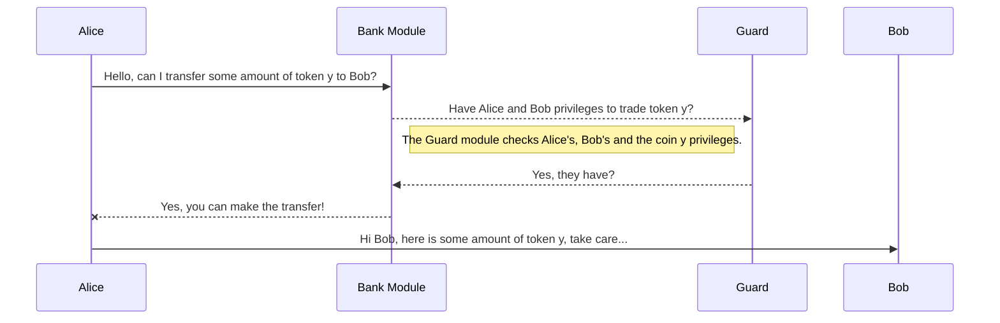

# x/guard

This module is primarily responsible for handling all the public facing user privileges permissions. Separate from the network permissions, these permissions are on the basis of a user account.

## Concepts

It use of bitwise operations, with each bit representing a **permission/category** for the user. So in this way we are able to create a multi permission requirement performant and cost effectively.
Currently, thee only supported permissions are related to tokens transfer for coins minted by the `x/coinfactory` module.

> The privileges are set to **0**, which means that the user and the custom tokens has no permissions by default and they cannot be traded if the user doesn't pass the KYC and the token groups privileges are not being specified by the operator.

## State

**Account privileges** and **required privileges** are stored in the form of a bytes array.

## Operation

When a user wants to transfer a coin minted by the `x/coinfactory` module, the following checks are performed:

- The user must have `soul-bond nft` in a restricted collection. That nft is minted by the quilified operators of the chain.
- The user must have the `token layer` permission set to `true` in the `account_privileges` array. Which byte of the array is the `token layer` permission is defined by the operator.
- The coin minted by the `x/coinfactory` module must have the `token layer` permission set to `true` in the `required_privileges` array. Which byte of the array is the `token layer` permission is defined by the operator.
  The privileges array are represented by 32 bytes arrays. Each bit represents a permission.
  The first 8 bytes are reserved. The rest of the bytes are used for the coins transfers permissions.

- 0 reserved for `not-blacklisted`
- 1 reserved for `not-locked`
- 2-63 reserved for system values in the future
- 0-63 will be 1 by default (affirmations) (2^64-1)
- 64-255 will be - by default. They are are used for the coins transfers permissions.

Example:

Let's say we have a custom token which has set in `required_privileges` array some bit to 1. This means the token is part of a some group, e.g. `KYC Base`. In order to user to be able to trade the token the user should be part of the same `KYC Base group`, i.e. the user wallet account should have the same bit from their `account_privileges` set to 1. If that same bit which corresponds to the token permission bit is set to 0 the user cannot trade the token.

|                        | User Wallet Privileges | Custom Token Privileges |
| ---------------------- | ---------------------- | ----------------------- |
| Can trade the token    | 00100000...            | 00100000...             |
| Cannot trade the token | 00000010...            | 00100000...             |

The Guard module checks the token y required privileges if there is a single match between the token required privileges and the Alice's and Bob's account privileges.

