# Mantrachain Transactions Flows

```mermaid
sequenceDiagram

participant cr as Creator
participant cf as Coin Factory(custom)
participant did as DID(custom)
participant fm as Farming(custom)
participant gd as Guard(custom)
participant lf as Liquid Farming(custom)
participant lt as Liquidity(custom)
participant lp as LP Farm(custom)
participant mm as Market Maker(custom)
participant tk as Token(custom)
participant tf as Tx Fees(custom)
participant cp as Community pool(native)
participant az as Authz module(native)
participant bk as Bank module(native)
participant nft as Nft module(native)

Note over cr, nft: Coin Factory Transactions
cr->>+cf: Create Denom Tx
cf->>gd: Is chain admin?
alt Chain admin
  cf->>cf: Set authority metadata
  cf->>bk: Set denom metadata
  cf->>cp: Charge fee
  cf-->>cr: Success
else Not a chain admin
  cf--x-cr: Error
end   
  
cr->>+cf: Mint Tx
cf->>cf: Is coin admin?
alt Coin admin
  cf->>bk: Mint coins to creator
Note over cf, bk: The transfer IS NOT restricted by the guard module
  cf-->>cr: Success
else Not a coin admin
  cf--x-cr: Error
end

cr->>+cf: Burn Tx
cf->>cf: Is coin admin?
alt Coin admin
  cf->>bk: Burn coins from creator
Note over cf, bk: The transfer IS NOT restricted by the guard module
  cf-->>cr: Success
else Not a coin admin
  cf--x-cr: Error
end
  
cr->>+cf: Change Admin Tx
cf->>cf: Is coin admin?
alt Coin admin
  cf->>cf: Set new coin admin
  cf-->>cr: Success
else Not a coin admin
  cf--x-cr: Error
end
  
cr->>+cf: Set Denom Metadata Tx
cf->>cf: Is coin admin?
alt Coin admin
  cf->>bk: Set denom metadata
  cf-->>cr: Success
else Not a coin admin
  cf--x-cr: Error
end
  
cr->>+cf: Force Transfer Tx
cf->>gd: Is chain admin?
alt Chain admin
  cf->>bk: Transfer coins from a wallet to the chain admin
Note over cf, bk: The transfer IS NOT restricted by the guard module
  cf-->>cr: Success
else Not a chain admin
  cf--x-cr: Error
end

Note over cr, nft: Did Transactions 
cr->>+did: Create Did Document Tx
did->>gd: Is chain admin?
alt Chain admin
  did->>did: Set did document
  did->>did: Set did metadata
  did-->>cr: Success
else Not a chain admin
  did--x-cr: Error
end

cr->>+did: Update Did Document Tx
did->>did: Can update did document?
alt Can update
  did->>did: Update did document
  did-->>cr: Success
else Cannot update
  did--x-cr: Error
end

cr->>+did: Add Verification Tx
did->>did: Can update did document?
alt Can update
  did->>did: Add verification
  did-->>cr: Success
else Cannot update
  did--x-cr: Error
end

cr->>+did: Revoke Verification Tx
did->>did: Can update did document?
alt Can update
  did->>did: Revoke verification
  did-->>cr: Success
else Cannot update
  did--x-cr: Error
end

cr->>+did: Set Verification Relationships Tx
did->>did: Can update did document?
alt Can update
  did->>did: Set verification relationships
  did-->>cr: Success
else Cannot update
  did--x-cr: Error
end

cr->>+did: Add Service Tx
did->>did: Can update did document?
alt Can update
  did->>did: Add service
  did-->>cr: Success
else Cannot update
  did--x-cr: Error
end

cr->>+did: Delete Service Tx
did->>did: Can update did document?
alt Can update
  did->>did: Delete service
  did-->>cr: Success
else Cannot update
  did--x-cr: Error
end

cr->>+did: Add Controller Tx
did->>did: Can update did document?
alt Can update
  did->>did: Add controller service
  did-->>cr: Success
else Cannot update
  did--x-cr: Error
end

cr->>+did: Delete Controller Tx
did->>did: Can update did document?
alt Can update
  did->>did: Delete controller service
  did-->>cr: Success
else Cannot update
  did--x-cr: Error
end

Note over cr, nft: Token Transactions 
cr->>+tk: Create Nft Collection Tx
tk->>tk: Is restricted nft collection?
alt Restricted nft collection
  tk->>gd: Is chain admin?
  alt Chain admin
    tk->>tk: Set nft collection metadata
    tk->>nft: Set nft collection
    tk-->>cr: Success
  else Not a chain admin
    tk--xcr: Error
  end
else Not restricted nft collection
  tk->>tk: Set nft collection metadata
  tk->>nft: Set nft collection
  tk-->>-cr: Success
end

cr->>+tk: Mint Nft Tx/Batch Mint Nfts Tx
tk->>tk: Is restricted nft collection?
alt Restricted nft collection
  tk->>gd: Is chain admin?
  alt Chain admin
    tk->>tk: Set nft(s) metadata
    tk->>nft: Set nft(s)
    tk->>did: Set did(s)
    Note over tk, did: Set nft(s) did(s) if the did flag is true
    tk-->>cr: Success
  else Not a chain admin
    tk--xcr: Error
  end
else Not restricted nft collection
  tk->>tk: Can mint nft(s)?
  alt Can mint nft(s)
    tk->>tk: Set nft(s) metadata
    tk->>nft: Set nft(s)
    tk-->>cr: Success
  else Cannot mint nft(s)
    tk--x-cr: Error
  end 
end

cr->>+tk: Burn Nft Tx/Batch Burn Nfts Tx
tk->>tk: Is restricted nft collection?
alt Restricted nft collection
  tk->>gd: Is chain admin?
  alt Chain admin
    tk->>tk: Delete nft(s) metadata
    tk->>nft: Delete nft(s)
    tk->>did: Delete did(s)
    Note over tk, did: Delete nft(s) did(s) if the did(dids) exists
    tk->>tk: Delete nft(s) approval(s)
    tk-->>cr: Success
  else Not a chain admin
    tk--xcr: Error
  end
else Not restricted nft collection
  tk->>tk: Can burn nft(s)?
  alt Can burn nft(s)
    tk->>tk: Delete nft(s) metadata
    tk->>nft: Delete nft(s)
    tk->>tk: Delete nft(s) approval(s)
    tk-->>cr: Success
  else Cannot burn nft(s)
    tk--x-cr: Error
  end 
end

cr->>+tk: Approve Nft Tx/Batch Approve Nfts Tx
tk->>tk: Is restricted nft collection?
alt Restricted nft collection
  tk->>gd: Is chain admin?
  alt Chain admin
    tk->>tk: Approve(Remove Approval) nft(s)
    tk-->>cr: Success
  else Not a chain admin
    tk--xcr: Error
  end
else Not restricted nft collection
  tk->>tk: Can approve nft(s)?
  alt Can approve nft(s)
    tk->>tk: Approve(Remove Approval) nft(s)
    tk-->>cr: Success
  else Cannot approve nft(s)
    tk--x-cr: Error
  end
end

cr->>+tk: Approve(Remove Approval) All Nfts Tx
tk->>tk: Approve(Remove Approval) all nfts
tk-->>-cr: Success

cr->>+tk: Transfer Nft Tx/Batch Transfer Nfts Tx
tk->>tk: Is soul bonded nft collection?
alt Not soul bonded nft collection
  tk->>tk: Is restricted nft collection?
  alt Restricted nft collection
    tk->>gd: Is chain admin?
    alt Chain admin
      tk->>nft: Transfer nft(s)
      tk->>tk: Delete nft(s) approval(s)
      tk-->>cr: Success
    else Not a chain admin
      tk--xcr: Error
    end
  else Not restricted nft collection
    tk->>tk: Can transfer nft(s)?
    alt Can transfer nft(s)
      tk->>tk: Transfer nft(s)
      tk->>tk: Delete nft(s) approval(s)
    else Cannot transfer nft(s)
      tk--xcr: Error
    end
  end
else Soul bonded nft collection
  tk--x-cr: Error
end

cr->>+tk: Update Guard Soul Bond Nft Image Tx
tk->>tk: Is restricted nft collection?
alt Restricted nft collection
  tk->>gd: Is chain admin?
  alt Chain admin
    tk->>tk: Update guard soul bond nft image
    tk-->>cr: Success
  else Not a chain admin
    tk--xcr: Error
  end
else Not restricted nft collection
  tk--x-cr: Error
end

Note over cr, nft: Tx Fees Transactions 
cr->>+tf: Create Fee Token Tx
tf->>gd: Is chain admin?
alt Chain admin
  tf->>tf: Set fee token
  tf-->>cr: Success
else Not a chain admin
  tf--x-cr: Error
end

cr->>+tf: Update Fee Token Tx
tf->>gd: Is chain admin?
alt Chain admin
  tf->>tf: Update fee token
  tf-->>cr: Success
else Not a chain admin
  tf--x-cr: Error
end

cr->>+tf: Delete Fee Token Tx
tf->>gd: Is chain admin?
alt Chain admin
  tf->>tf: Delete fee token
  tf-->>cr: Success
else Not a chain admin
  tf--x-cr: Error
end

Note over cr, nft: Guard Transactions 
cr->>+gd: Update Account Privileges Tx/Update Account Privileges Batch Tx/Update Account Privileges Grouped Batch Tx
gd->>gd: Is chain admin?
alt Chain admin
  gd->>gd: Update account privileges
else Not a chain admin
  gd--x-cr: Error
end

cr->>+gd: Update Required Privileges Tx/Update Required Privileges Batch Tx/Update Required Privileges Grouped Batch Tx
gd->>gd: Is chain admin?
alt Chain admin
  gd->>gd: Update required privileges
else Not a chain admin
  gd--x-cr: Error
end

cr->>+gd: Update Guard Transfer Coins Tx
gd->>gd: Is chain admin?
alt Chain admin
  gd->>gd: Update guard transfer coins
else Not a chain admin
  gd--x-cr: Error
end

cr->>+gd: Update Authz Generic Grant Revoke Batch Tx
gd->>gd: Is chain admin?
alt Chain admin
  gd->>az: Add/remove generic authorization(s)
else Not a chain admin
  gd--x-cr: Error
end

Note over cr, nft: Farming Transactions
cr->>+fm: Create Fixed Amount Plan Tx
fm->>gd: Is chain admin?
alt Chain admin
  fm->>bk: Charge fee
  fm->>fm: Set fixed amount plan
  fm-->>cr: Success
else Not a chain admin
  fm--x-cr: Error
end

cr->>+fm: Create Ratio Plan Tx
fm->>gd: Is chain admin?
alt Chain admin
  fm->>bk: Charge fee
  fm->>fm: Set ratio plan
  fm-->>cr: Success
else Not a chain admin
  fm--x-cr: Error
end

cr->>+fm: Stake Tx
fm->>bk: Transfer staking coins from the creator
Note over fm, bk: The transfer IS restricted by the guard module
fm->>fm: Set stake
fm-->>-cr: Success

cr->>+fm: Unstake Tx
fm->>bk: Return staking coins back to the creator
Note over fm, bk: The transfer IS NOT restricted by the guard module
fm->>fm: Set unstake
fm-->>-cr: Success

cr->>+fm: Harvest Tx
fm->>bk: Withdraw farming rewards to the creator
Note over fm, bk: The transfer IS NOT restricted by the guard module
fm-->>-cr: Success

cr->>+fm: Remove Plan Tx
fm->>bk: Return plan creation fee back to the creator
fm->>fm: Delete plan
fm-->>-cr: Success

cr->>+fm: Advance epoch Tx
Note left of fm: For testing purposes
fm->>gd: Is chain admin?
alt Chain admin
  fm->>fm: Is advance epoch enabled?
  alt Advance epoch enabled
    fm->>fm: Advance epoch
    fm-->>cr: Success
  else Advance epoch disabled
    fm--xcr: Error
  end
else Not a chain admin
  fm--x-cr: Error
end

Note over cr, nft: Liquidity Transactions
cr->>+lt: Create Pair Tx
lt->>gd: Is chain admin?
alt Chain admin
  lt->>lt: Set pair
  lt->>bk: Charge fee
  lt-->>cr: Success
else Not a chain admin
  lt--x-cr: Error
end

cr->>+lt: Create Basic Pool Tx/Create Ranged Pool Tx
lt->>Guard module: Is chain admin?
alt Chain admin
  lt->>lt: Get pair
  lt->>bk: Deposit pool coins
  Note over lt, bk: The transfer IS restricted by the guard module
  lt->>lt: Set basic/ranged pool
  lt->>bk: Charge fee
  lt->> bk: Mint LP coins to creator
  Note over lt, bk: The transfer IS NOT restricted by the guard module
  lt-->>cr: Success
else Not a chain admin
  lt--x-cr: Error
end

cr->>+lt: Deposit Tx
lt->>lt: Get pool
lt->>bk: Deposit pool coins
Note over lt, bk: The transfer IS restricted by the guard module
lt->>bk: Mint LP coins to creator
Note over lt, bk: The transfer IS NOT restricted by the guard module
lt-->>-cr: Success

cr->>+lt: Withdraw Tx
lt->>lt: Get pool
lt->>bk: Withdraw pool coins
Note over lt, bk: The transfer IS NOT restricted by the guard module
lt->>bk: Burn LP coins from creator
Note over lt, bk: The transfer IS NOT restricted by the guard module
lt-->>-cr: Success

cr->>+lt: Limit Order Tx
lt->>lt: Get pair
lt->>bk: Transfer offer coin from the creator
Note over lt, bk: The transfer IS restricted by the guard module
lt->>lt: Create limit order(includes multiple calls)
lt-->>-cr: Success

cr->>+lt: Market Order Tx
lt->>lt: Get pair
lt->>bk: Transfer offer coin from the creator
Note over lt, bk: The transfer IS restricted by the guard module
lt->>lt: Create market order(includes multiple calls)
lt-->>-cr: Success

cr->>+lt: MM Order Tx
lt->>lt: Get pair
lt->>bk: Transfer offer coin from the creator
Note over lt, bk: The transfer IS restricted by the guard module
lt->>lt: Create mm order(includes multiple calls)
lt-->>-cr: Success

cr->>+lt: Cancel Order Tx
lt->>lt: Finish order(includes multiple calls)
lt-->>-cr: Success

cr->>+lt: Cancel All Orders Tx
lt->>lt: Get pair
lt->>lt: Finish all orders(includes multiple calls)
lt-->>-cr: Success

cr->>+lt: Cancel MM Order Tx
lt->>lt: Get pair
lt->>lt: Finish mm order(includes multiple calls)
lt-->>-cr: Success

Note over cr, nft: LP Farm Transactions
  cr->>+lp: Create Private Plan Tx
lp->>gd: Is chain admin?
alt Chain admin
  gd-->>lp: Yes
  lp->>lp: Set private plan
  lp->>bk: Charge fee
  lp-->>cr: Success
else Not a chain admin
  gd-->>lp: No
  lp--x-cr: Error
end

cr->>+lp: Terminate Private Plan Tx
lp->>lp: Is the plan termination account?
alt Plan termination account
  lp->>lp: Terminate private plan
  lp-->>cr: Success
else Not the plan termination account
  lp--x-cr: Error
end

cr->>+lp: Farm Tx
lp->>bk: Transfer farming coins from the creator
Note over lp, bk: The transfer IS restricted by the guard module
lp->>lp: Set farming position
lp-->>-cr: Success

cr->>+lp: Unfarm Tx
lp->>bk: Return farming coins back to the creator
Note over lp, bk: The transfer IS NOT restricted by the guard module
lp->>bk: Withdraw farming rewards to the creator
Note over lp, bk: The transfer IS NOT restricted by the guard module
lp->>lp: Delete farming position
lp-->>-cr: Success

cr->>+lp: Harvest
lp->>bk: Withdraw farming rewards to the creator
Note over lp, bk: The transfer IS NOT restricted by the guard module
lp-->>-cr: Success

Note over cr, nft: Market Maker Transactions
cr->>+mm: Apply Market Maker
mm->>mm: Set deposit for each pair
mm->>mm: Set market maker for each pair
mm->>bk: Deposit coins
Note over mm, bk: The transfer IS restricted by the guard module
mm-->>-cr: Success

cr->>+mm: Claim Incentives
mm->>bk: Withdraw claimable(includes multiple calls)
Note over mm, bk: The transfer IS NOT restricted by the guard module
mm->>mm: Delete incentive
mm-->>-cr: Success

```

## ***Note***: All the restricted transfers by the ***guard module*** ONLY apply if the guard for transfers is enabled and if the transfer is not with the chain's default denom, i.e. `uaum`

## ***Note***: All fee charge operations ARE NOT restricted by the ***guard module*** because they are with the chain's default denom, i.e. `uaum`
