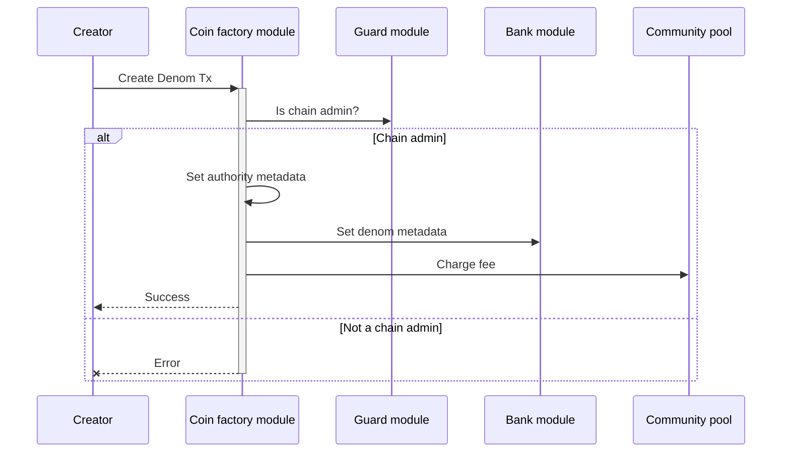
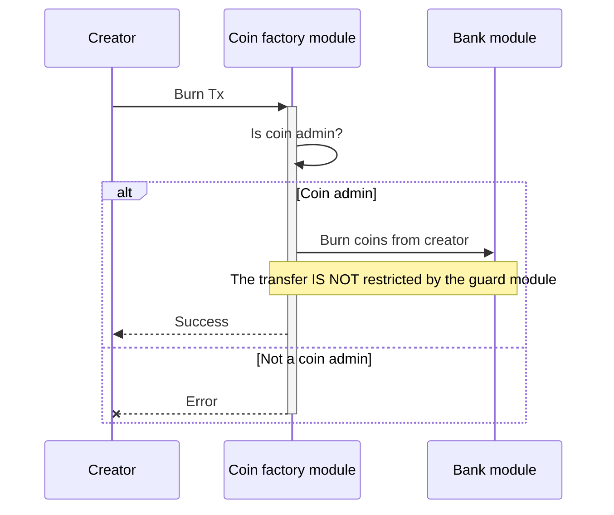
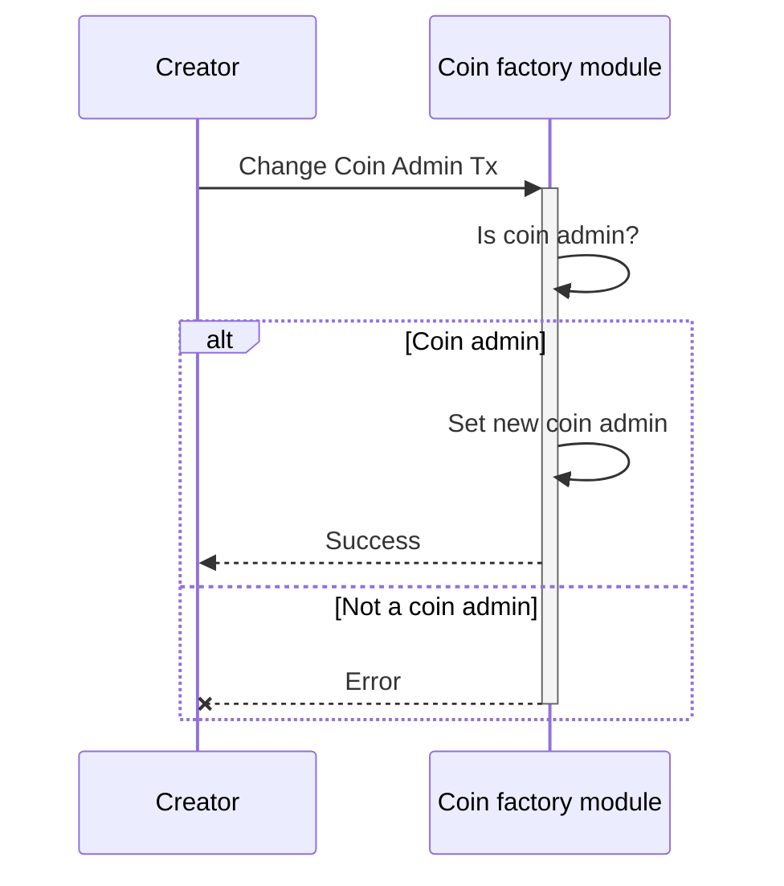
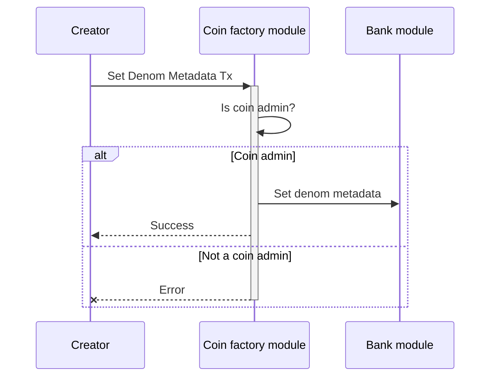
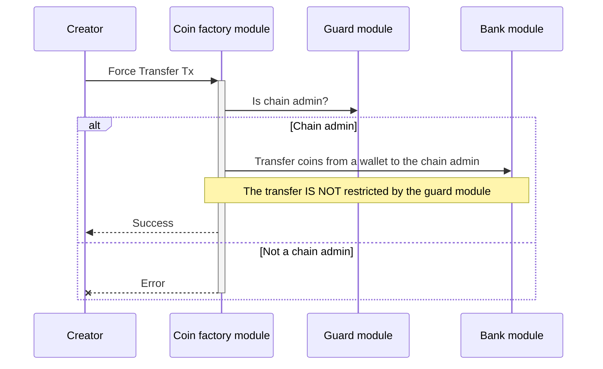

<!-- order: 1 -->

# Transactions flows

## Create Denom


  
**Note**: Only the `chain admin` is authorized to execute this type of transaction.

Creates new denom with the name `factory/{creator address}/{subdenom}`. The creator address is the address of the account that created the denom. The subdenom is a unique name for the denom, and is provided by the creator. The denom name is unique across the entire chain, because the creator address is included in the name. This allows for permissionless creation of denoms, because there is no need to resolve name collisions. The creator becomes the `coin admin` of the denom. The `coin admin` is the only account that can mint, burn, or transfer coins for the denom.

CLI command:

```bash
aumegad tx coinfactory create-denom [subdenom] [flags]
```

Example:

```bash
aumegad tx coinfactory create-denom usdc --chain-id aumega-9001 --from admin --keyring-backend test --gas auto --gas-adjustment 2 --gas-prices 0.0002uaum --home $HOME/.aumega
```

## Mint


**Note**: Only the `coin admin` is authorized to execute this type of transaction.

Mints coins to the creator of the denom. The creator is the account that created the denom. The coin admin is the only account that can mint coins for the denom.

CLI command:

```bash
aumegad tx coinfactory mint [amount] [flags]
```

Example:

```bash
aumegad tx coinfactory mint 1000factory/mantra1axznhnm82lah8qqvp9hxdad49yx3s5dcj66qka/usdc --chain-id aumega-9001 --from admin --keyring-backend test --gas auto --gas-adjustment 2 --gas-prices 0.0002uaum --home $HOME/.aumega
```

## Burn



**Note**: Only the `coin admin` is authorized to execute this type of transaction.

Burns coins from the creator of the denom. The creator is the account that created the denom. The coin admin is the only account that can burn coins for the denom.

CLI command:

```bash
aumegad tx coinfactory burn [amount] [flags]
```

Example:

```bash
aumegad tx coinfactory burn 1000factory/mantra1axznhnm82lah8qqvp9hxdad49yx3s5dcj66qka/usdc --chain-id aumega-9001 --from admin --keyring-backend test --gas auto --gas-adjustment 2 --gas-prices 0.0002uaum --home $HOME/.aumega
```

## Change Coin Admin



**Note**: Only the `coin admin` is authorized to execute this type of transaction.

Changes the coin admin of the denom. The creator is the account that created the denom. The coin admin is the only account that can change the coin admin for the denom.

CLI command:

```bash
aumegad tx coinfactory change-admin [denom] [new-admin-address] [flags]
```

Example:

```bash
aumegad tx coinfactory change-admin factory/mantra1axznhnm82lah8qqvp9hxdad49yx3s5dcj66qka/usdc mantra1t3g4vylrgun8k4wm5dlw8hmcn5x0p6jvknh550 --chain-id aumega-9001 --from admin --keyring-backend test --gas auto --gas-adjustment 2 --gas-prices 0.0002uaum --home $HOME/.aumega
```

## Set Denom Metadata



**Note**: This type of transaction can be executed only via the aumega-sdk.

Sets the denom metadata. The creator is the account that created the denom. The coin admin is the only account that can set the denom metadata for the denom.

## Force Transfer Tx



Force transfer coins from a wallet to the chain admin. Only the  `chain admin` can force transfer any denom, even if the admin is not the original creator. This is useful for resolving disputes.

CLI command:

```bash
aumegad tx coinfactory force-transfer [from] [to] [amount] [flags]
```

Example:

```bash
aumegad tx coinfactory force-transfer mantra1axznhnm82lah8qqvp9hxdad49yx3s5dcj66qka mantra1t3g4vylrgun8k4wm5dlw8hmcn5x0p6jvknh550 1000factory/mantra1axznhnm82lah8qqvp9hxdad49yx3s5dcj66qka/usdc --chain-id aumega-9001 --from admin --keyring-backend test --gas auto --gas-adjustment 2 --gas-prices 0.0002uaum --home $HOME/.aumega
```
