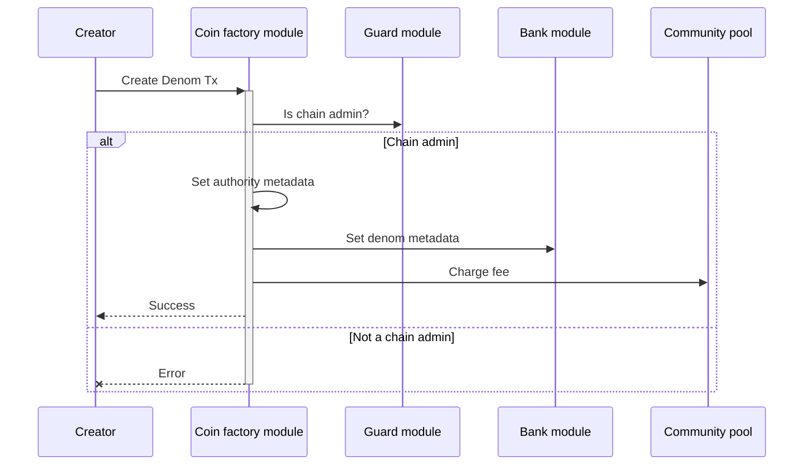
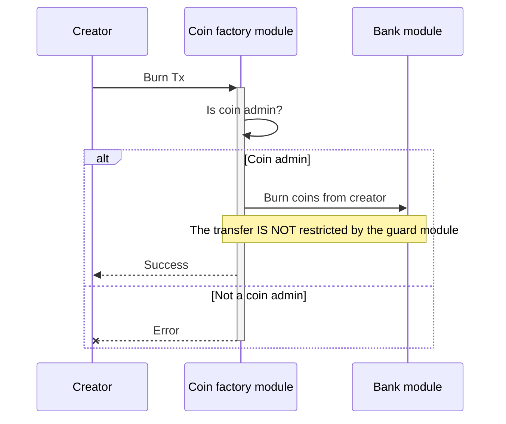
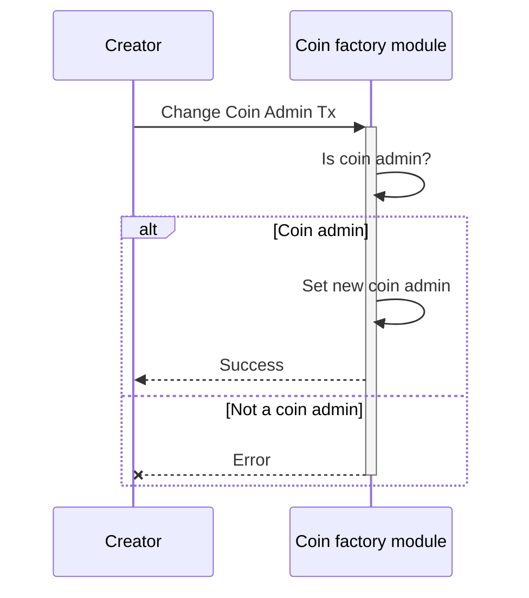
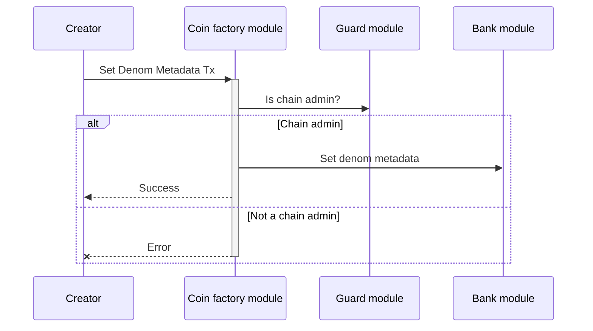
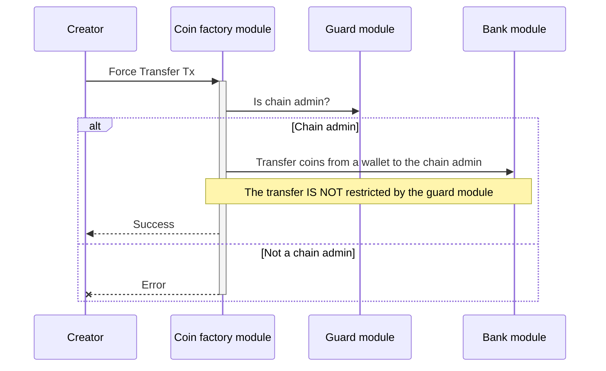

<!-- order: 1 -->

# Transactions flows

## Create Denom

```mermaid
sequenceDiagram
Creator->>+Coin factory module: Create Denom Tx
Coin factory module->>Guard module: Is chain admin?
alt Chain admin
  Coin factory module->>Coin factory module: Set authority metadata
  Coin factory module->>Bank module: Set denom metadata
  Coin factory module->>Community pool: Charge fee
  Coin factory module-->>Creator: Success
else Not a chain admin
  Coin factory module--x-Creator: Error
end
```

## Mint

```mermaid
sequenceDiagram
Creator->>+Coin factory module: Mint Tx
Coin factory module->>Coin factory module: Is coin admin?
alt Coin admin
  Coin factory module->>Bank module: Mint coins to creator
  Note over Coin factory module, Bank module: The transfer IS NOT restricted by the guard module
  Coin factory module-->>Creator: Success
else Not a coin admin
  Coin factory module--x-Creator: Error
end
```

## Burn

```mermaid
sequenceDiagram
Creator->>+Coin factory module: Burn Tx
Coin factory module->>Coin factory module: Is coin admin?
alt Coin admin
  Coin factory module->>Bank module: Burn coins from creator
  Note over Coin factory module, Bank module: The transfer IS NOT restricted by the guard module
  Coin factory module-->>Creator: Success
else Not a coin admin
  Coin factory module--x-Creator: Error
end
```

## Change Coin Admin

```mermaid
sequenceDiagram
Creator->>+Coin factory module: Change Coin Admin Tx
Coin factory module->>Coin factory module: Is coin admin?
alt Coin admin
  Coin factory module->>Coin factory module: Set new coin admin
  Coin factory module-->>Creator: Success
else Not a coin admin
  Coin factory module--x-Creator: Error
end
```

## Set Denom Metadata

```mermaid
sequenceDiagram
Creator->>+Coin factory module: Set Denom Metadata Tx
Coin factory module->>Guard module: Is chain admin?
alt Chain admin
  Coin factory module->>Bank module: Set denom metadata
  Coin factory module-->>Creator: Success
else Not a chain admin
  Coin factory module--x-Creator: Error
end
```

## Force Transfer Tx

```mermaid
sequenceDiagram
Creator->>+Coin factory module: Force Transfer Tx
Coin factory module->>Guard module: Is chain admin?
alt Chain admin
  Coin factory module->>Bank module: Transfer coins from a wallet to the chain admin
  Note over Coin factory module, Bank module: The transfer IS NOT restricted by the guard module
  Coin factory module-->>Creator: Success
else Not a chain admin
  Coin factory module--x-Creator: Error
end
```
