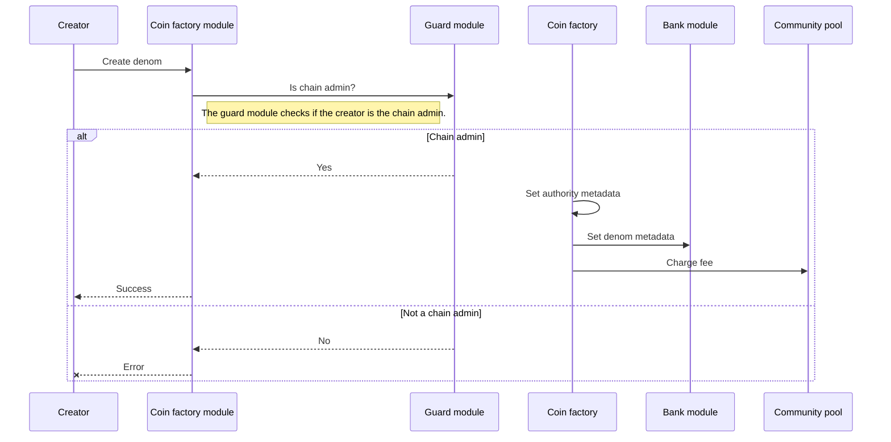
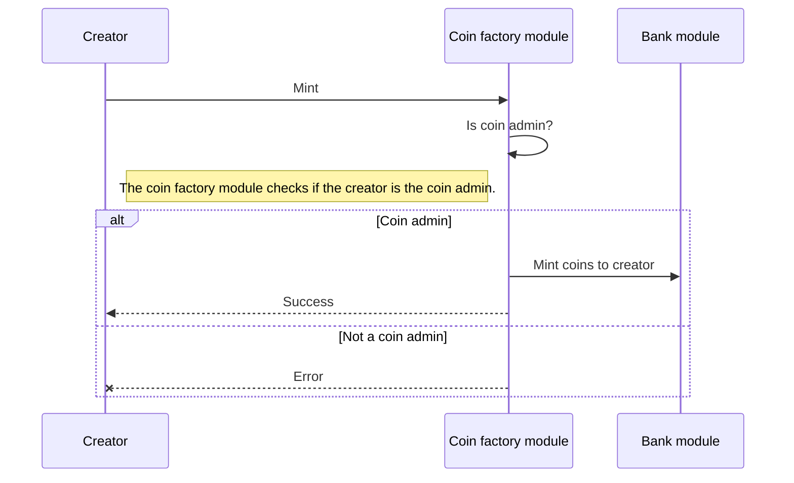
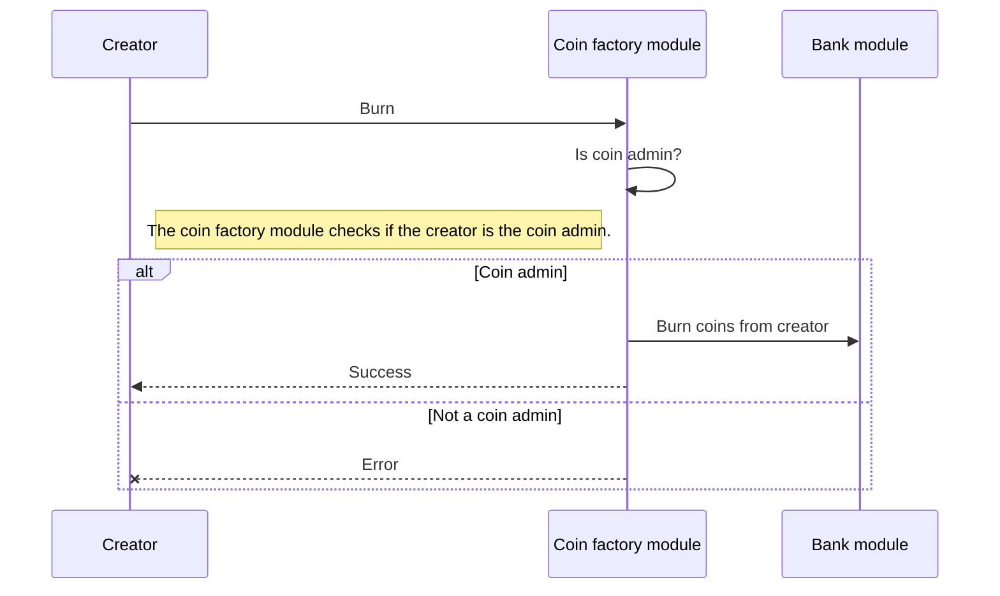
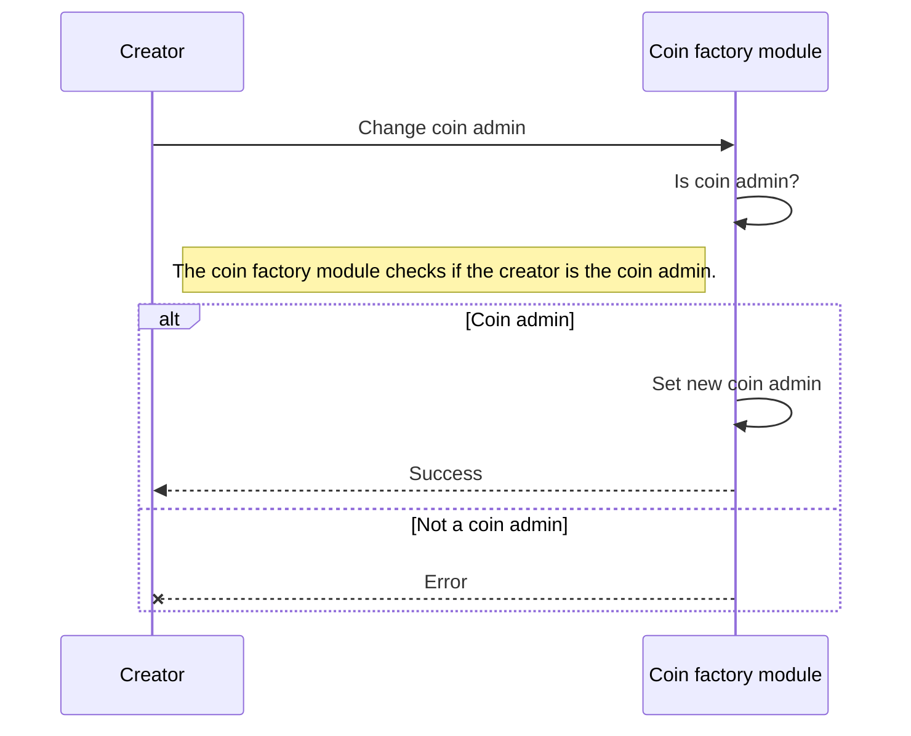
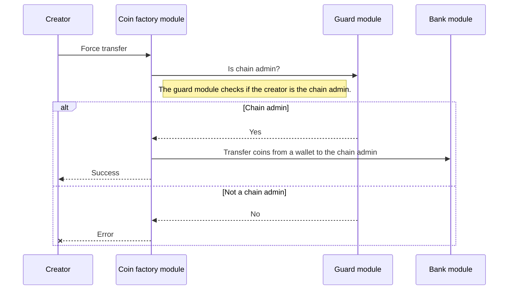

<!-- order: 1 -->

# Transactions flows

## Create denom

```mermaid
sequenceDiagram
Creator ->> Coin factory module: Create denom
Coin factory module->>Guard module: Is chain admin?
Note left of Guard module: The guard module checks if the creator is the chain admin.
alt Chain admin
  Guard module-->>Coin factory module: Yes
  Coin factory->>Coin factory: Set authority metadata
  Coin factory->>Bank module: Set denom metadata
  Coin factory->>Community pool: Charge fee
  Coin factory module-->> Creator: Success
else Not a chain admin
  Guard module-->>Coin factory module: No
  Coin factory module--x Creator: Error
end
```

## Mint coins

```mermaid
sequenceDiagram
Creator ->> Coin factory module: Mint
Coin factory module->>Coin factory module: Is coin admin?
Note left of Coin factory module: The coin factory module checks if the creator is the coin admin.
alt Coin admin
  Coin factory module->>Bank module: Mint coins to creator
  Coin factory module-->> Creator: Success
else Not a coin admin
  Coin factory module--x Creator: Error
end
```

## Burn coins

```mermaid
sequenceDiagram
Creator ->> Coin factory module: Burn
Coin factory module->>Coin factory module: Is coin admin?
Note left of Coin factory module: The coin factory module checks if the creator is the coin admin.
alt Coin admin
  Coin factory module->>Bank module: Burn coins from creator
  Coin factory module-->> Creator: Success
else Not a coin admin
  Coin factory module--x Creator: Error
end
```

## Change coin admin

```mermaid
sequenceDiagram
Creator ->> Coin factory module: Change coin admin
Coin factory module->>Coin factory module: Is coin admin?
Note left of Coin factory module: The coin factory module checks if the creator is the coin admin.
alt Coin admin
  Coin factory module->>Coin factory module: Set new coin admin
  Coin factory module-->> Creator: Success
else Not a coin admin
  Coin factory module--x Creator: Error
end
```

## Force transfer coins

```mermaid
sequenceDiagram
Creator ->> Coin factory module: Force transfer
Coin factory module->>Guard module: Is chain admin?
Note left of Guard module: The guard module checks if the creator is the chain admin.
alt Chain admin
  Guard module-->>Coin factory module: Yes
  Coin factory module->>Bank module: Transfer coins from a wallet to the chain admin
  Coin factory module-->> Creator: Success
else Not a chain admin
  Guard module-->>Coin factory module: No
  Coin factory module--x Creator: Error
end
```
