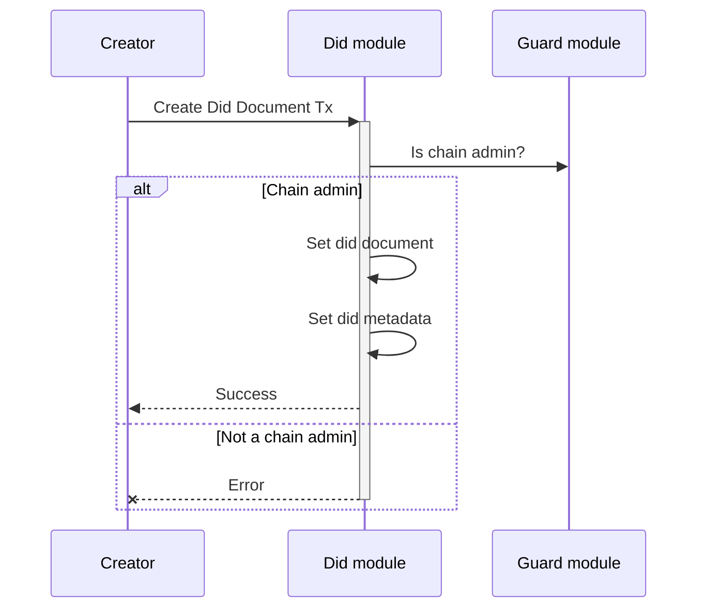
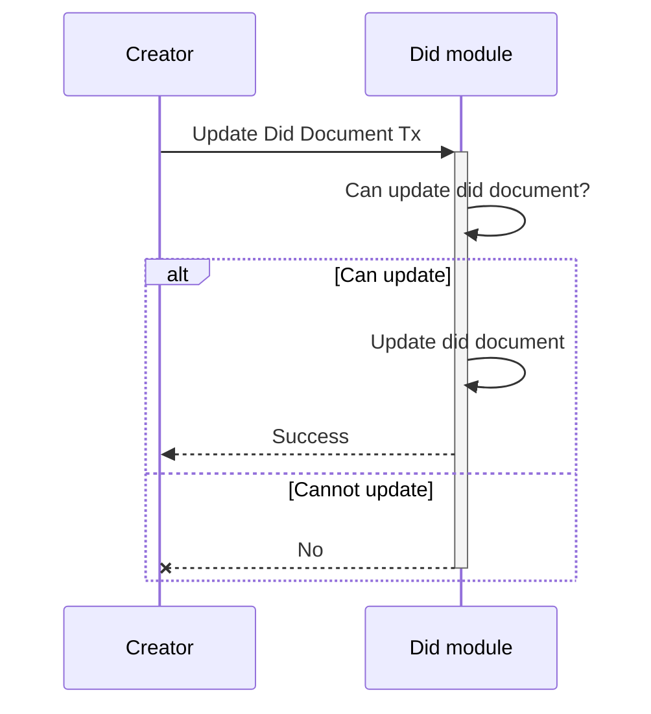
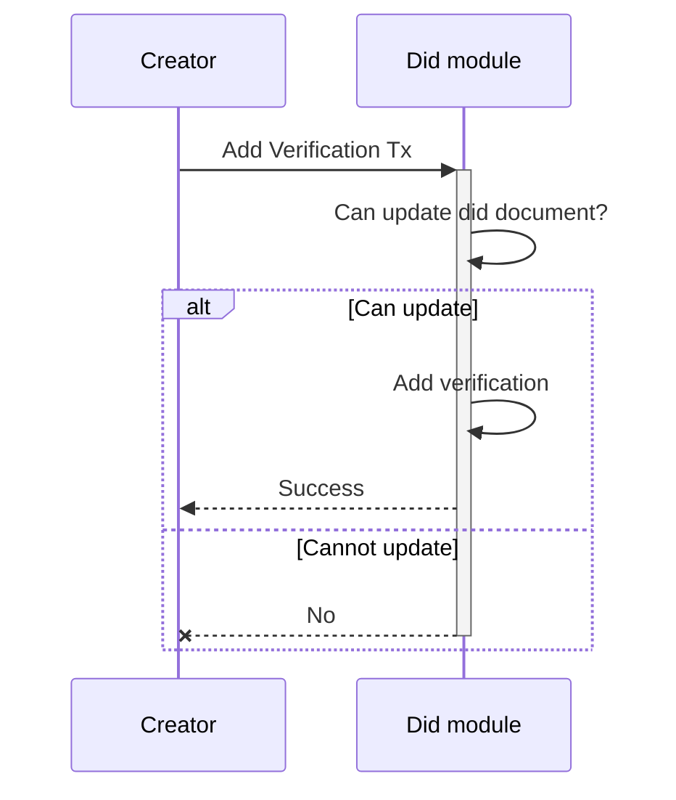
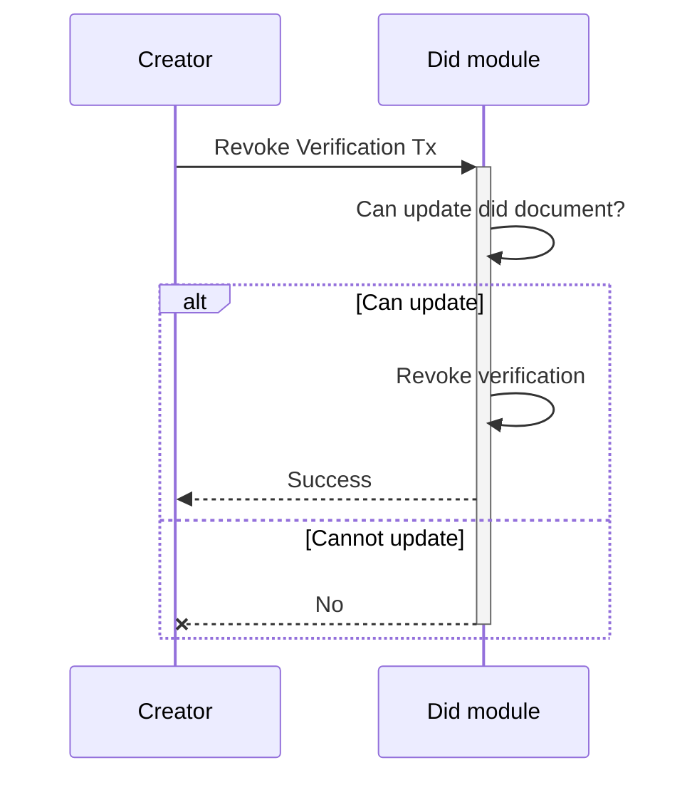
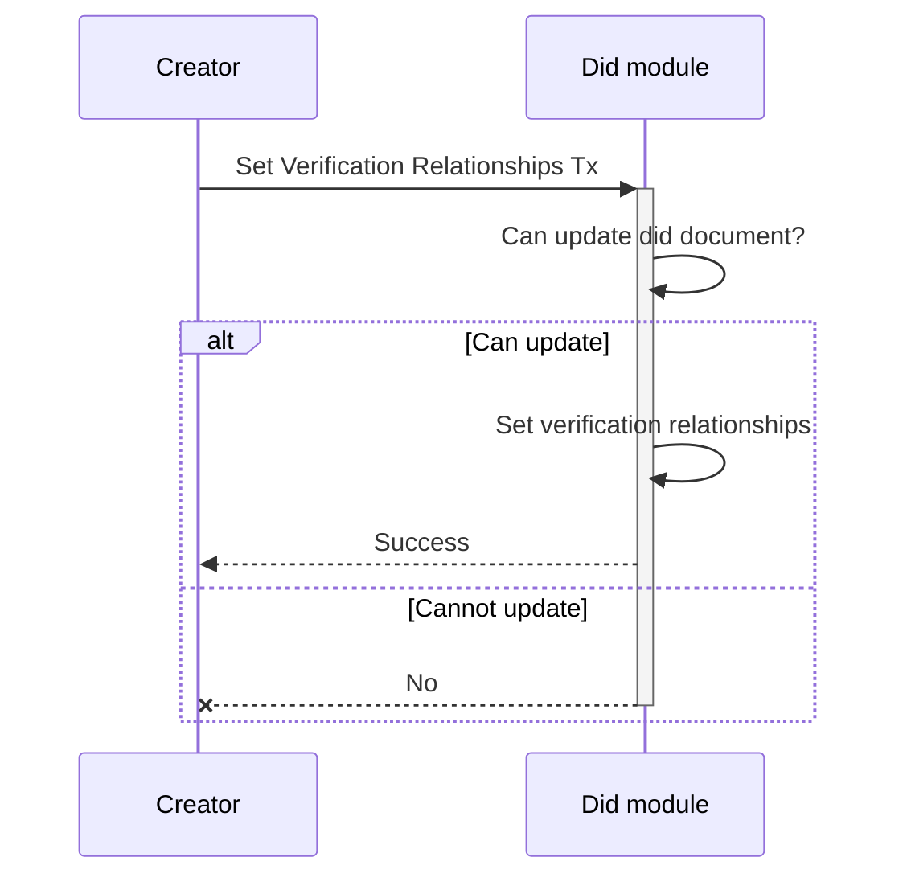
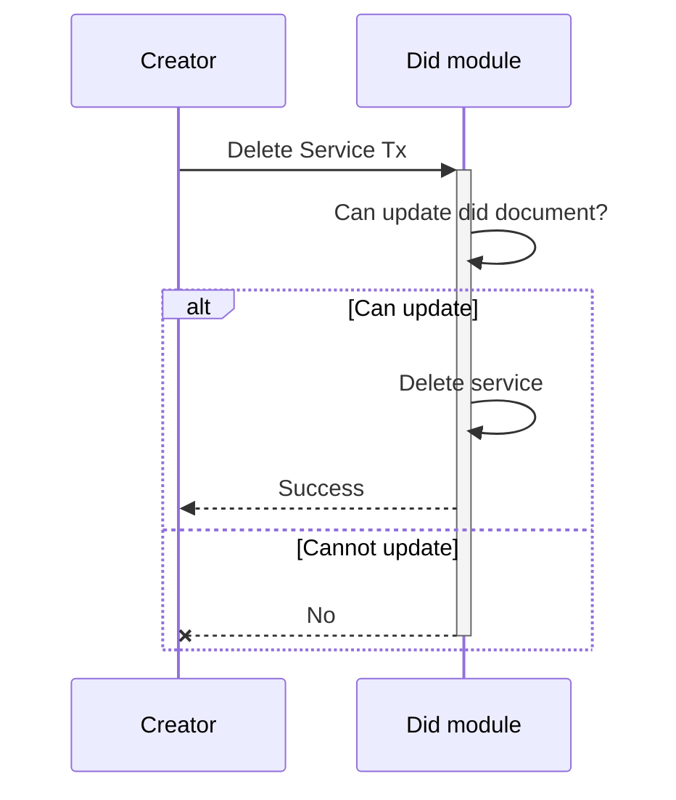

<!-- order: 1 -->

# Transactions flows

## Create Did Document

## Update Did Document

## Add Verification

## Revoke Verification

## Set Verification Relationships

## Add Service

## Delete Service

## Add Controller

## Delete Controller

