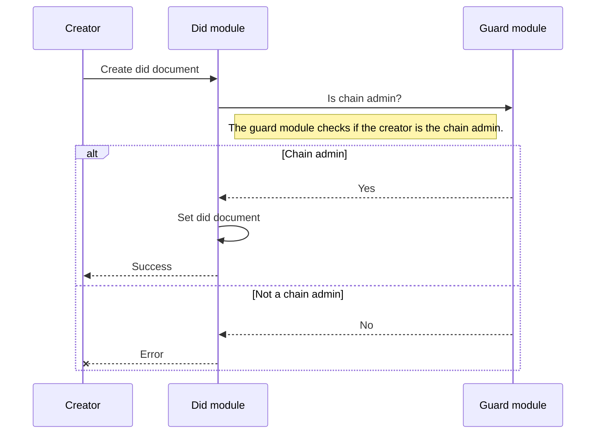
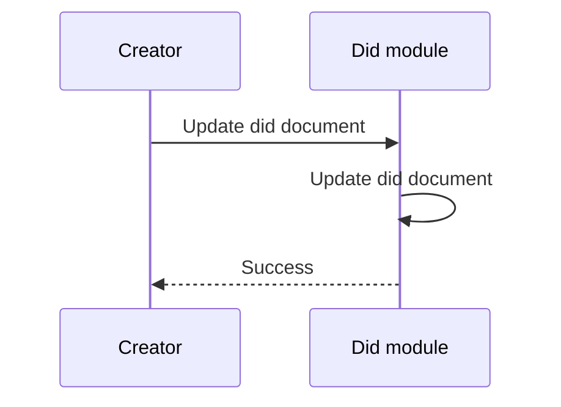

<!-- order: 1 -->

# Transactions flows

## Create did document

```mermaid
sequenceDiagram
Creator ->> Did module: Create did document
Did module->>Guard module: Is chain admin?
Note left of Guard module: The guard module checks if the creator is the chain admin.
alt Chain admin
  Guard module-->>Did module: Yes
  Did module->>Did module: Set did document
  Did module-->> Creator: Success
else Not a chain admin
  Guard module-->>Did module: No
  Did module--x Creator: Error
end
```

## Update did document

```mermaid
sequenceDiagram
Creator ->> Did module: Update did document
Did module->>Did module: Update did document
Did module-->> Creator: Success
```
