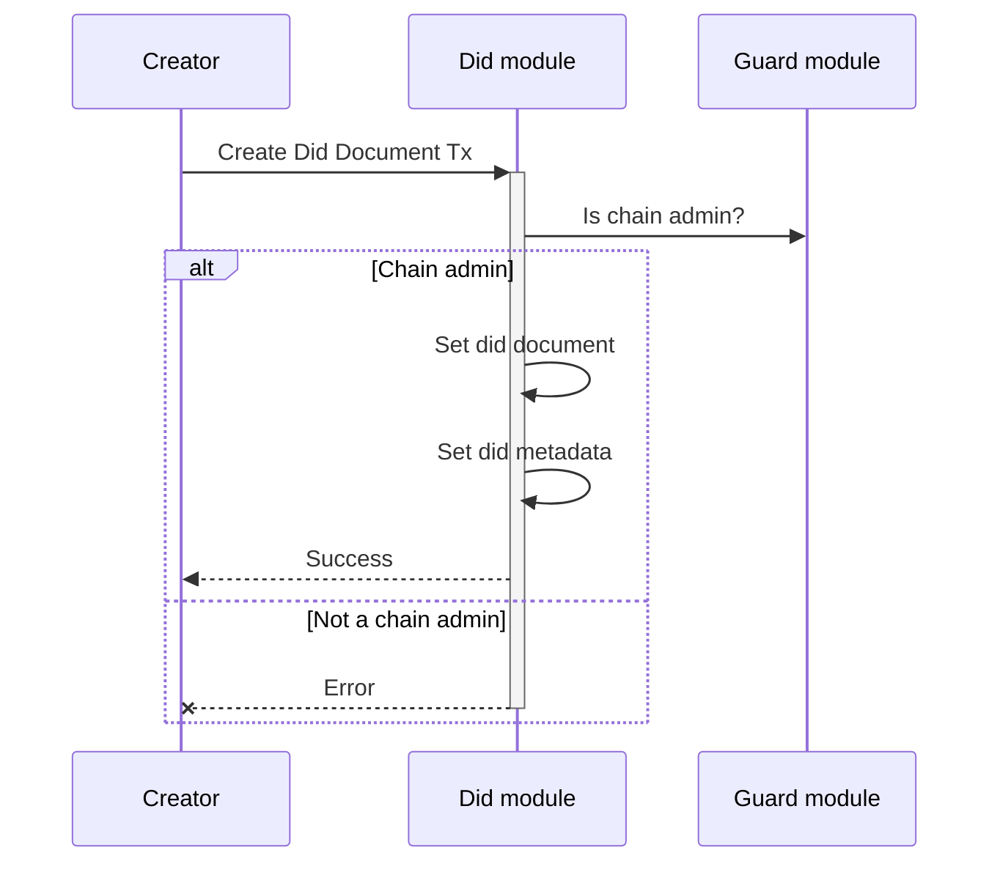
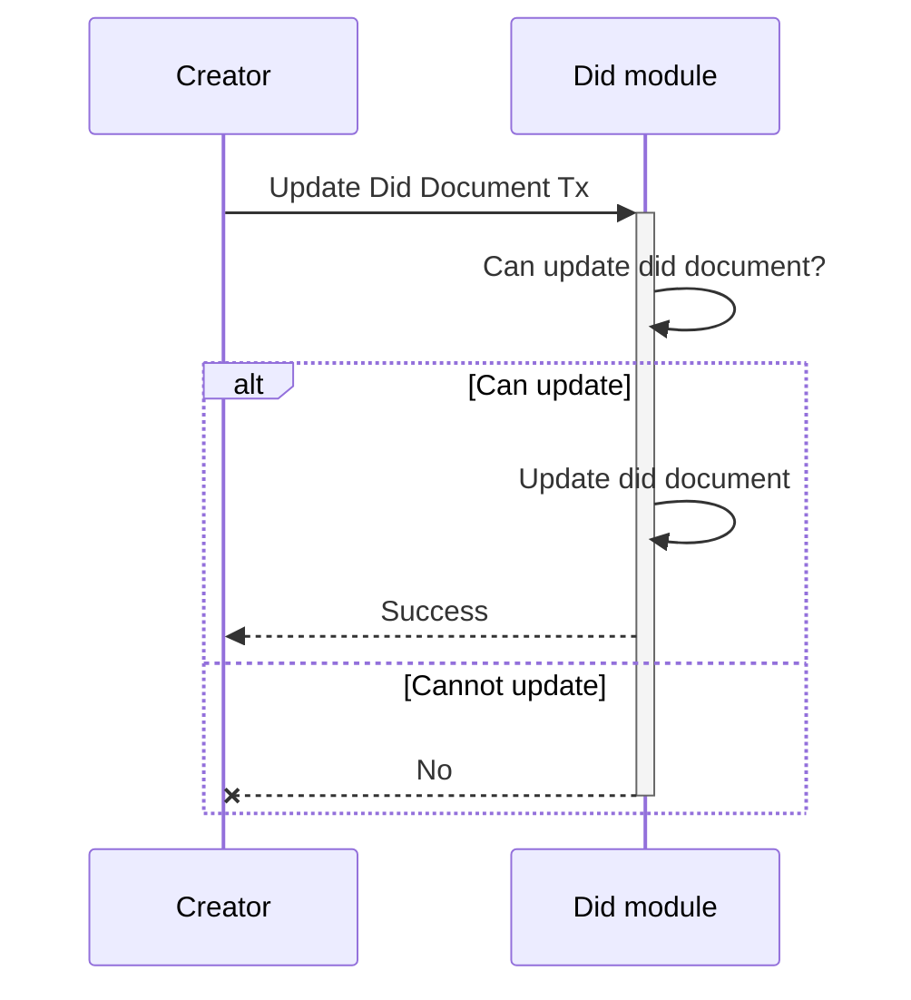
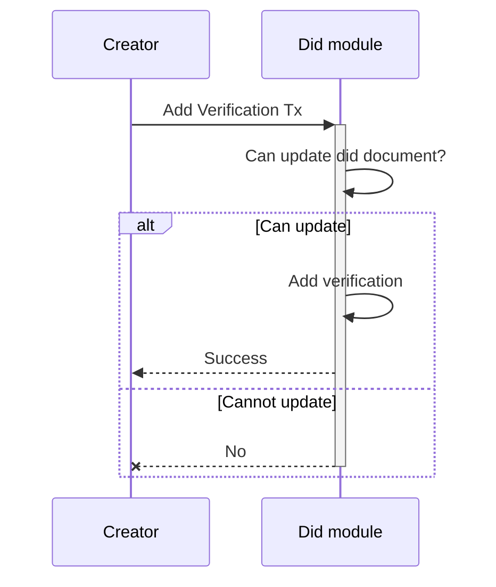
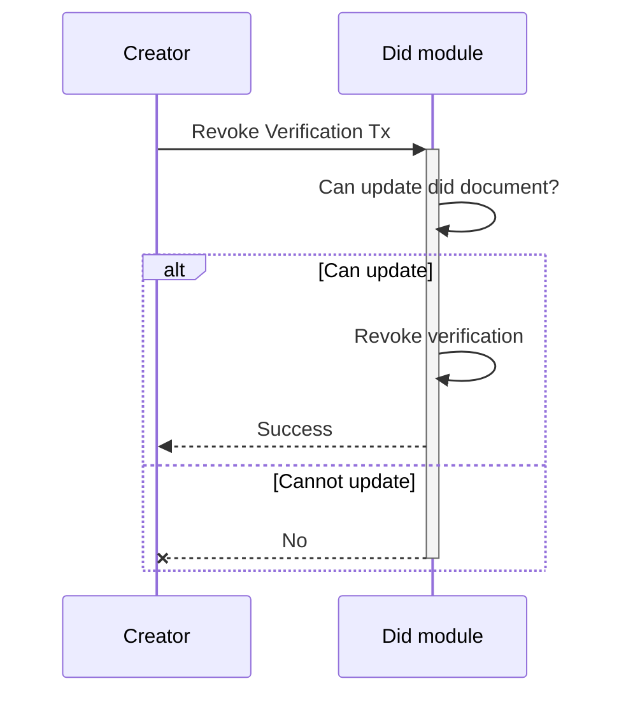
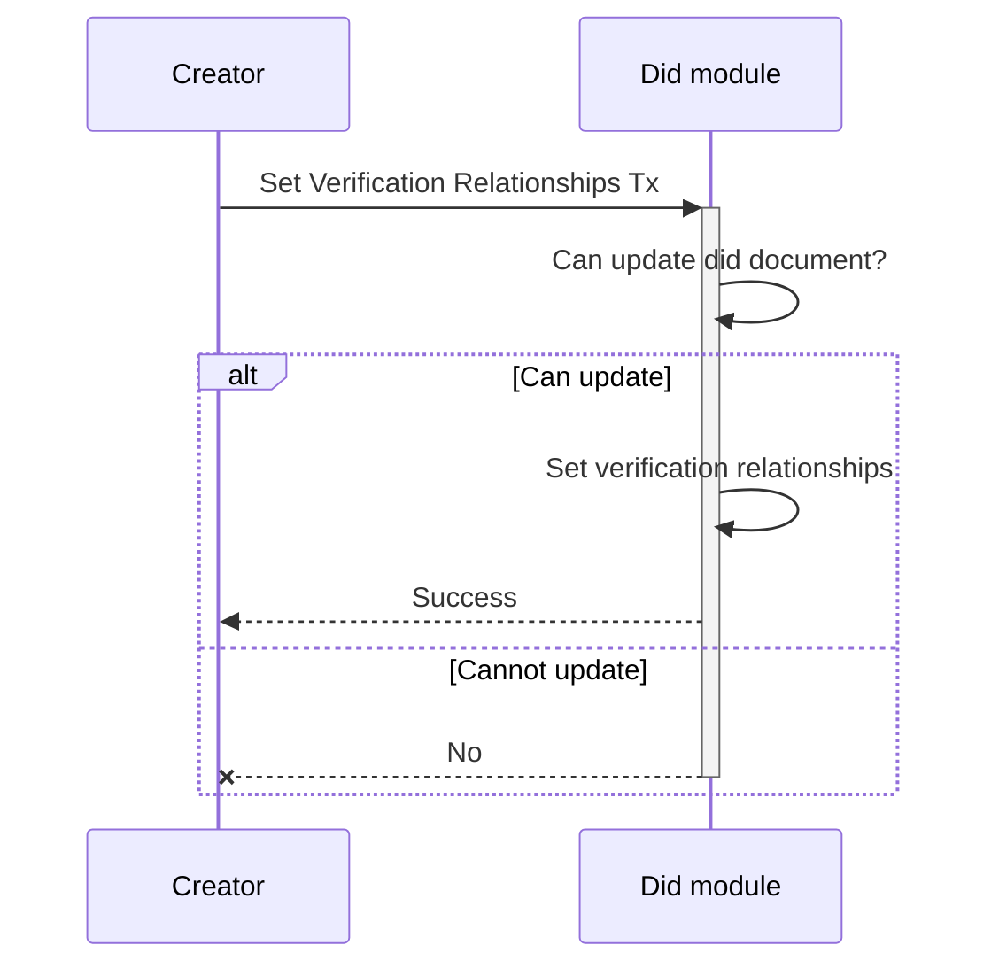
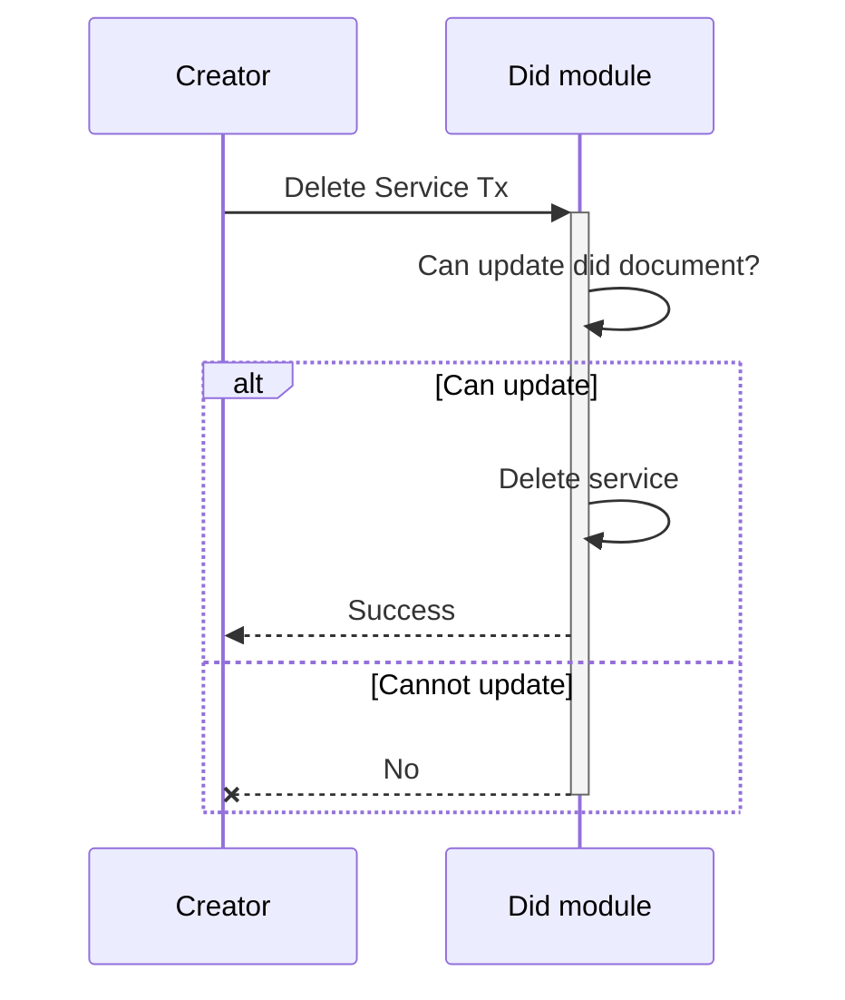

<!-- order: 1 -->

# Transactions flows

## Create Did Document

Creates a new did document and metadata.

**Note**: Only the `chain admin` is authorized to execute this type of transaction.

## Update Did Document

Updates an existing did document.

## Add Verification

Adds a new verification method and related verification relationships to a did document.

## Revoke Verification

Removes a verification method and related verification relationships from a did document.

## Set Verification Relationships

Overwrites the verification relationships for a verification methods of a did document.

## Add Service

Adds a new service to a did document.

## Delete Service

Removes a service from a did document.

## Add Controller

Adds a new controller to a did document.

## Delete Controller

Removes a controller from a did document.
