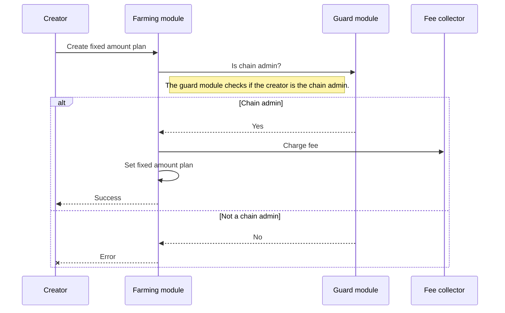
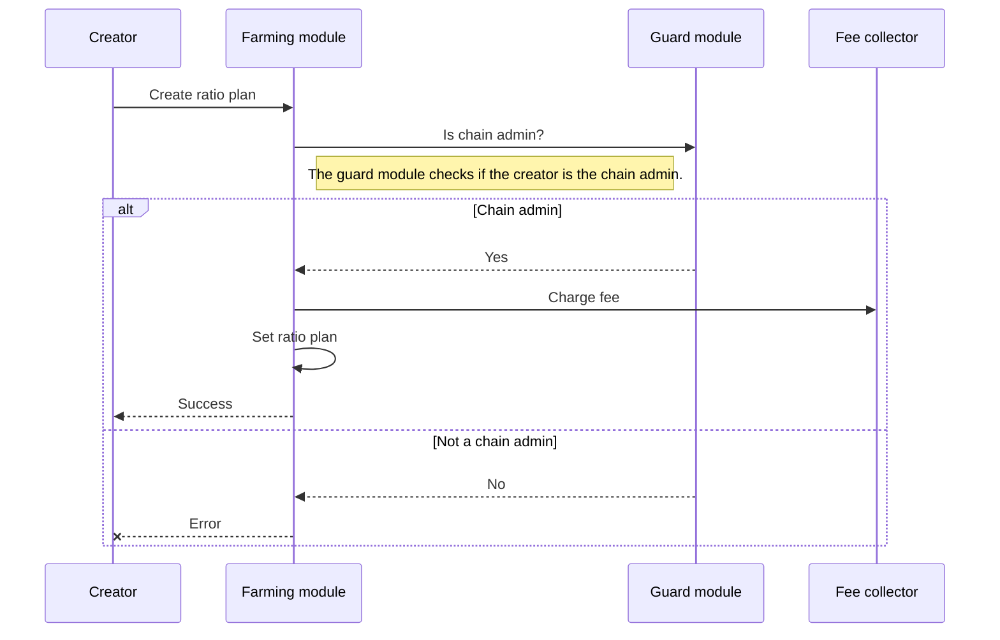
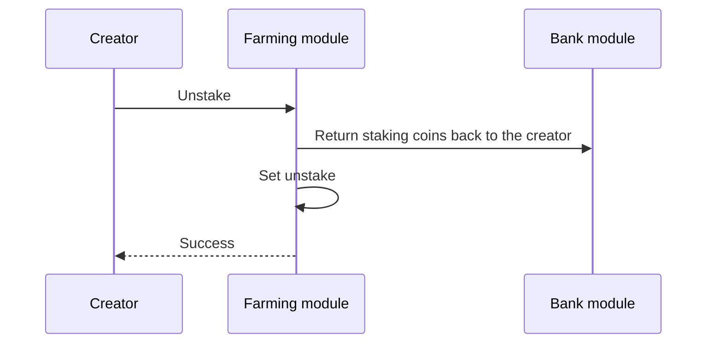
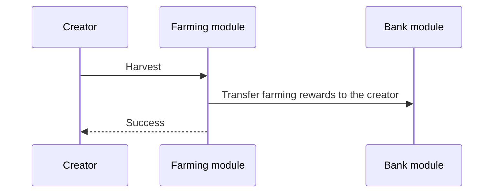
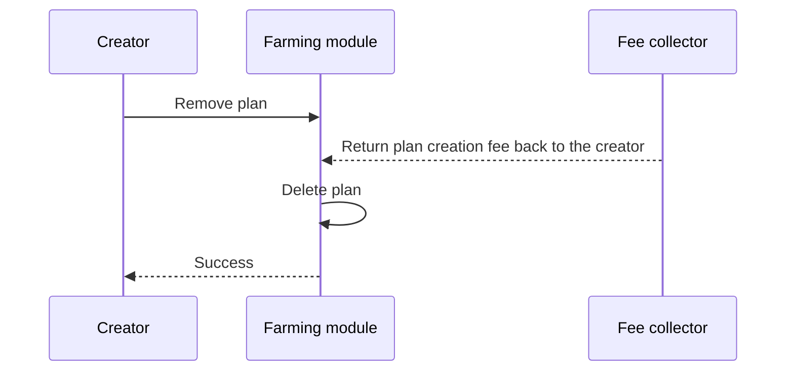

<!-- order: 9 -->

# Transactions flows

## Create fixed amount plan

```mermaid
sequenceDiagram
Creator ->> Farming module: Create fixed amount plan
Farming module->>Guard module: Is chain admin?
Note left of Guard module: The guard module checks if the creator is the chain admin.
alt Chain admin
  Guard module-->>Farming module: Yes
  Farming module->>Fee collector: Charge fee
  Farming module->>Farming module: Set fixed amount plan
  Farming module-->> Creator: Success
else Not a chain admin
  Guard module-->>Farming module: No
  Farming module--x Creator: Error
end
```

## Create ratio plan

```mermaid
sequenceDiagram
Creator ->> Farming module: Create ratio plan
Farming module->>Guard module: Is chain admin?
Note left of Guard module: The guard module checks if the creator is the chain admin.
alt Chain admin
  Guard module-->>Farming module: Yes
  Farming module->>Fee collector: Charge fee
  Farming module->>Farming module: Set ratio plan
  Farming module-->> Creator: Success
else Not a chain admin
  Guard module-->>Farming module: No
  Farming module--x Creator: Error
end
```

## Stake

```mermaid
sequenceDiagram
Creator ->> Farming module: Stake
Farming module->>Bank module: Transfer staking coins from the creator
Farming module->>Farming module: Set stake
Farming module-->> Creator: Success
```

## Untake

```mermaid
sequenceDiagram
Creator ->> Farming module: Unstake
Farming module->>Bank module: Return staking coins back to the creator
Farming module->>Farming module: Set unstake
Farming module-->> Creator: Success
```

## Harvest

```mermaid
sequenceDiagram
Creator ->> Farming module: Harvest
Farming module->>Bank module: Transfer farming rewards to the creator
Farming module-->> Creator: Success
```

## Remove plan

```mermaid
sequenceDiagram
Creator ->> Farming module: Remove plan
Fee collector-->>Farming module: Return plan creation fee back to the creator
Farming module->>Farming module: Delete plan
Farming module-->> Creator: Success
```
