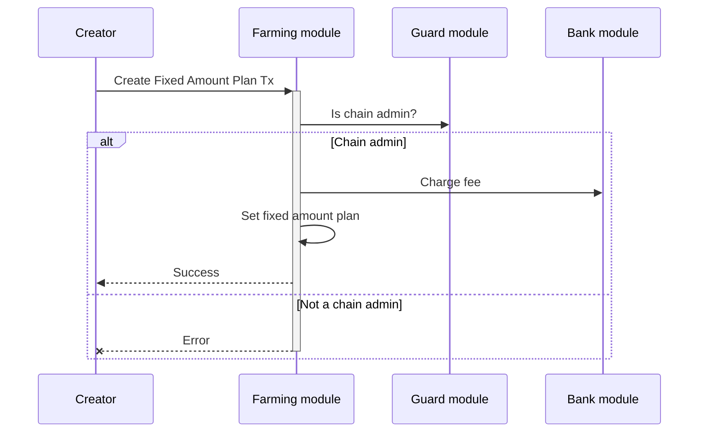
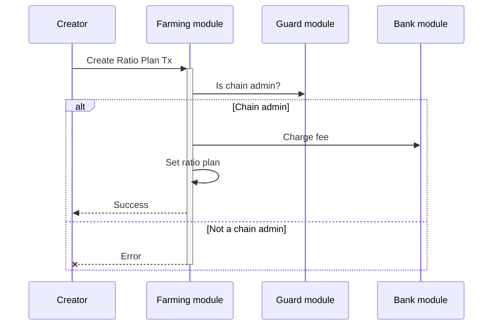
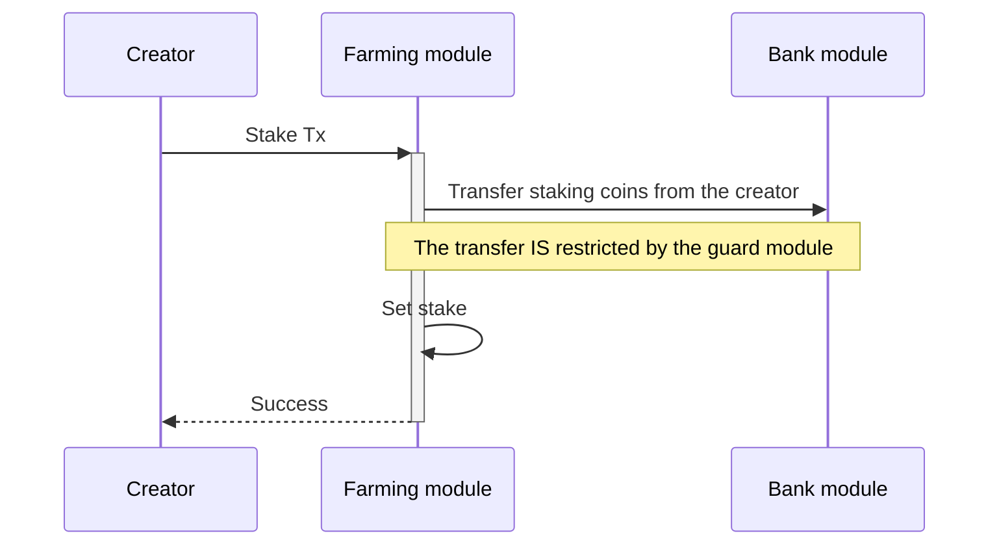
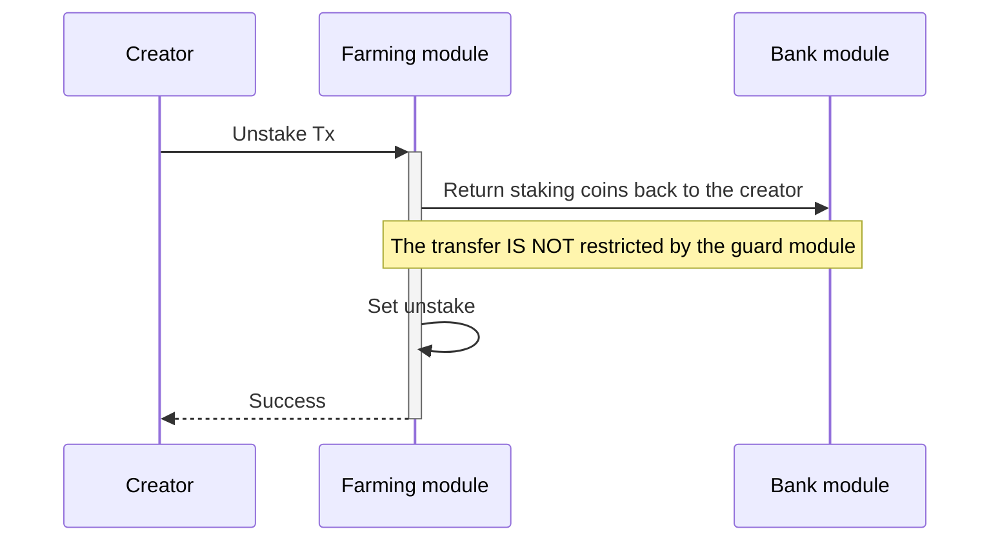
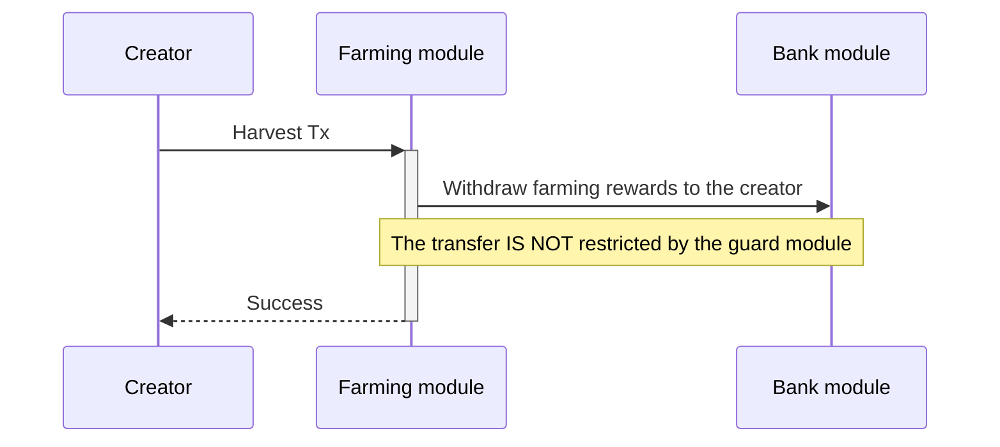
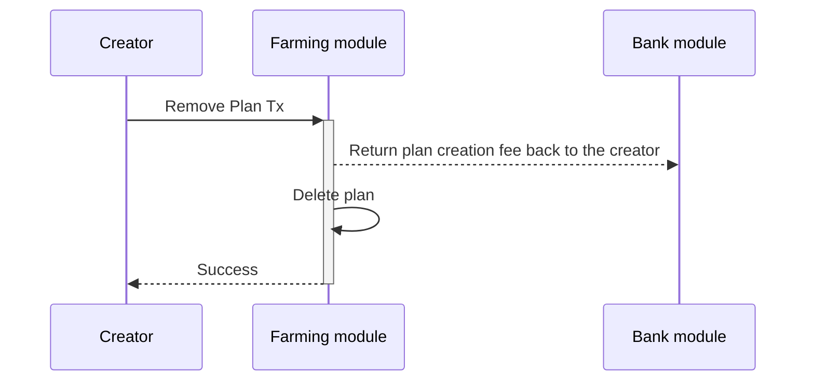
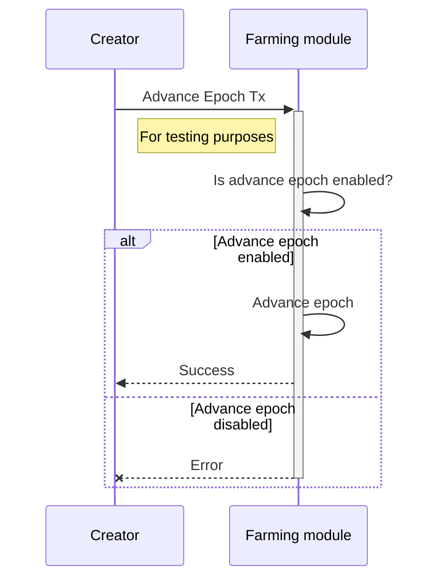

<!-- order: 9 -->

# Transactions flows

## Create Fixed Amount Plan

```mermaid
sequenceDiagram
Creator->>+Farming module: Create Fixed Amount Plan Tx
Farming module->>Guard module: Is chain admin?
alt Chain admin
  Farming module->>Bank module: Charge fee
  Farming module->>Farming module: Set fixed amount plan
  Farming module-->>Creator: Success
else Not a chain admin
  Farming module--x-Creator: Error
end
```

## Create Ratio Plan

```mermaid
sequenceDiagram
Creator->>+Farming module: Create Ratio Plan Tx
Farming module->>Guard module: Is chain admin?
alt Chain admin
  Farming module->>Bank module: Charge fee
  Farming module->>Farming module: Set ratio plan
  Farming module-->>Creator: Success
else Not a chain admin
  Farming module--x-Creator: Error
end
```

## Stake

```mermaid
sequenceDiagram
Creator->>+Farming module: Stake Tx
Farming module->>Bank module: Transfer staking coins from the creator
Note over Farming module, Bank module: The transfer IS restricted by the guard module
Farming module->>Farming module: Set stake
Farming module-->>-Creator: Success
```

## Untake

```mermaid
sequenceDiagram
Creator->>+Farming module: Unstake Tx
Farming module->>Bank module: Return staking coins back to the creator
Note over Farming module, Bank module: The transfer IS NOT restricted by the guard module
Farming module->>Farming module: Set unstake
Farming module-->>-Creator: Success
```

## Harvest

```mermaid
sequenceDiagram
Creator->>+Farming module: Harvest Tx
Farming module->>Bank module: Withdraw farming rewards to the creator
Note over Farming module, Bank module: The transfer IS NOT restricted by the guard module
Farming module-->>-Creator: Success
```

## Remove Plan

```mermaid
sequenceDiagram
Creator->>+Farming module: Remove Plan Tx
Farming module-->>Bank module: Return plan creation fee back to the creator
Farming module->>Farming module: Delete plan
Farming module-->>-Creator: Success
```

## Advance Epoch

```mermaid
sequenceDiagram
Creator->>+Farming module: Advance Epoch Tx
Note left of Farming module: For testing purposes
Farming module->>Farming module: Is advance epoch enabled?
alt Advance epoch enabled
  Farming module->>Farming module: Advance epoch
  Farming module-->>Creator: Success
else Advance epoch disabled
  Farming module--x-Creator: Error
end
```
