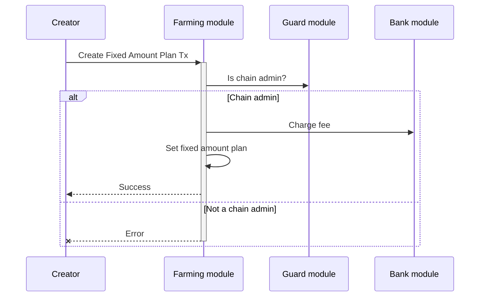
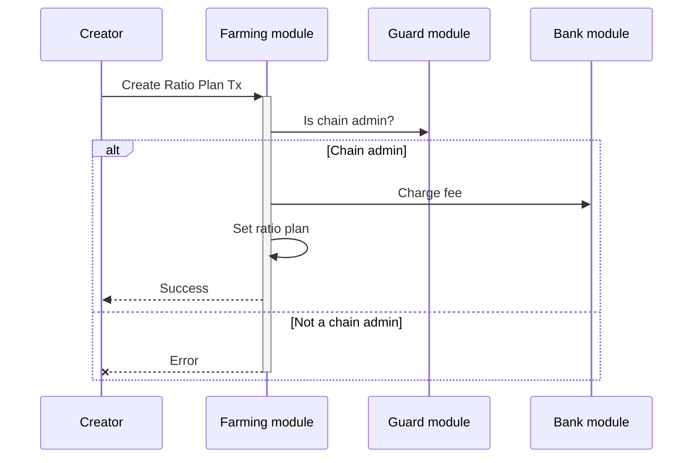
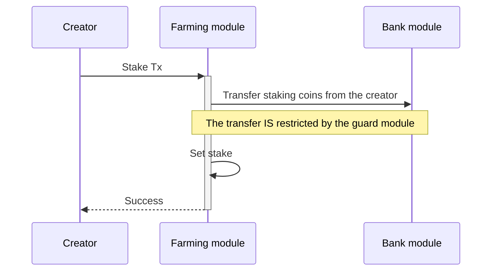
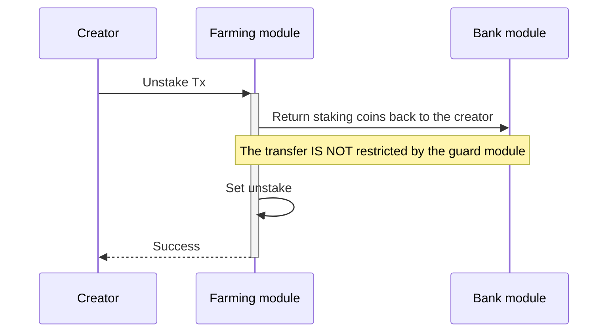
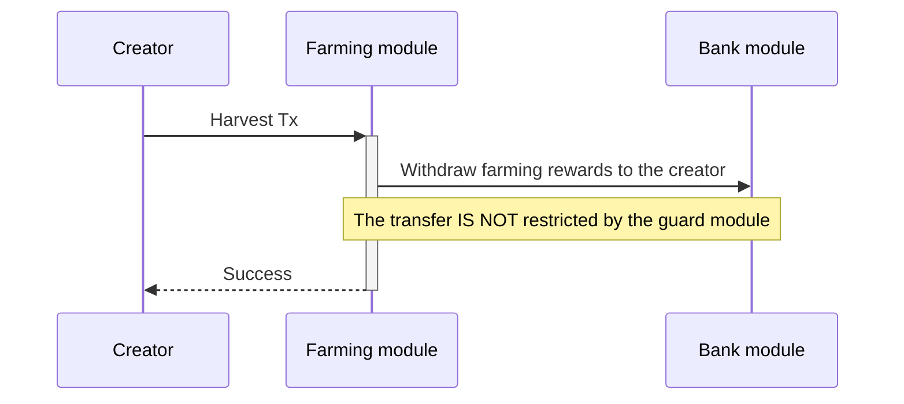
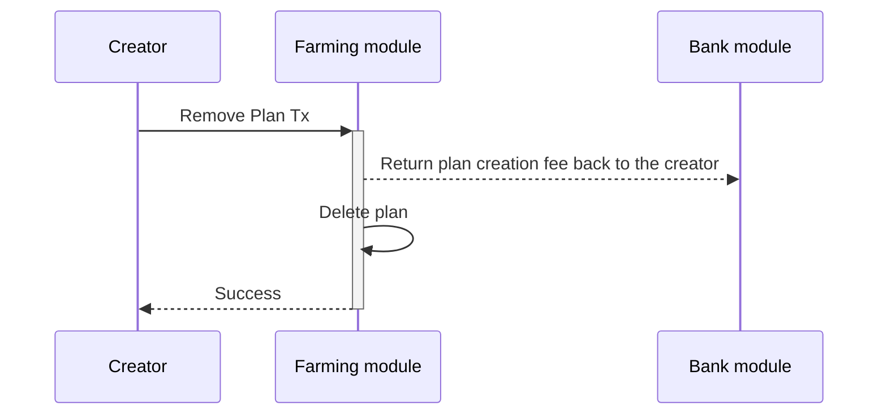
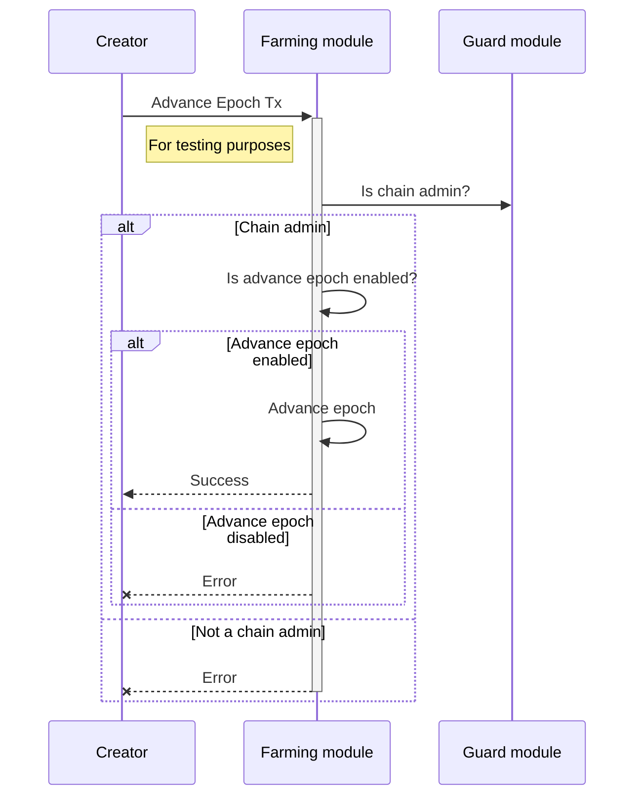

<!-- order: 9 -->

# Transactions flows

## Create Fixed Amount Plan



**Note**: Only the `chain admin` is authorized to execute this type of transaction.

Create a new fixed amount plan. The plan will be created with the `Pending` status. The plan will be activated after the `start_time` is reached. The plan will be deleted after the `end_time` is reached.
The plan will be terminated if the `termination_address` calls the `Remove Plan` transaction. The plan's termination address is set to the plan creator.

CLI command:

```bash
aumegad tx farming create-private-fixed-plan [plan-file] [flags]
```

## Create Ratio Plan



**Note**: Only the `chain admin` is authorized to execute this type of transaction.

Create a new ratio plan. The plan will be created with the `Pending` status. The plan will be activated after the `start_time` is reached. The plan will be deleted after the `end_time` is reached.
The plan will be terminated if the `termination_address` calls the `Remove Plan` transaction. The plan's termination address is set to the plan creator.

This transaction is only enabled when the `EnableRatioPlan` flag is set to `true`.

## Stake



Stake coins to a farming plan.

CLI command:

```bash
aumegad tx farming stake [amount] [flags]
```

## Untake



Unstake coins from a farming plan.

CLI command:

```bash
aumegad tx farming unstake [amount] [flags]
```

## Harvest



Harvest farming rewards from a farming plan.

CLI command:

```bash
aumegad tx farming harvest [staking-coin-denoms] [flags]
```

## Remove Plan



Remove a farming plan.

CLI command:

```bash
aumegad tx farming remove-plan [plan-id] [flags]
```

## Advance Epoch



**Note**: Only the `chain admin` is authorized to execute this type of transaction.

Advance the farming module's epoch. This transaction is only enabled when the `EnableAdvanceEpoch` flag is set to `true`.
