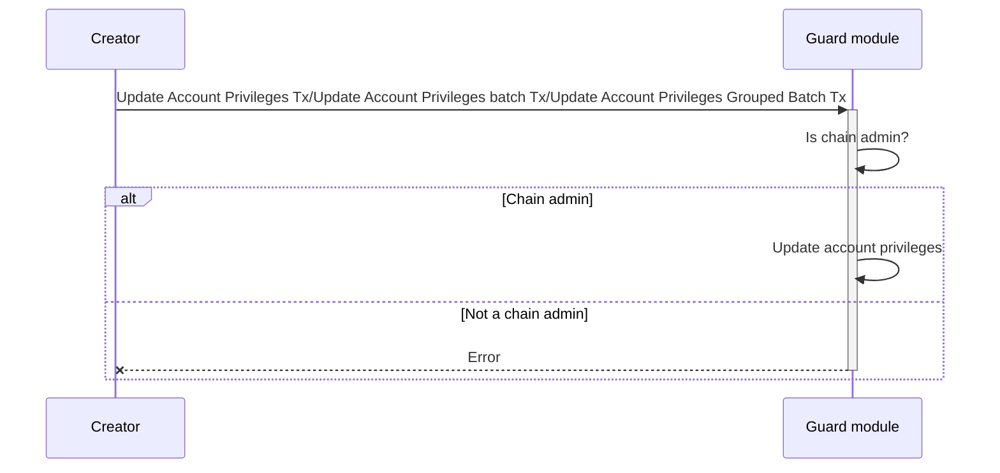
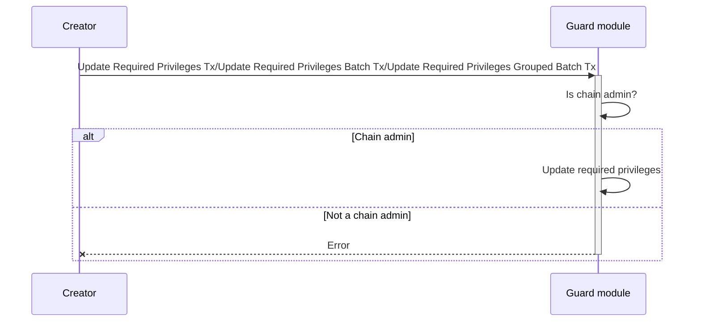
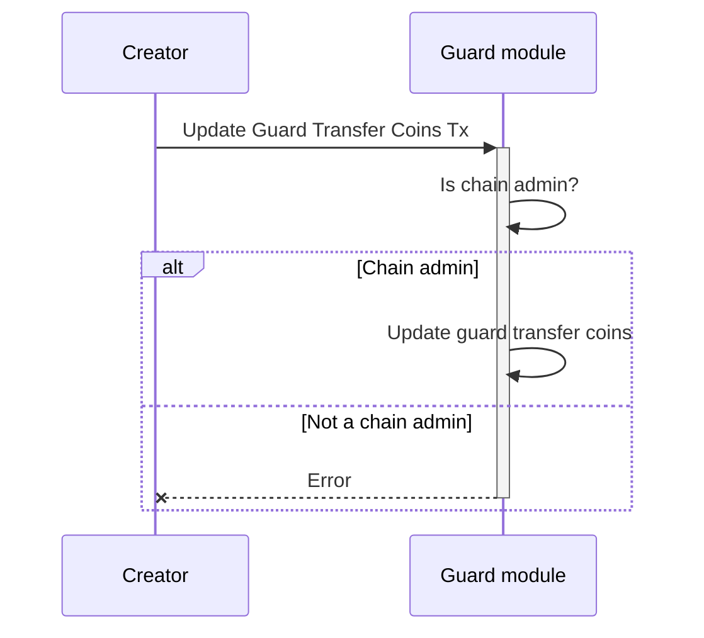
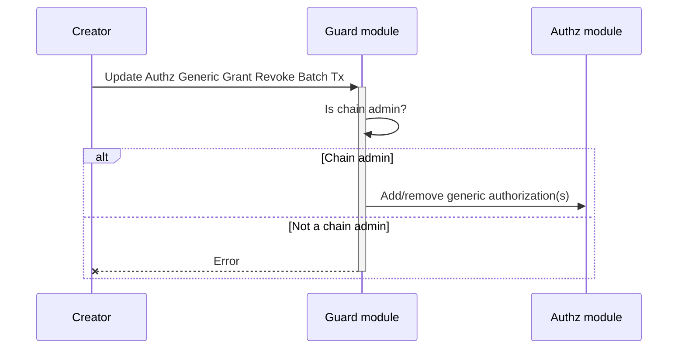

<!-- order: 4 -->

# Transactions flows

## Update Account Privileges/Update Account Privileges batch/Update Account Privileges Grouped Batch



**Note**: Only the `chain admin` is authorized to execute this type of transaction.

Update account privileges for an account. The account can be a user account or a module account. The account privileges are also used to determine if the account is authorized to execute a transaction that is restricted by the guard module. Currently, the only restricted transaction by the guard module is `bank -> transfer`.

CLI command:

```bash
mantrachaind tx guard update-account-privileges [account] [privileges] [flags]
```

## Update Required Privileges/Update Required Privileges Batch/Update Required Privileges Grouped Batch



**Note**: Only the `chain admin` is authorized to execute this type of transaction.

Update required privileges for a entity. Currently, the only entity that can have required privileges is a `denom`. The required privileges are used to determine if an account is authorized to execute a transaction that is restricted by the guard module. Currently, the only restricted transaction by the guard module is `bank -> transfer`.

CLI command:

```bash
mantrachaind tx guard update-required-privileges [index] [privileges] [kind] [flags]
```

## Update Guard Transfer Coins



**Note**: Only the `chain admin` is authorized to execute this type of transaction.

Sets the flag to enable/disable the guard module to restrict the `bank -> transfer` transaction.

CLI command:

```bash
mantrachaind tx guard update-guard-transfer-coins [enabled] [flags]
```

Example:

```bash
mantrachaind tx guard update-guard-transfer-coins true --chain-id mantrachain-9001 --from admin --keyring-backend test --gas auto --gas-adjustment 2 --gas-prices 0.0002uom --home $HOME/.mantrachain
```

## Update Authz Generic Grant Revoke Batch



**Note**: Only the `chain admin` is authorized to execute this type of transaction.

Adds or removes generic authorization(s) for an account. The generic authorization(s) are used to determine if the account is authorized to execute a transaction on behalf of another account.

CLI command:

```bash
mantrachaind tx guard update-authz-generic-grant-revoke-batch [grantee] [payload-json] [flags]
```
