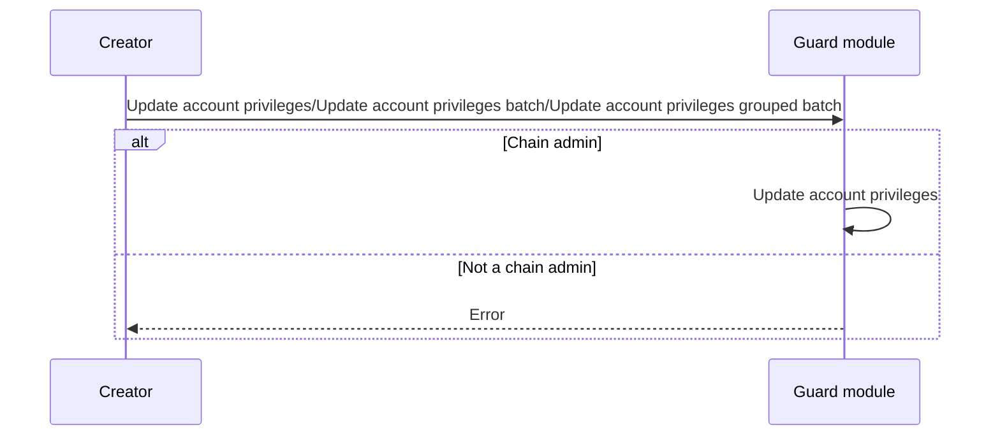
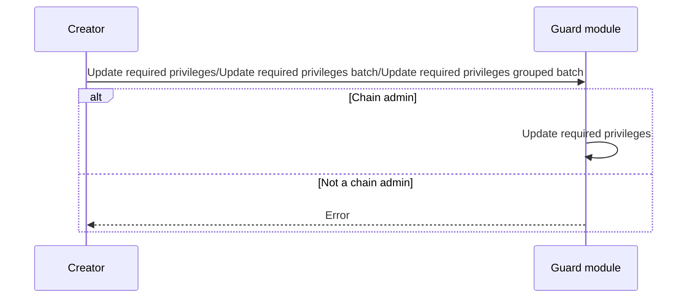
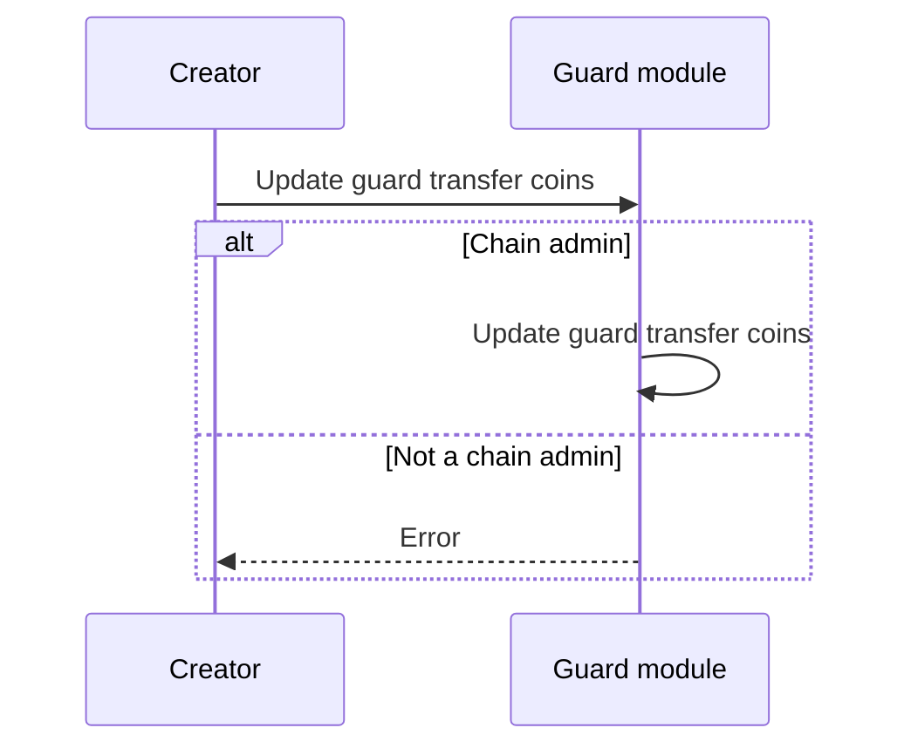

<!-- order: 4 -->

# Transactions flows

## Update account privileges/Update account privileges batch/Update account privileges grouped batch

## Update required privileges/Update required privileges batch/Update required privileges grouped batch

## Update guard transfer coins

