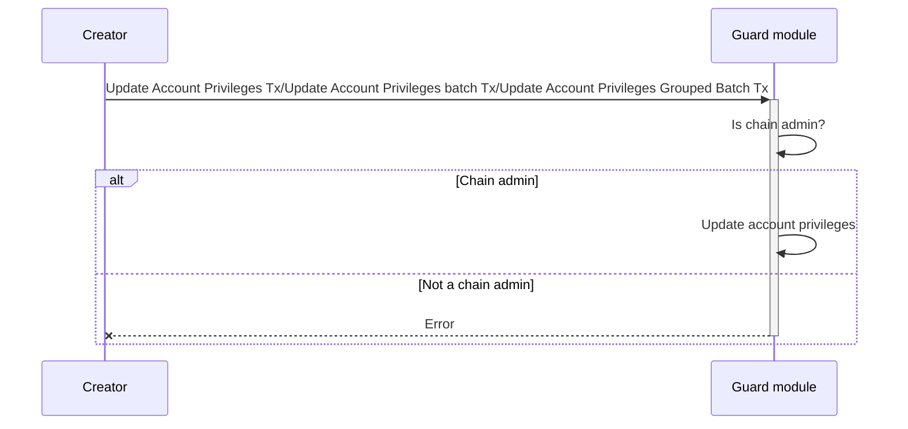
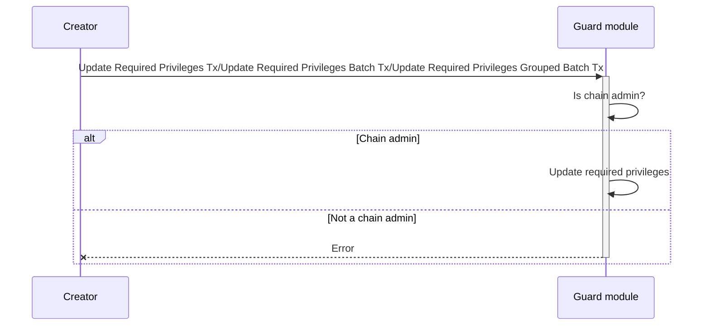
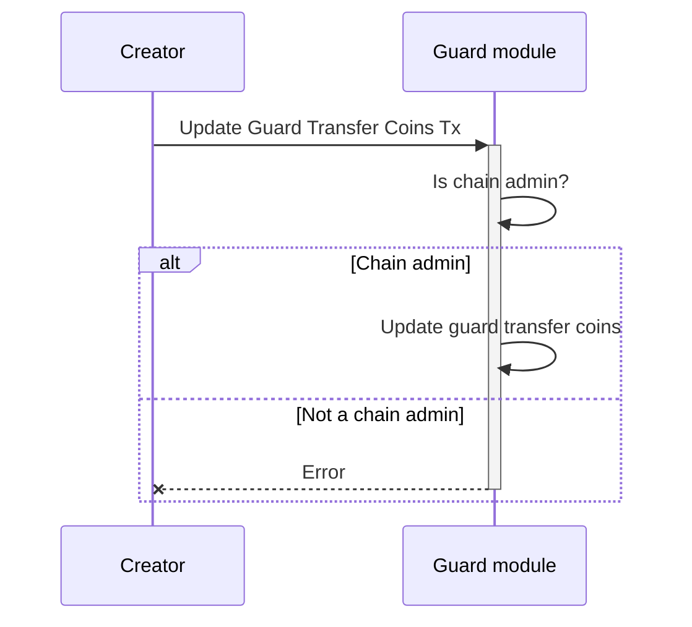
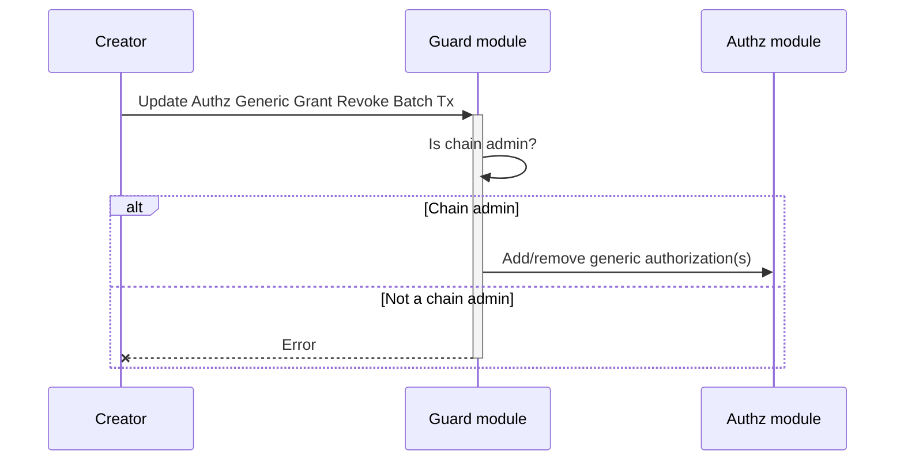

<!-- order: 4 -->

# Transactions flows

## Update Account Privileges/Update Account Privileges batch/Update Account Privileges Grouped Batch

## Update Required Privileges/Update Required Privileges Batch/Update Required Privileges Grouped Batch

## Update Guard Transfer Coins

## Update Authz Generic Grant Revoke Batch

