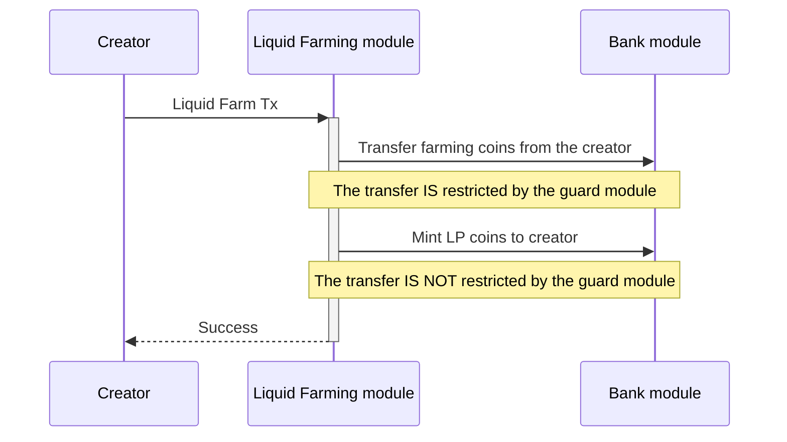
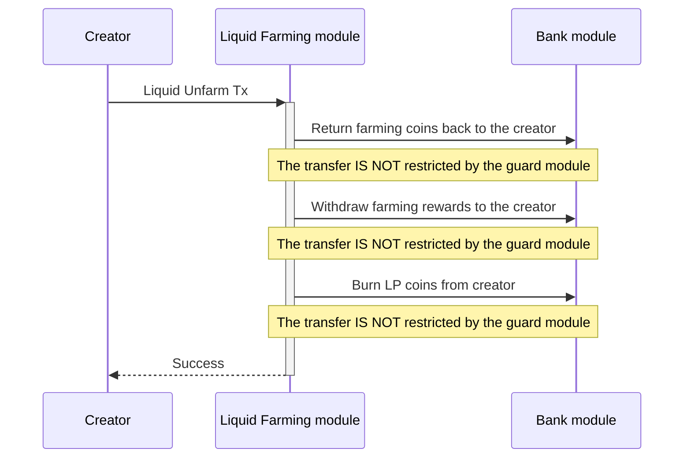
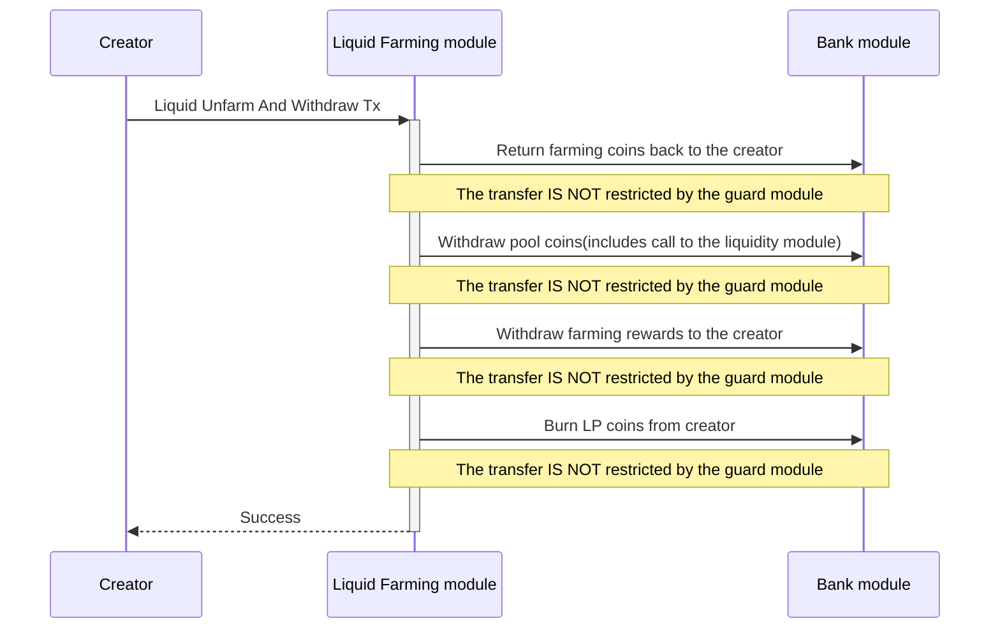
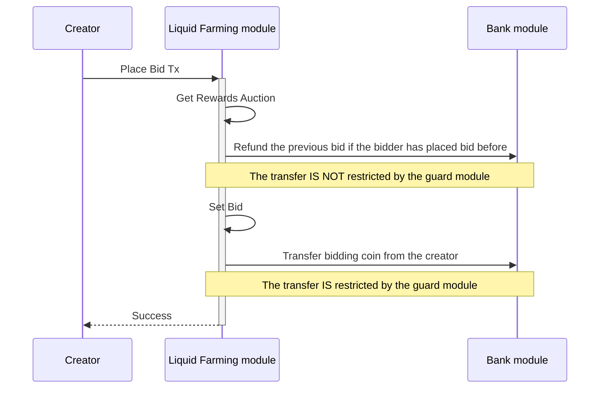
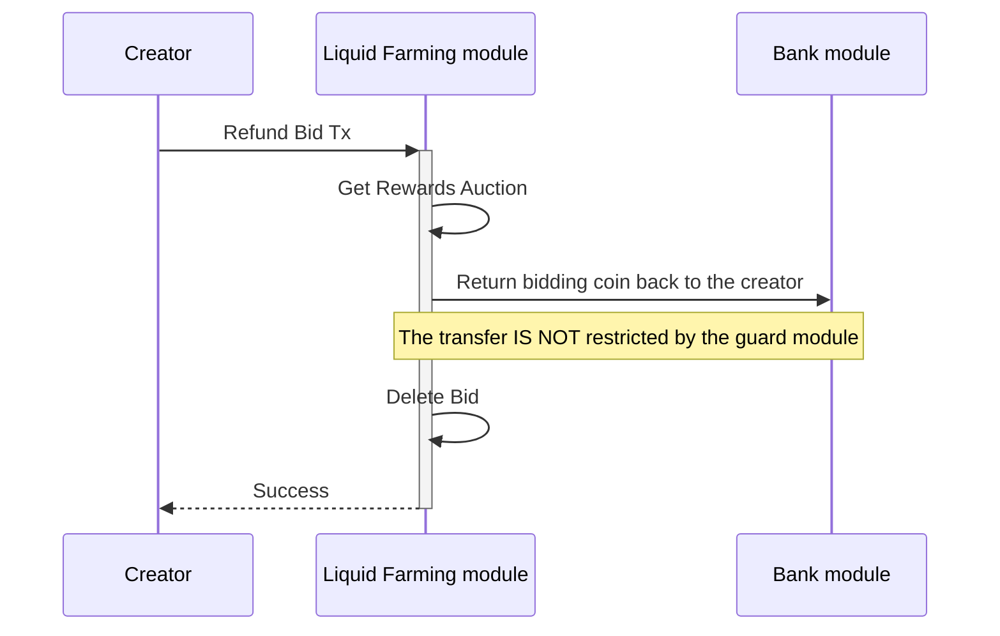
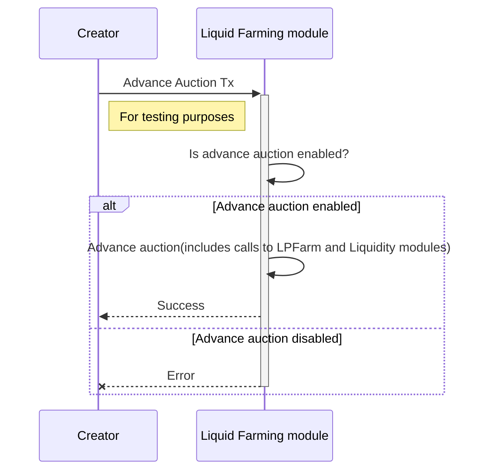

<!-- order: 8 -->

# Transactions flows

## Liquid Farm

```mermaid
sequenceDiagram
Creator->>+Liquid Farming module: Liquid Farm Tx
Liquid Farming module->>Bank module: Transfer farming coins from the creator
Note over Liquid Farming module, Bank module: The transfer IS restricted by the guard module
Liquid Farming module->>Bank module: Mint LP coins to creator
Note over Liquid Farming module, Bank module: The transfer IS NOT restricted by the guard module
Liquid Farming module-->>-Creator: Success
```

## Liquid Unfarm

```mermaid
sequenceDiagram
Creator->>+Liquid Farming module: Liquid Unfarm Tx
Liquid Farming module->>Bank module: Return farming coins back to the creator
Note over Liquid Farming module, Bank module: The transfer IS NOT restricted by the guard module
Liquid Farming module->>Bank module: Withdraw farming rewards to the creator
Note over Liquid Farming module, Bank module: The transfer IS NOT restricted by the guard module
Liquid Farming module->>Bank module: Burn LP coins from creator
Note over Liquid Farming module, Bank module: The transfer IS NOT restricted by the guard module
Liquid Farming module-->>-Creator: Success
```

## Liquid Unfarm And Withdraw

```mermaid
sequenceDiagram
Creator->>+Liquid Farming module: Liquid Unfarm And Withdraw Tx
Liquid Farming module->>Bank module: Return farming coins back to the creator
Note over Liquid Farming module, Bank module: The transfer IS NOT restricted by the guard module
Liquid Farming module->>Bank module: Withdraw pool coins(includes call to the liquidity module)
Note over Liquid Farming module, Bank module: The transfer IS NOT restricted by the guard module
Liquid Farming module->>Bank module: Withdraw farming rewards to the creator
Note over Liquid Farming module, Bank module: The transfer IS NOT restricted by the guard module
Liquid Farming module->>Bank module: Burn LP coins from creator
Note over Liquid Farming module, Bank module: The transfer IS NOT restricted by the guard module
Liquid Farming module-->>-Creator: Success
```

## Place Bid

```mermaid
sequenceDiagram
Creator->>+Liquid Farming module: Place Bid Tx
Liquid Farming module->>Liquid Farming module: Get Rewards Auction
Liquid Farming module->>Bank module: Refund the previous bid if the bidder has placed bid before
Note over Liquid Farming module, Bank module: The transfer IS NOT restricted by the guard module
Liquid Farming module->>Liquid Farming module: Set Bid
Liquid Farming module->>Bank module: Transfer bidding coin from the creator
Note over Liquid Farming module, Bank module: The transfer IS restricted by the guard module
Liquid Farming module-->>-Creator: Success
```

## Refund Bid

```mermaid
sequenceDiagram
Creator->>+Liquid Farming module: Refund Bid Tx
Liquid Farming module->>Liquid Farming module: Get Rewards Auction
Liquid Farming module->>Bank module: Return bidding coin back to the creator
Note over Liquid Farming module, Bank module: The transfer IS NOT restricted by the guard module
Liquid Farming module->>Liquid Farming module: Delete Bid
Liquid Farming module-->>-Creator: Success
```

## Advance Auction

```mermaid
sequenceDiagram
Creator->>+Liquid Farming module: Advance Auction Tx
Note left of Liquid Farming module: For testing purposes
Liquid Farming module->>Liquid Farming module: Is advance auction enabled?
alt Advance auction enabled
  Liquid Farming module->>Liquid Farming module: Advance auction(includes calls to LPFarm and Liquidity modules)
  Liquid Farming module-->>Creator: Success
else Advance auction disabled
  Liquid Farming module--x-Creator: Error
end
```
