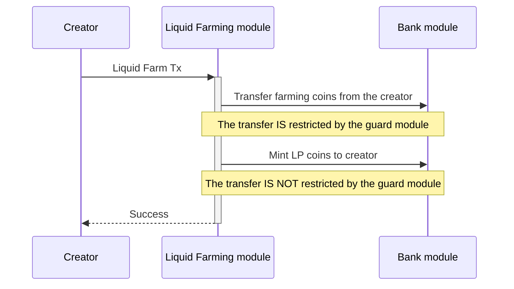
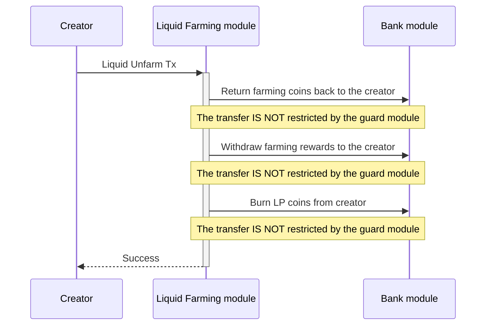
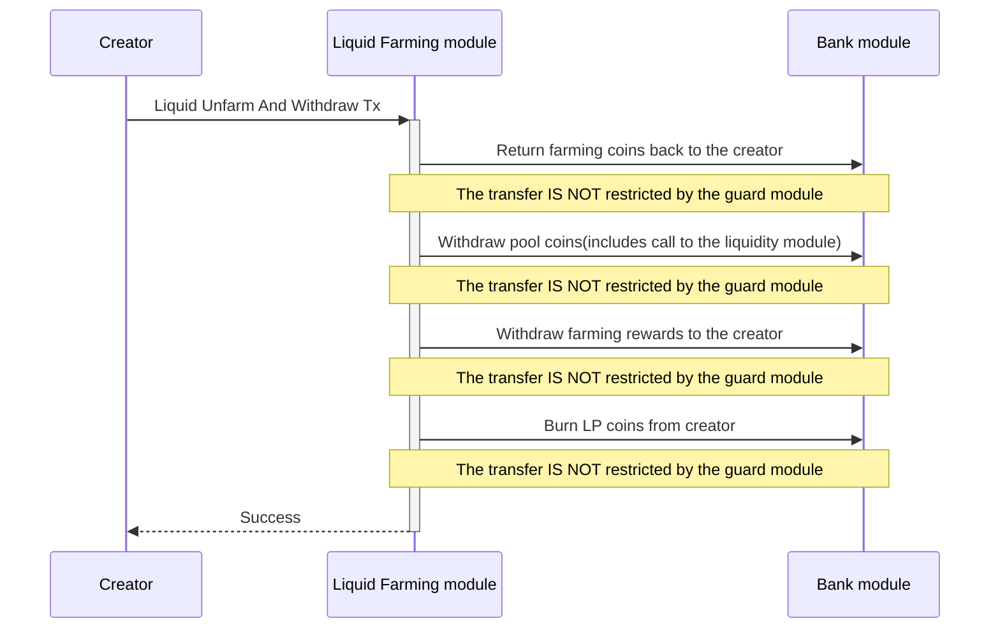
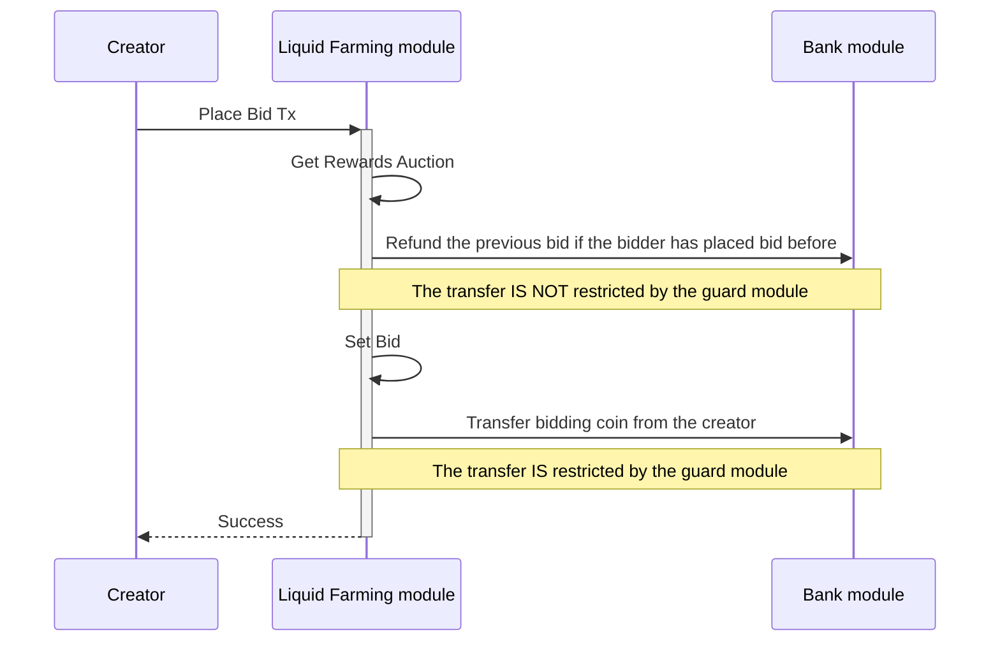
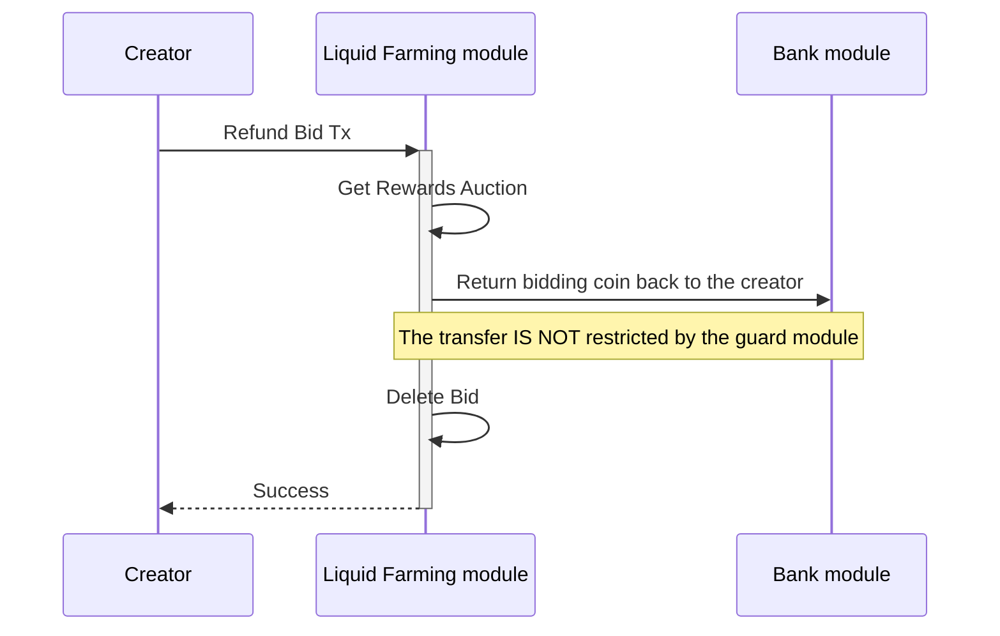
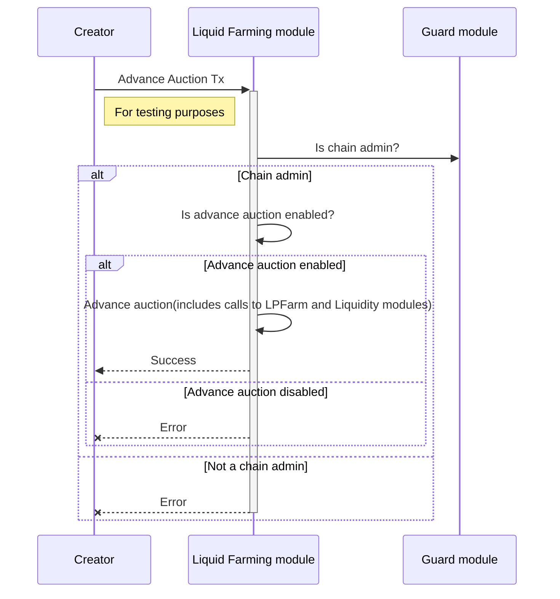

<!-- order: 8 -->

# Transactions flows

## Liquid Farm



Staking pool coins to the `lpfarm` module and minting LFCoin.

CLI command:

```bash
mantrachaind tx liquidfarming liquid-farm [pool-id] [amount] [flags]
```

## Liquid Unfarm



Unstaking pool coins from the `lpfarm` module and burning LFCoin. Also, the tx claims farming rewards.

CLI command:

```bash
mantrachaind tx liquidfarming liquid-unfarm [pool-id] [amount] [flags]
```

## Liquid Unfarm And Withdraw



Unstaking pool coins from the `lpfarm` module, withdrawing pool coins from the `liquidity` module, and burning LFCoin. Also, the tx claims farming rewards.

CLI command:

```bash
mantrachaind tx liquidfarming liquid-unfarm-and-withdraw [pool-id] [amount] [flags]
```

## Place Bid



Placing a bid for the rewards auction.

CLI command:

```bash
mantrachaind tx liquidfarming place-bid [auction-id] [pool-id] [amount] [flags]
```

## Refund Bid



Refunding the bid for the rewards auction.

CLI command:

```bash
mantrachaind tx liquidfarming refund-bid [auction-id] [pool-id] [flags]
```

## Advance Auction



**Note**: Only the `chain admin` is authorized to execute this type of transaction.

Advancing the rewards auction. This transaction is only enabled when the `EnableAdvanceAuction` flag is set to `true`.
