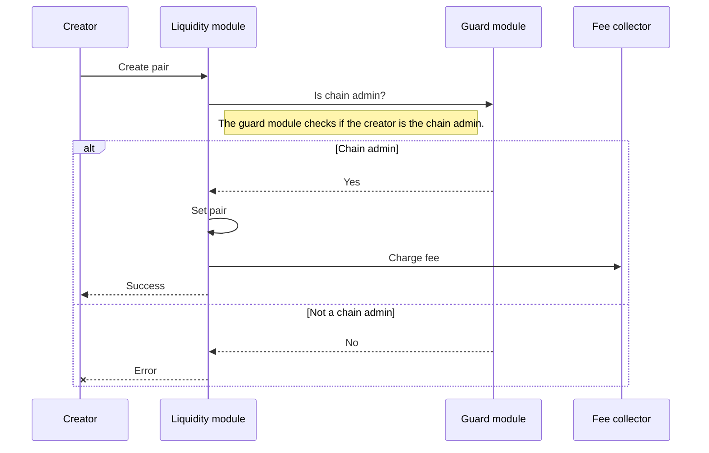
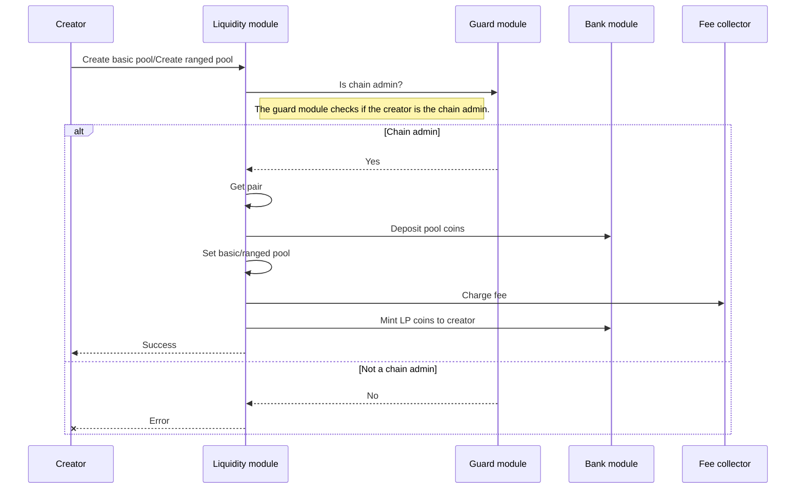
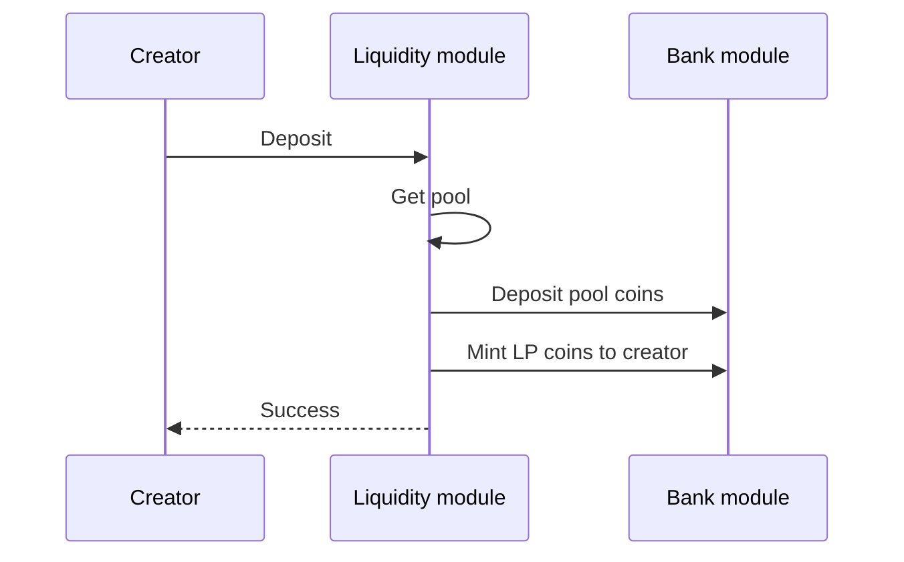
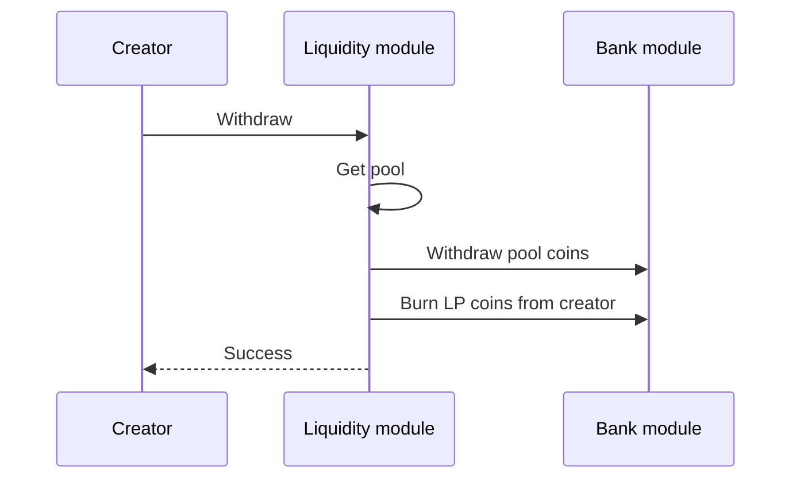
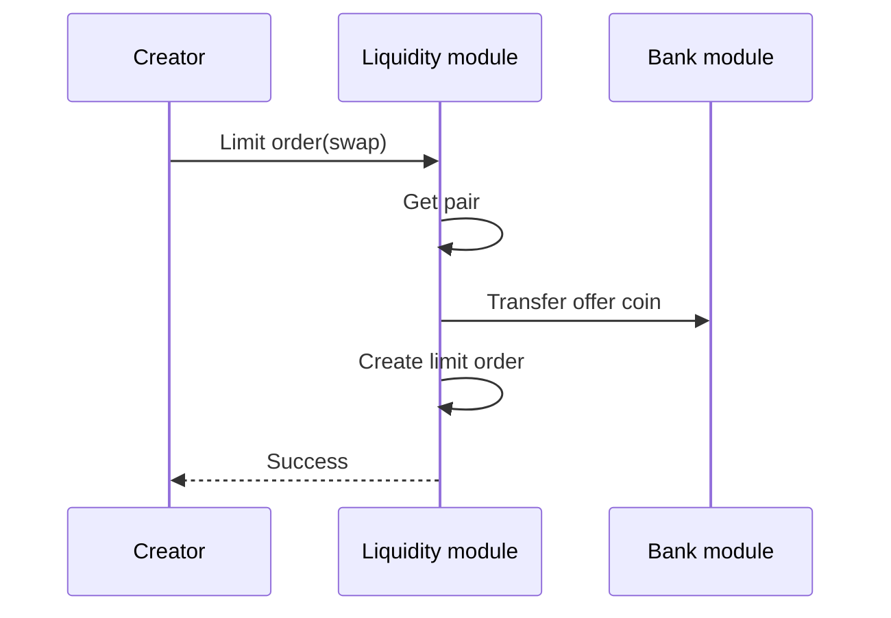
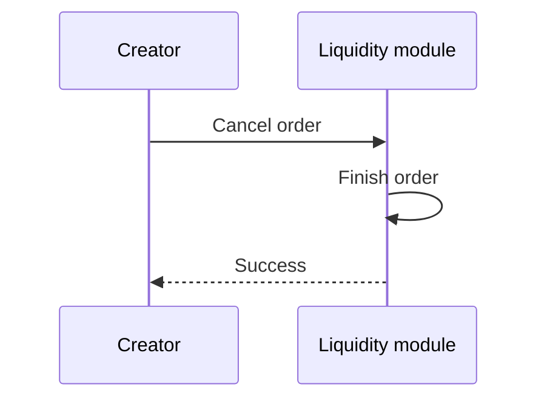
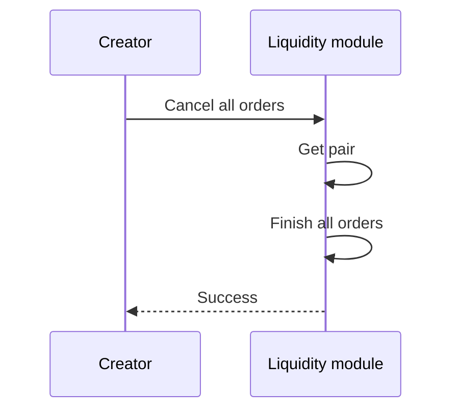

<!-- order: 9 -->

# Transactions flows

## Create pair

```mermaid
sequenceDiagram
Creator ->> Liquidity module: Create pair
Liquidity module->>Guard module: Is chain admin?
Note left of Guard module: The guard module checks if the creator is the chain admin.
alt Chain admin
  Guard module-->>Liquidity module: Yes
  Liquidity module->>Liquidity module: Set pair
  Liquidity module->>Fee collector: Charge fee
  Liquidity module-->> Creator: Success
else Not a chain admin
  Guard module-->>Liquidity module: No
  Liquidity module--x Creator: Error
end
```

## Create basic pool/Create ranged pool

```mermaid
sequenceDiagram
Creator ->> Liquidity module: Create basic pool/Create ranged pool
Liquidity module->>Guard module: Is chain admin?
Note left of Guard module: The guard module checks if the creator is the chain admin.
alt Chain admin
  Guard module-->>Liquidity module: Yes
  Liquidity module->>Liquidity module: Get pair
  Liquidity module->>Bank module: Deposit pool coins
  Liquidity module->>Liquidity module: Set basic/ranged pool
  Liquidity module->>Fee collector: Charge fee
  Liquidity module->> Bank module: Mint LP coins to creator
  Liquidity module-->> Creator: Success
else Not a chain admin
  Guard module-->>Liquidity module: No
  Liquidity module--x Creator: Error
end
```

## Deposit

```mermaid
sequenceDiagram
Creator ->> Liquidity module: Deposit
Liquidity module->>Liquidity module: Get pool
Liquidity module->>Bank module: Deposit pool coins
Liquidity module->> Bank module: Mint LP coins to creator
Liquidity module-->> Creator: Success
```

## Withdraw

```mermaid
sequenceDiagram
Creator ->> Liquidity module: Withdraw
Liquidity module->>Liquidity module: Get pool
Liquidity module->>Bank module: Withdraw pool coins
Liquidity module->> Bank module: Burn LP coins from creator
Liquidity module-->> Creator: Success
```

## Limit order(swap)

```mermaid
sequenceDiagram
Creator ->> Liquidity module: Limit order(swap)
Liquidity module->>Liquidity module: Get pair
Liquidity module->>Bank module: Transfer offer coin
Liquidity module->> Liquidity module: Create limit order
Liquidity module-->> Creator: Success
```

## Cancel order

```mermaid
sequenceDiagram
Creator ->> Liquidity module: Cancel order
Liquidity module->>Liquidity module: Finish order
Liquidity module-->> Creator: Success
```

## Cancel all orders

```mermaid
sequenceDiagram
Creator ->> Liquidity module: Cancel all orders
Liquidity module->>Liquidity module: Get pair
Liquidity module->>Liquidity module: Finish all orders
Liquidity module-->> Creator: Success
```
