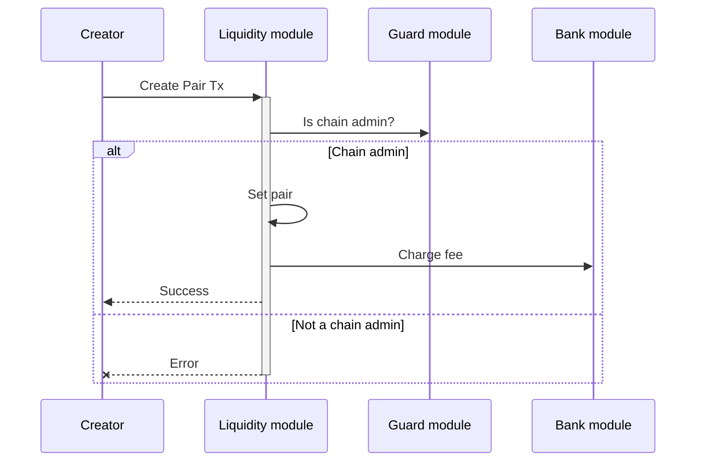
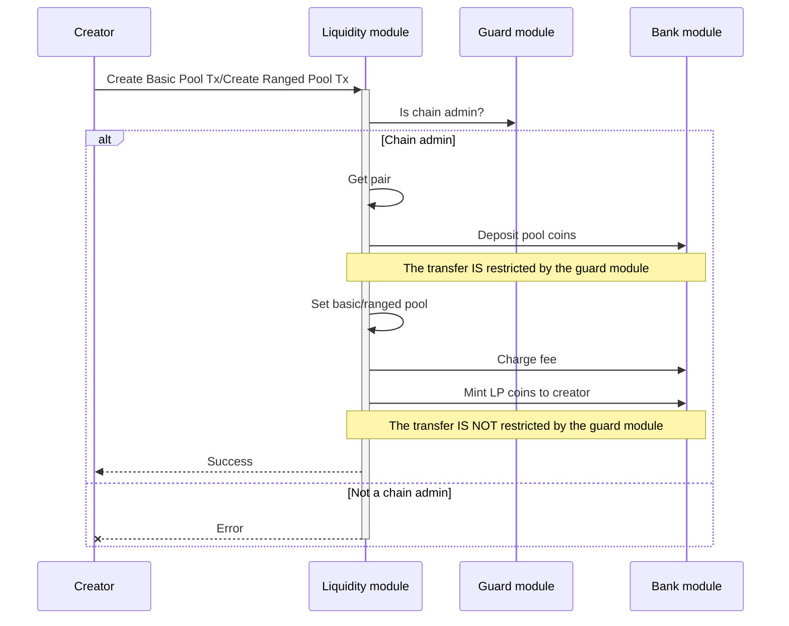
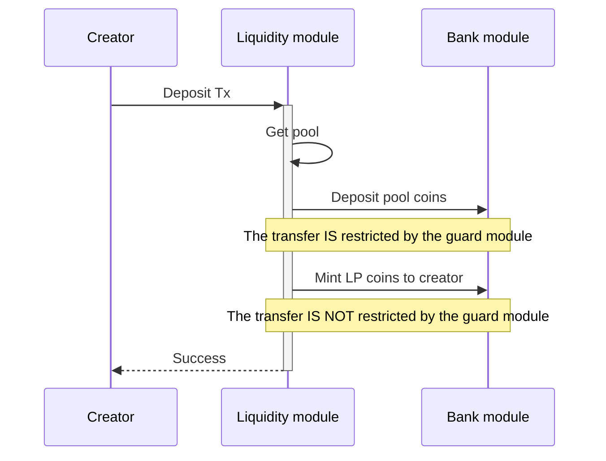
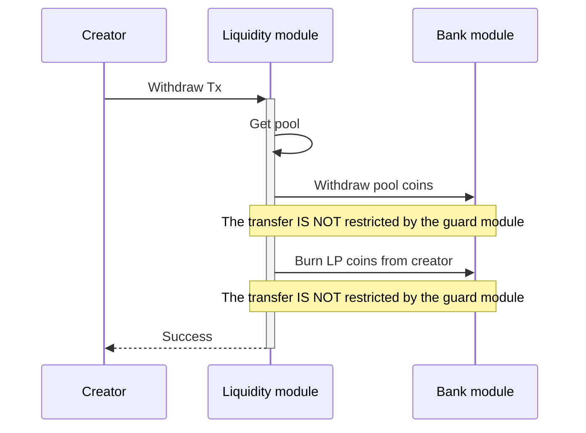
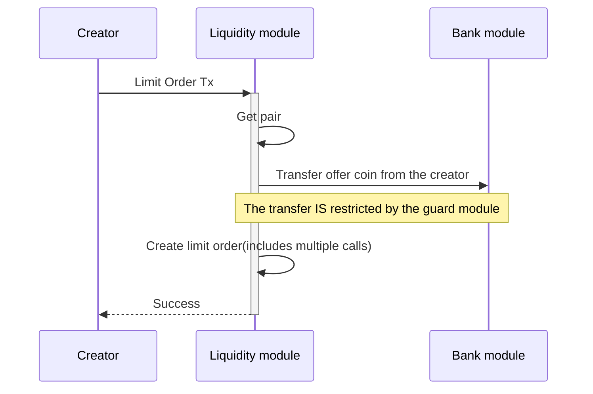
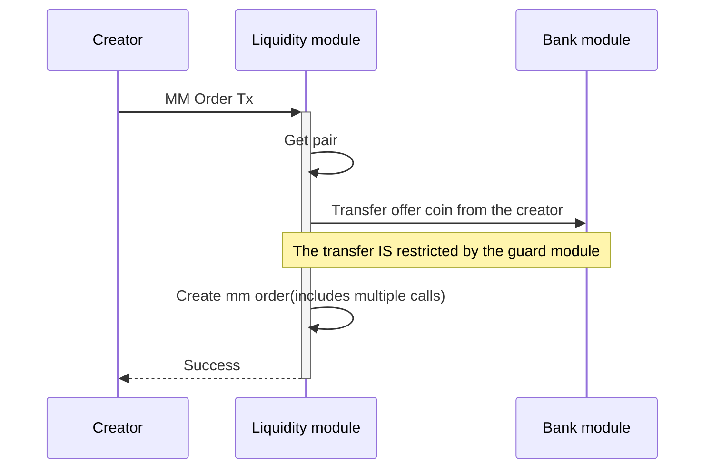
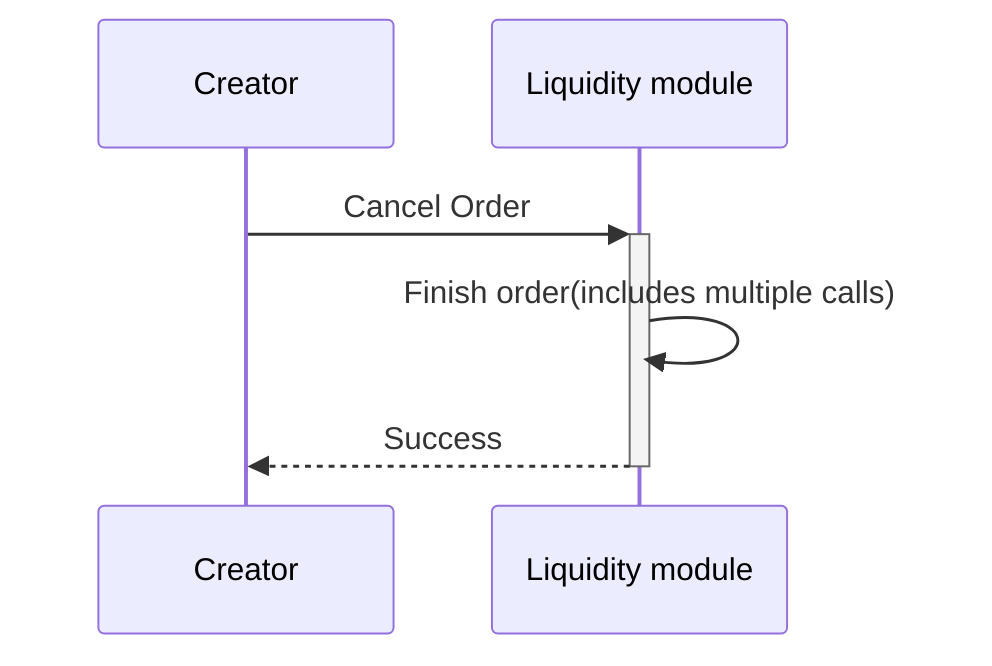
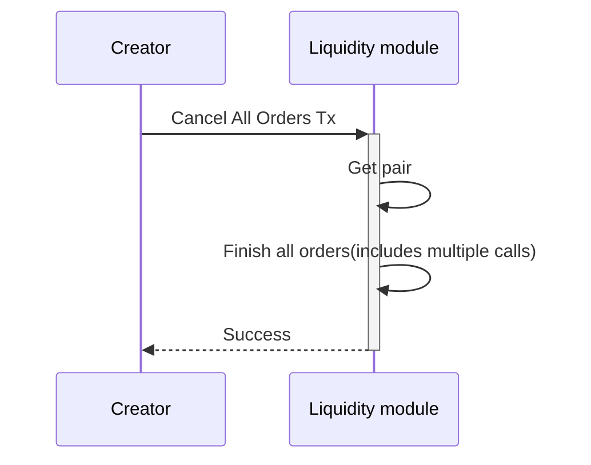
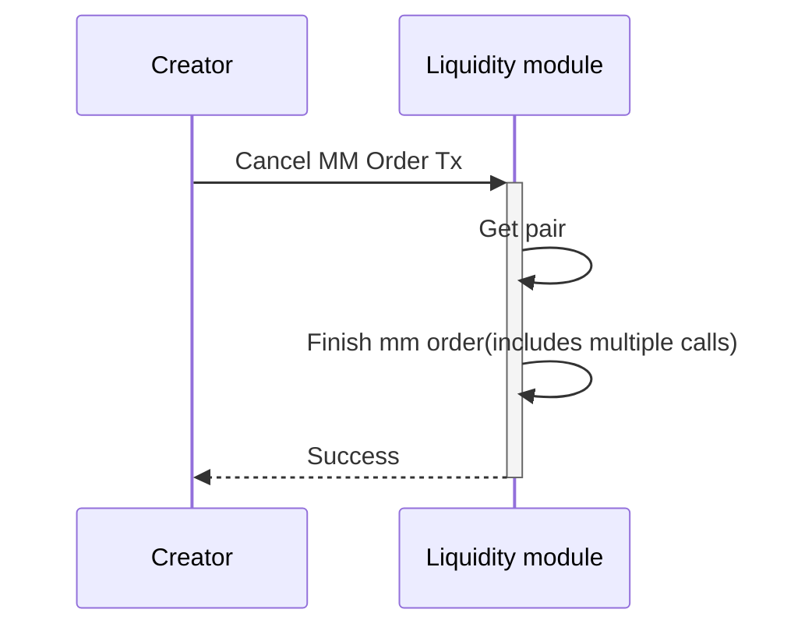

<!-- order: 9 -->

# Transactions flows

## Create Pair



CLI command:

```bash
mantrachaind tx liquidity create-pair [base-coin-denom] [quote-coin-denom] [flags]
```

Example:

```bash
mantrachaind tx liquidity create-pair factory/mantra1axznhnm82lah8qqvp9hxdad49yx3s5dcj66qka/atom factory/mantra1axznhnm82lah8qqvp9hxdad49yx3s5dcj66qka/usdc --chain-id mantrachain-9001 --from admin --keyring-backend test --gas auto --gas-adjustment 2 --gas-prices 0.0002uaum --home $HOME/.mantrachain
```

## Create Basic Pool/Create Ranged Pool



**Note**: Only the `chain admin` is authorized to execute this type of transaction.

CLI commands:

```bash
mantrachaind tx liquidity create-pool [pair-id] [deposit-coins] [flags]
```

```bash
mantrachaind tx liquidity create-ranged-pool [pair-id] [deposit-coins] [min-price] [max-price] [initial-price] [flags]
```

Examples:

```bash
mantrachaind tx liquidity create-pool 1 1000000factory/mantra1axznhnm82lah8qqvp9hxdad49yx3s5dcj66qka/atom,1000000factory/mantra1axznhnm82lah8qqvp9hxdad49yx3s5dcj66qka/usdc --chain-id mantrachain-9001 --from admin --keyring-backend test --gas auto --gas-adjustment 2 --gas-prices 0.0002uaum --home $HOME/.mantrachain
```

```bash
mantrachaind tx liquidity create-ranged-pool 1 1000000factory/mantra1axznhnm82lah8qqvp9hxdad49yx3s5dcj66qka/atom,1000000factory/mantra1axznhnm82lah8qqvp9hxdad49yx3s5dcj66qka/usdc 0.9 1.1 1 --chain-id mantrachain-9001 --from admin --keyring-backend test --gas auto --gas-adjustment 2 --gas-prices 0.0002uaum --home $HOME/.mantrachain
```

## Deposit



CLI command:

```bash
mantrachaind tx liquidity deposit [pool-id] [deposit-coins] [flags]
```

Example:

```bash
mantrachaind tx liquidity deposit 1 1000factory/mantra1axznhnm82lah8qqvp9hxdad49yx3s5dcj66qka/atom,1000factory/mantra1axznhnm82lah8qqvp9hxdad49yx3s5dcj66qka/usdc --chain-id mantrachain-9001 --from admin --keyring-backend test --gas auto --gas-adjustment 2 --gas-prices 0.0002uaum --home $HOME/.mantrachain
```

## Withdraw



CLI command:

```bash
mantrachaind tx liquidity withdraw [pool-id] [pool-coin] [flags]
```

Example:

```bash
mantrachaind tx liquidity withdraw 1 1000pool1 --chain-id mantrachain-9001 --from admin --keyring-backend test --gas auto --gas-adjustment 2 --gas-prices 0.0002uaum --home $HOME/.mantrachain
```

## Limit Order



Create limit order.

CLI command:

```bash
mantrachaind tx liquidity limit-order [pair-id] [direction] [offer-coin] [demand-coin-denom] [price] [amount] [flags]
```

## Market Order


Create market order.

CLI command:

```bash
mantrachaind tx liquidity market-order [pair-id] [direction] [offer-coin] [demand-coin-denom] [amount] [flags]
```

## MM Order



Create mm order.

CLI command:

```bash
mantrachaind tx liquidity mm-order [pair-id] [max-sell-price] [min-sell-price] [sell-amount] [max-buy-price] [min-buy-price] [buy-amount] [flags]
```

## Cancel Order



Cancel order.

CLI command:

```bash
mantrachaind tx liquidity cancel-order [pair-id] [order-id] [flags]
```

## Cancel All Orders



Cancel all orders.

CLI command:

```bash
mantrachaind tx liquidity cancel-all-orders [pair-ids] [flags]
```

## Cancel MM Order



Cancel mm order.

CLI command:

```bash
mantrachaind tx liquidity cancel-mm-order [pair-id] [flags]
```
