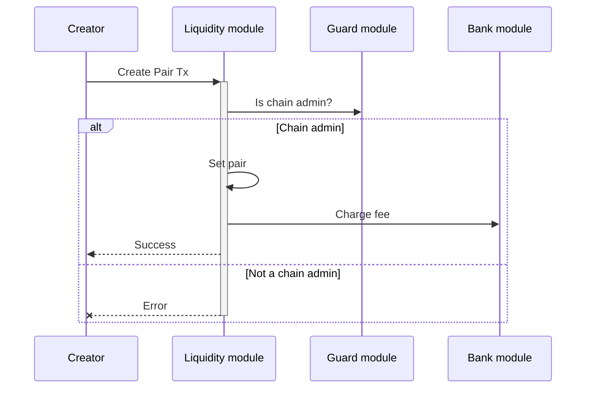
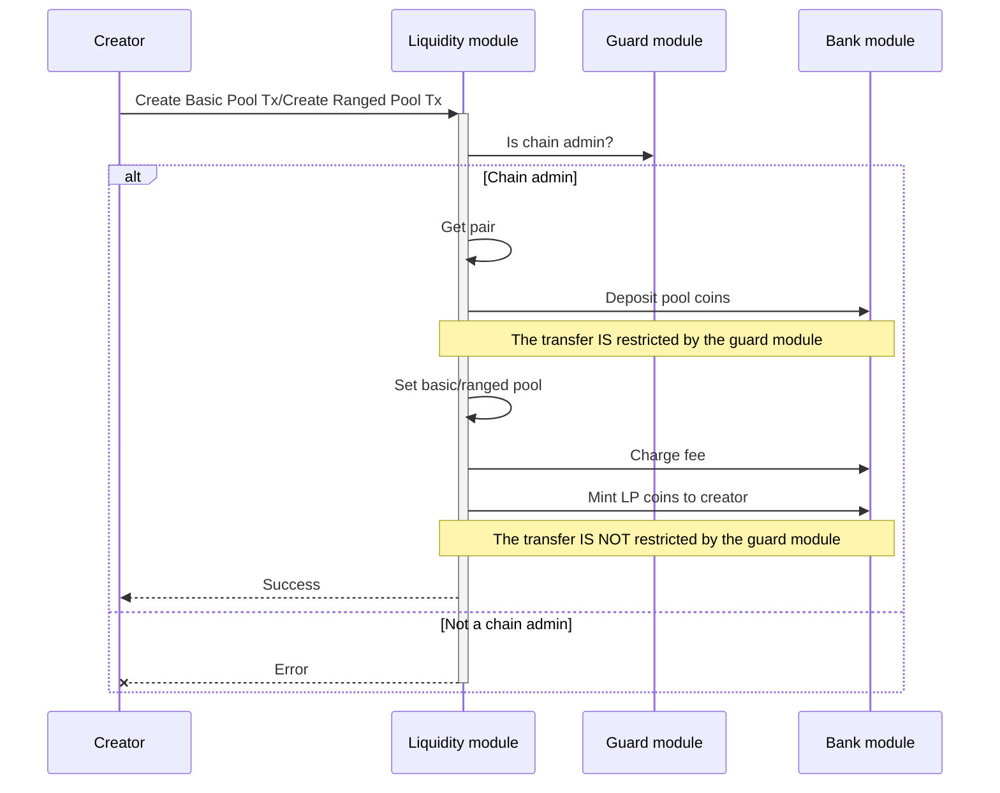
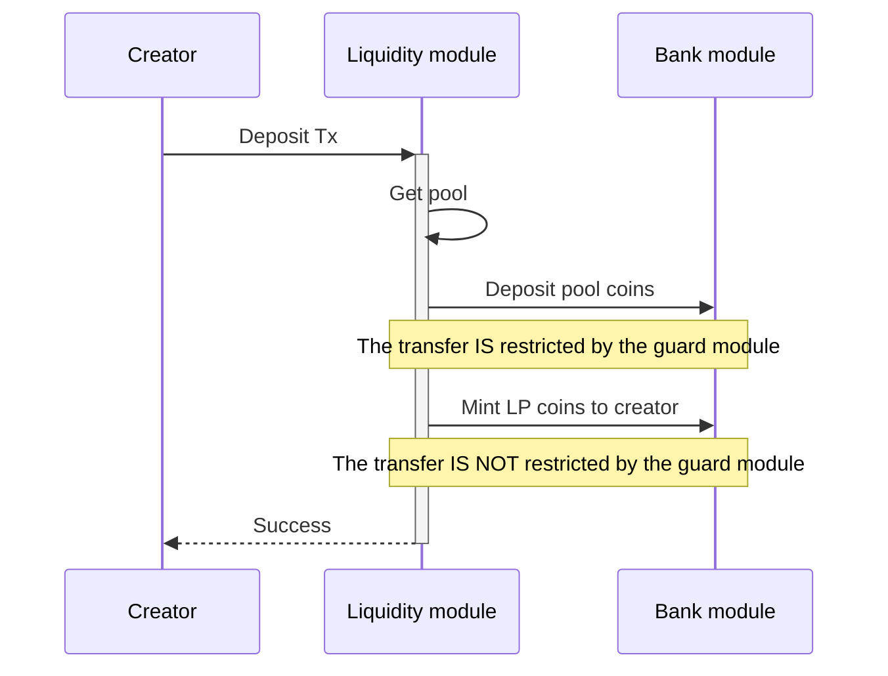
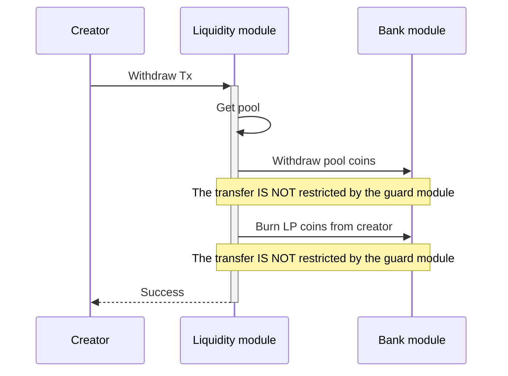
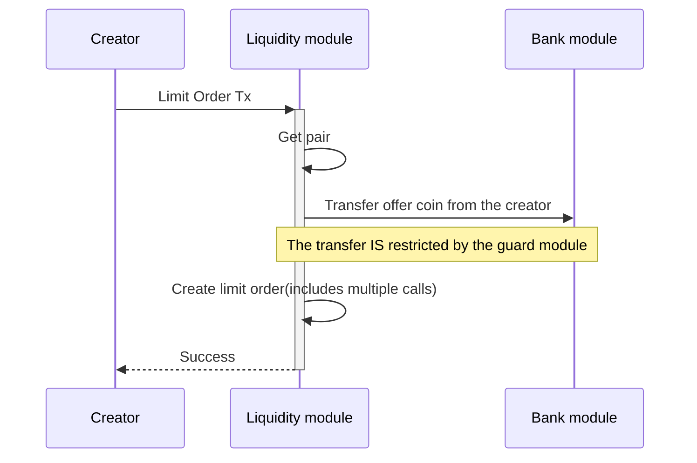
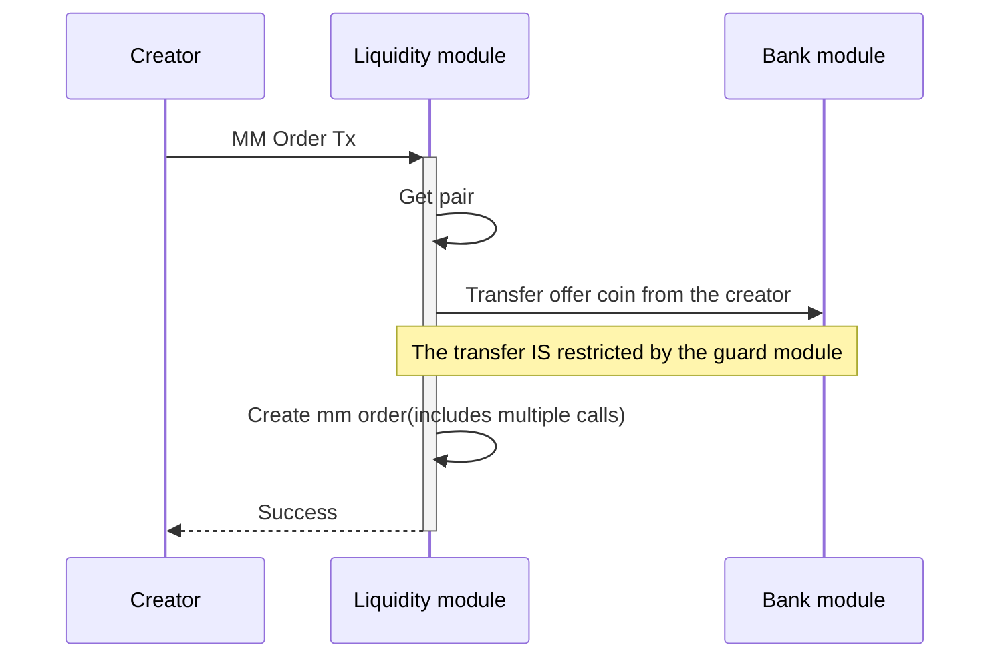
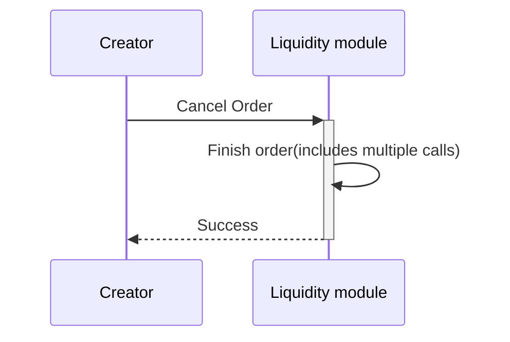
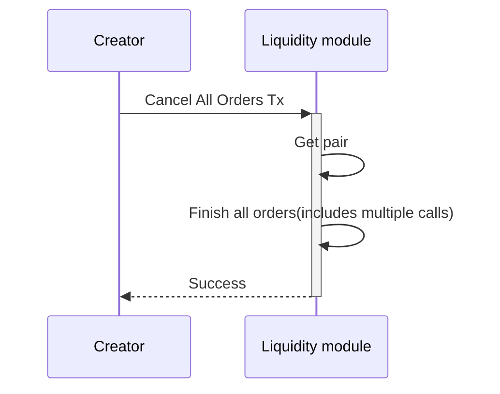
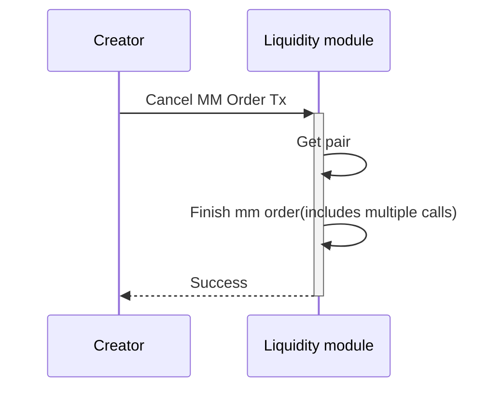

<!-- order: 9 -->

# Transactions flows

## Create Pair

## Create Basic Pool/Create Ranged Pool

## Deposit

## Withdraw

## Limit Order

## Market Order

## MM Order

## Cancel Order

## Cancel All Orders

## Cancel MM Order

