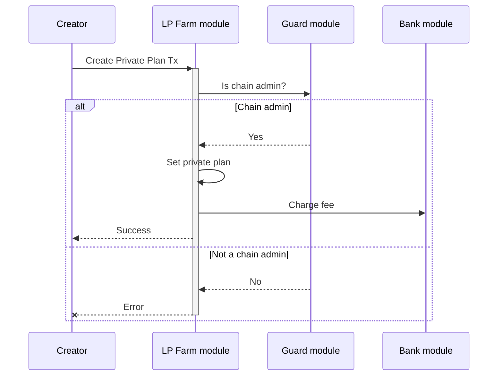
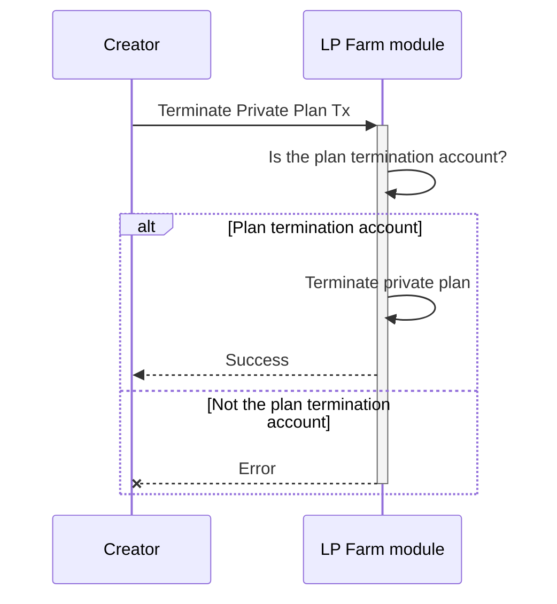
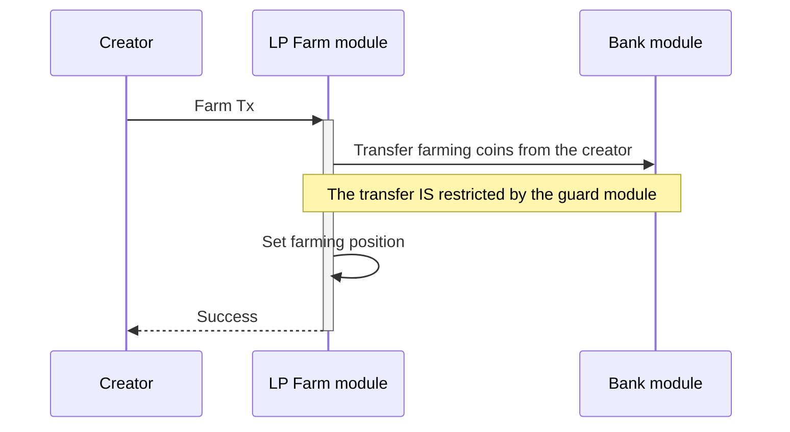
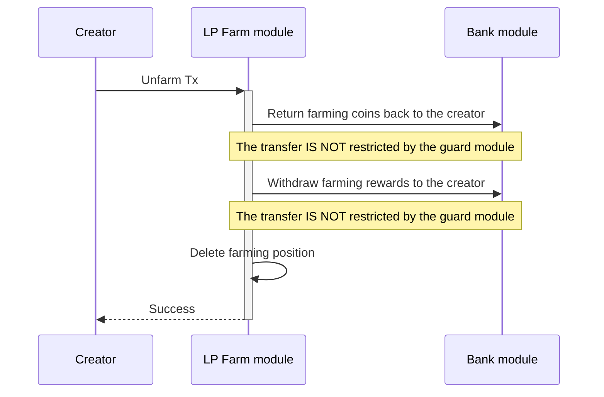
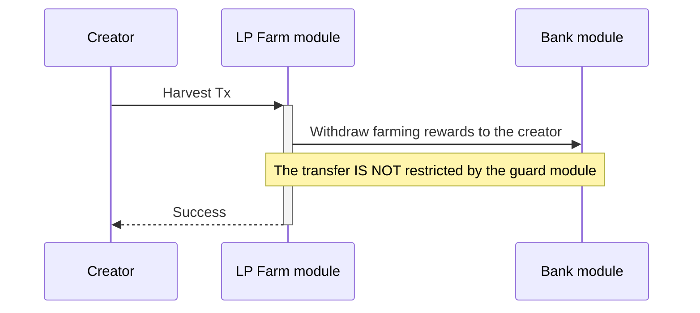

<!-- order: 7 -->

# Transactions flows

## Create Private Plan

**Note**: Only the `chain admin` is authorized to execute this type of transaction.

Create a new private farming plan.
The newly created plan's farming pool address is automatically generated and will have no balances in the account initially.
Manually send enough reward coins to the generated farming pool address to make sure that the rewards allocation happens.
The plan's termination address is set to the plan creator.

## Terminate Private Plan

Terminate a private farming plan.

## Farm

Add a new farming position to an existing farming plan.

## Unfarm

Remove an existing farming position from an existing farming plan.

## Harvest

Withdraw farming rewards from an existing farming plan.
