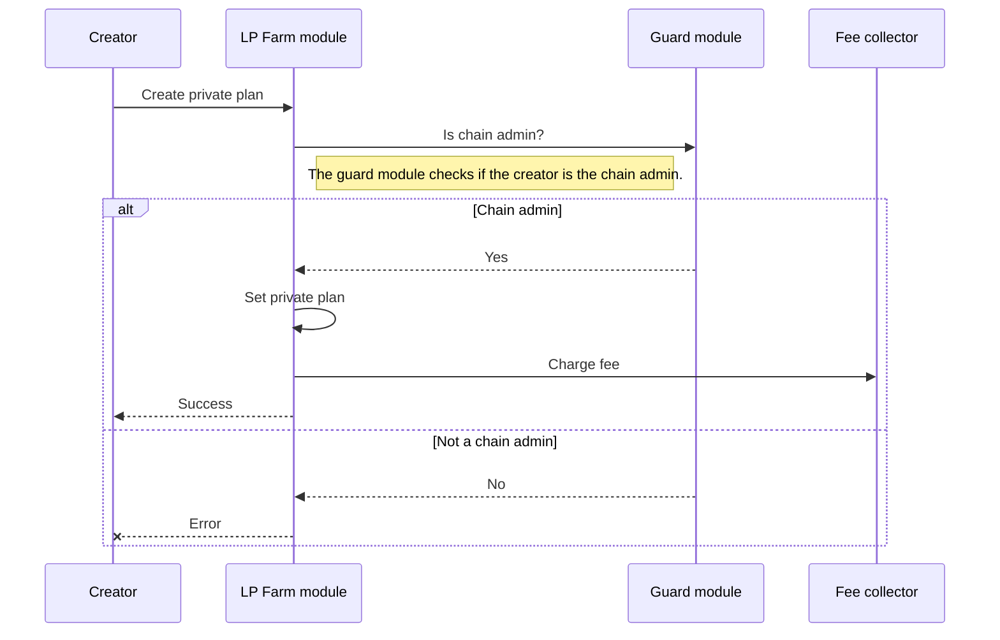
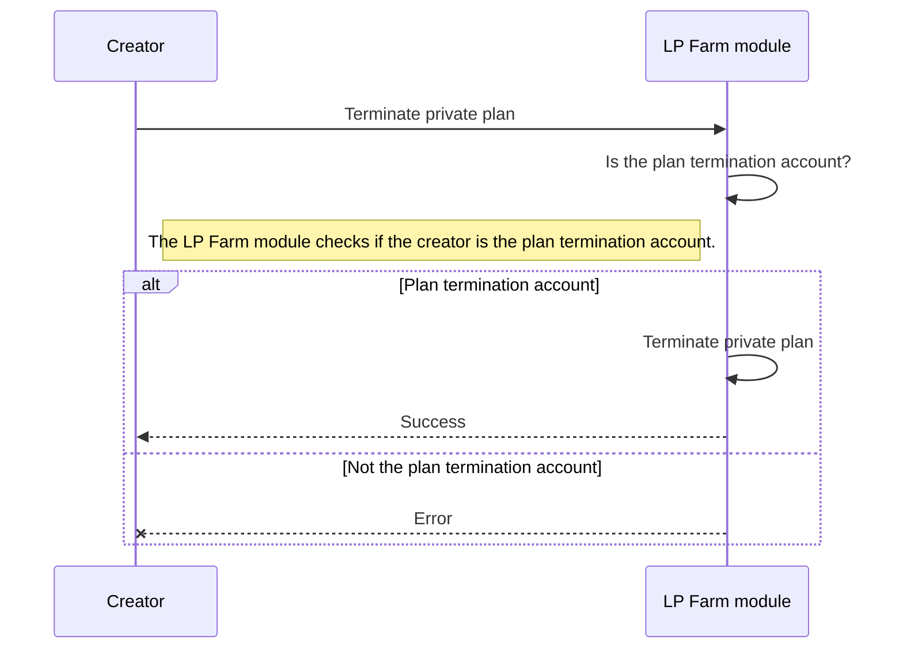
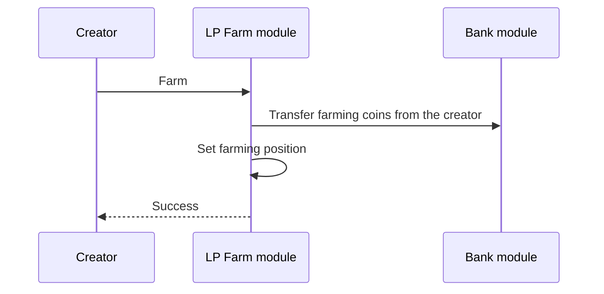
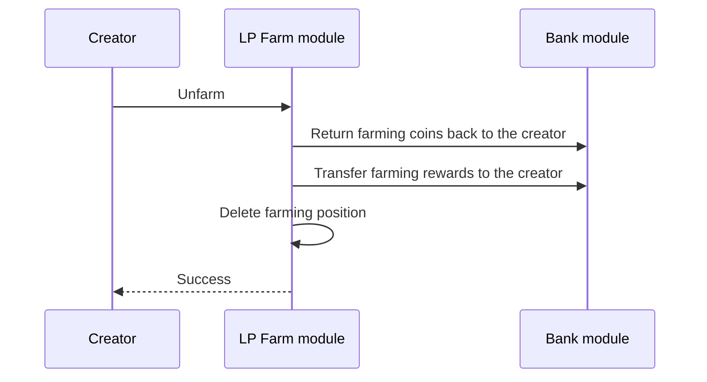
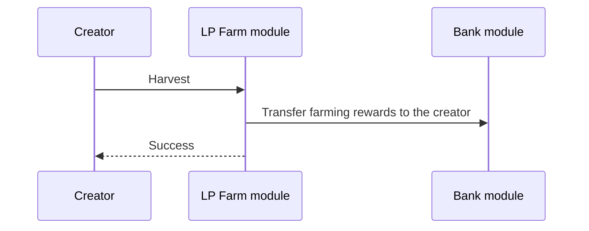

<!-- order: 7 -->

# Transactions flows

## Create private plan

```mermaid
sequenceDiagram
Creator ->> LP Farm module: Create private plan
LP Farm module->>Guard module: Is chain admin?
Note left of Guard module: The guard module checks if the creator is the chain admin.
alt Chain admin
  Guard module-->>LP Farm module: Yes
  LP Farm module->>LP Farm module: Set private plan
  LP Farm module->>Fee collector: Charge fee
  LP Farm module-->> Creator: Success
else Not a chain admin
  Guard module-->>LP Farm module: No
  LP Farm module--x Creator: Error
end
```

## Terminate private plan

```mermaid
sequenceDiagram
Creator ->> LP Farm module: Terminate private plan
LP Farm module->>LP Farm module: Is the plan termination account?
Note left of LP Farm module: The LP Farm module checks if the creator is the plan termination account.
alt Plan termination account
  LP Farm module->>LP Farm module: Terminate private plan
  LP Farm module-->> Creator: Success
else Not the plan termination account
  LP Farm module--x Creator: Error
end
```

## Farm

```mermaid
sequenceDiagram
Creator ->> LP Farm module: Farm
LP Farm module->>Bank module: Transfer farming coins from the creator
LP Farm module->> LP Farm module: Set farming position
LP Farm module-->> Creator: Success
```

## Unfarm

```mermaid
sequenceDiagram
Creator ->> LP Farm module: Unfarm
LP Farm module->>Bank module: Return farming coins back to the creator
LP Farm module->>Bank module: Transfer farming rewards to the creator
LP Farm module->> LP Farm module: Delete farming position
LP Farm module-->> Creator: Success
```

## Harvest

```mermaid
sequenceDiagram
Creator ->> LP Farm module: Harvest
LP Farm module->>Bank module: Transfer farming rewards to the creator
LP Farm module-->> Creator: Success
```
