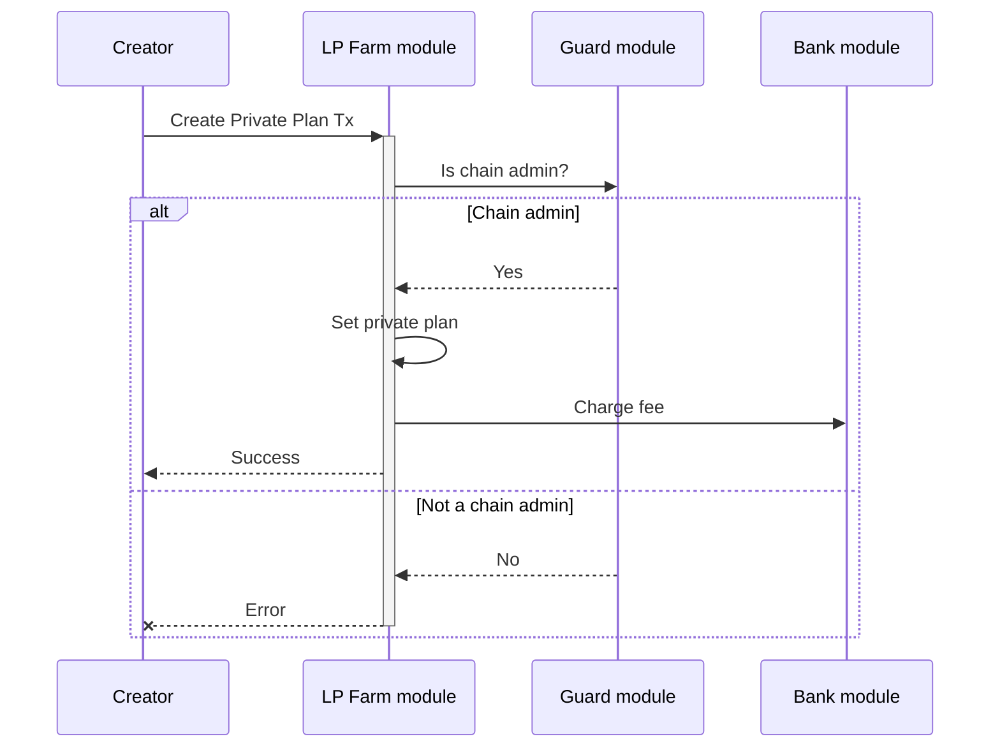
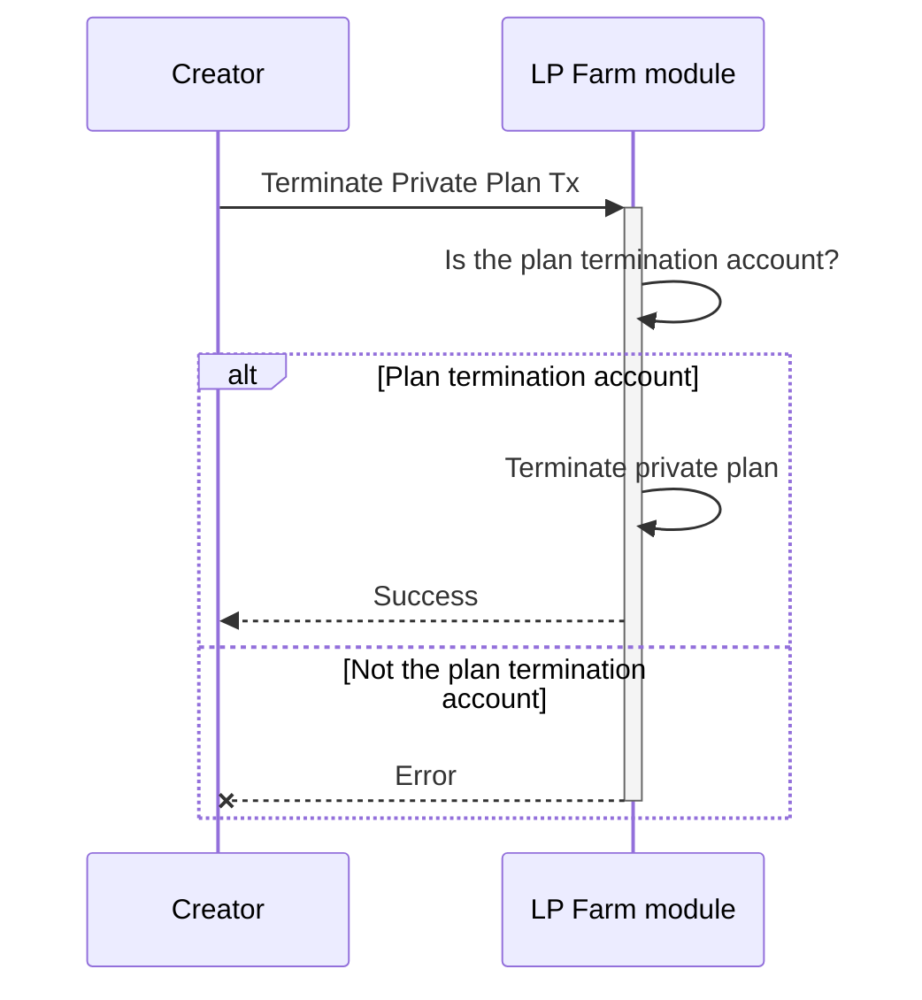
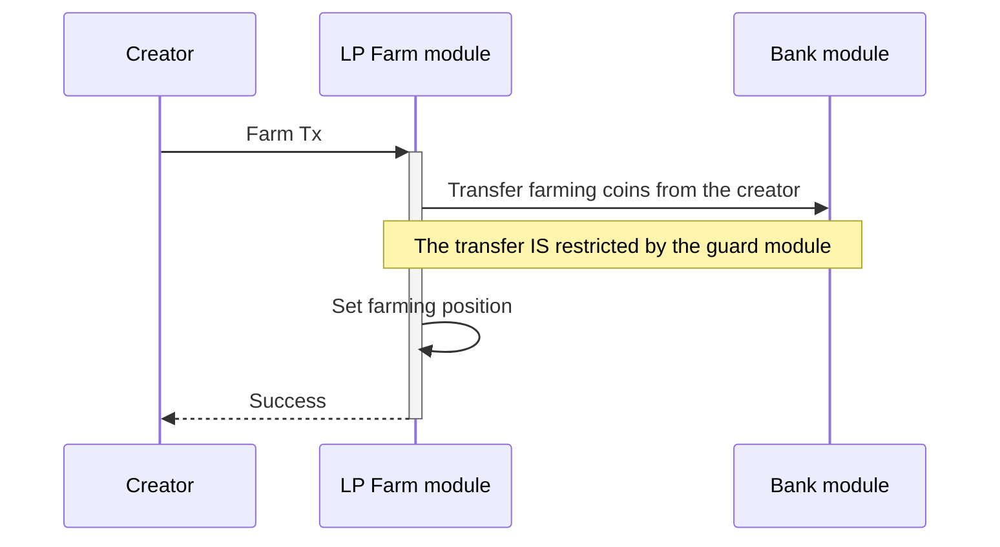
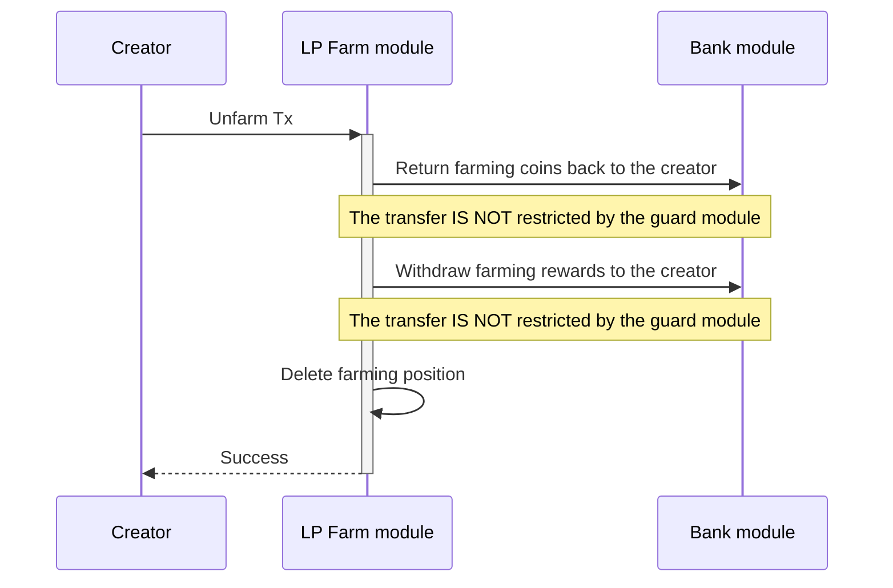
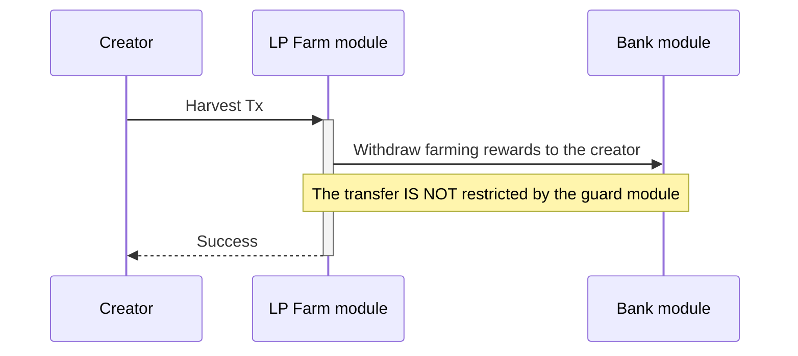

<!-- order: 7 -->

# Transactions flows

## Create Private Plan

```mermaid
sequenceDiagram
Creator->>+LP Farm module: Create Private Plan Tx
LP Farm module->>Guard module: Is chain admin?
alt Chain admin
  Guard module-->>LP Farm module: Yes
  LP Farm module->>LP Farm module: Set private plan
  LP Farm module->>Bank module: Charge fee
  LP Farm module-->>Creator: Success
else Not a chain admin
  Guard module-->>LP Farm module: No
  LP Farm module--x-Creator: Error
end
```

## Terminate Private Plan

```mermaid
sequenceDiagram
Creator->>+LP Farm module: Terminate Private Plan Tx
LP Farm module->>LP Farm module: Is the plan termination account?
alt Plan termination account
  LP Farm module->>LP Farm module: Terminate private plan
  LP Farm module-->>Creator: Success
else Not the plan termination account
  LP Farm module--x-Creator: Error
end
```

## Farm

```mermaid
sequenceDiagram
Creator->>+LP Farm module: Farm Tx
LP Farm module->>Bank module: Transfer farming coins from the creator
Note over LP Farm module, Bank module: The transfer IS restricted by the guard module
LP Farm module->>LP Farm module: Set farming position
LP Farm module-->>-Creator: Success
```

## Unfarm

```mermaid
sequenceDiagram
Creator->>+LP Farm module: Unfarm Tx
LP Farm module->>Bank module: Return farming coins back to the creator
Note over LP Farm module, Bank module: The transfer IS NOT restricted by the guard module
LP Farm module->>Bank module: Withdraw farming rewards to the creator
Note over LP Farm module, Bank module: The transfer IS NOT restricted by the guard module
LP Farm module->>LP Farm module: Delete farming position
LP Farm module-->>-Creator: Success
```

## Harvest

```mermaid
sequenceDiagram
Creator->>+LP Farm module: Harvest Tx
LP Farm module->>Bank module: Withdraw farming rewards to the creator
Note over LP Farm module, Bank module: The transfer IS NOT restricted by the guard module
LP Farm module-->>-Creator: Success
```
