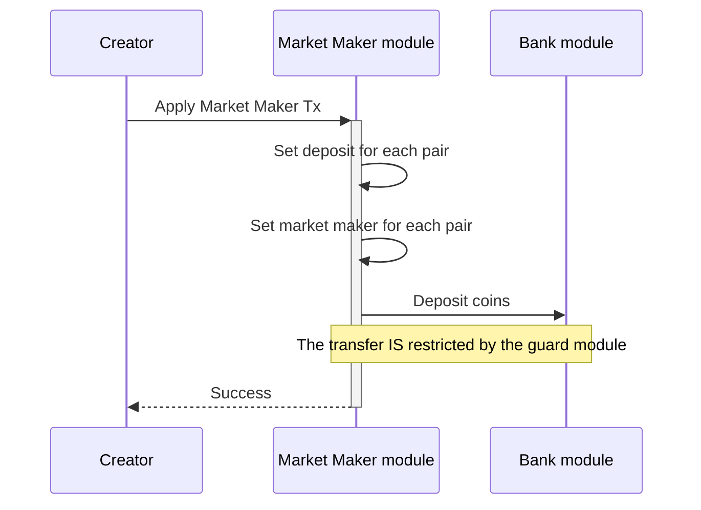
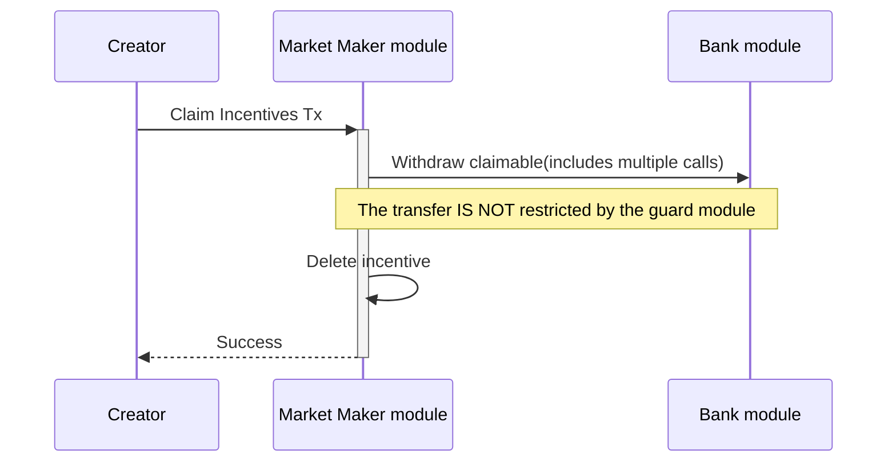

<!-- order: 8 -->

# Transactions flows

## Apply Market Maker



Apply market maker for a list of pairs.

CLI command:

```bash
mantrachaind tx marketmaker apply [pool-ids] [flags]
```

## Claim Incentives



Claim incentives.

CLI command:

```bash
mantrachaind tx liquidfarming claim [flags]
```
