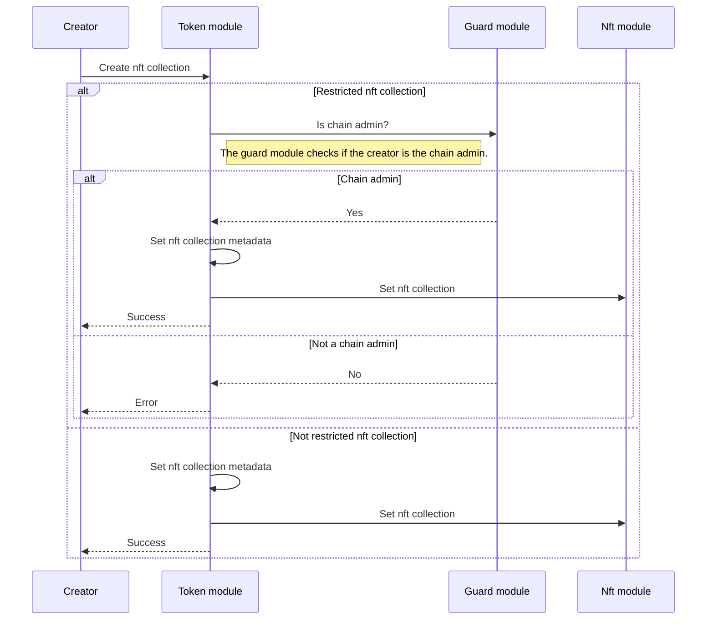
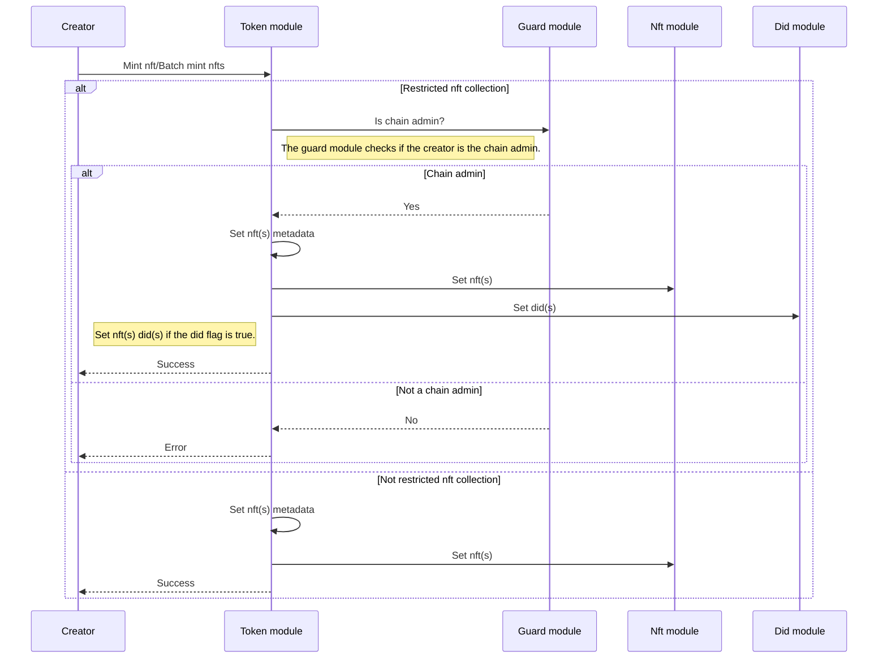
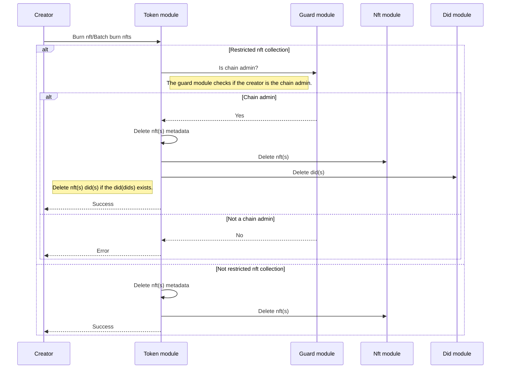
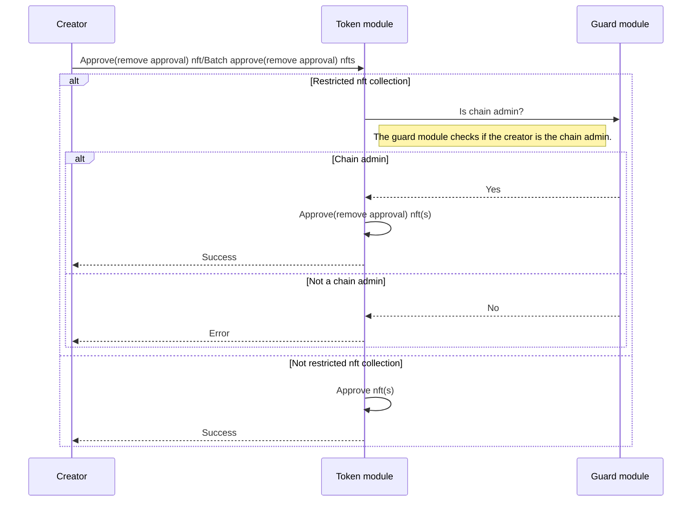
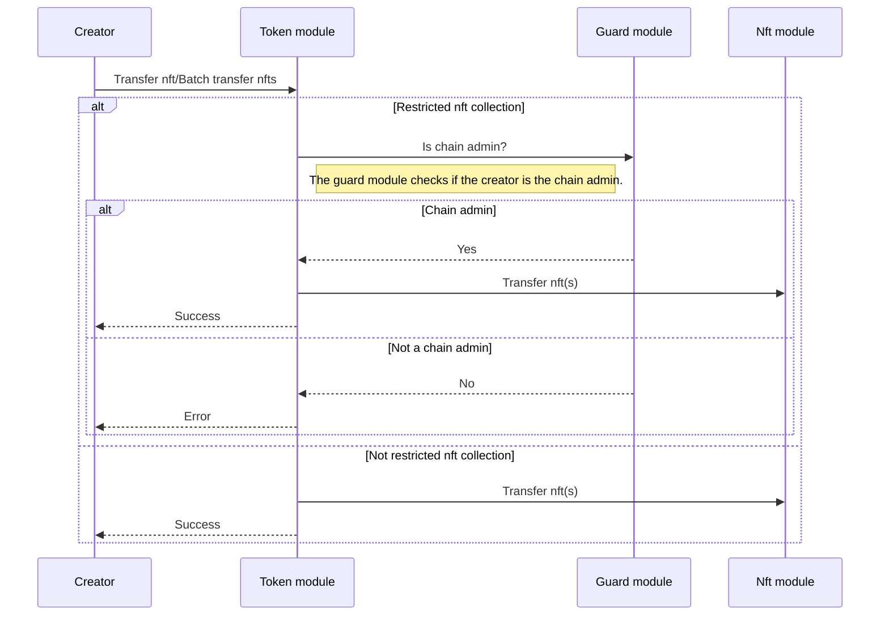

<!-- order: 1 -->

# Transactions flows

## Create nft collection

## Mint nft/Batch mint nfts

## Burn nft/Batch burn nfts

## Approve nft/Batch approve nfts

## Transfer nft/Batch transfer nfts

