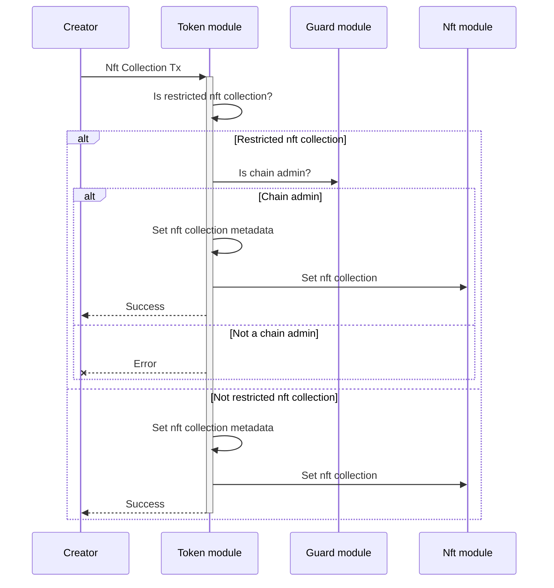
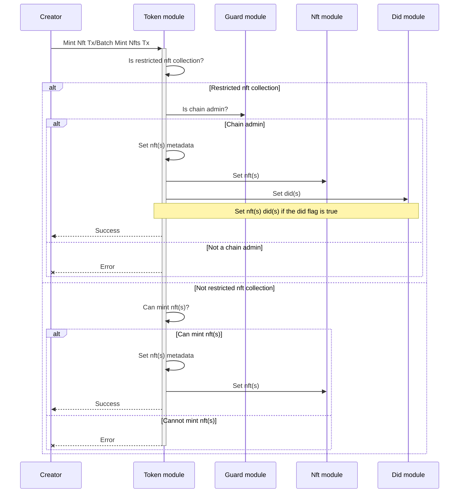
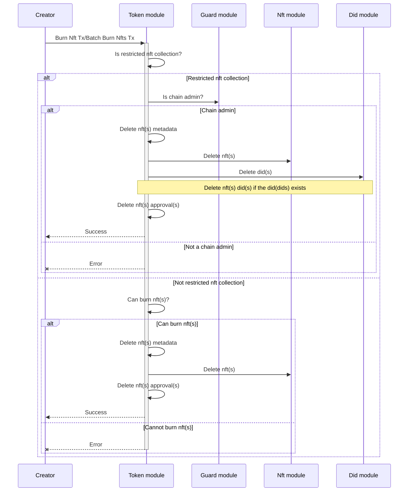
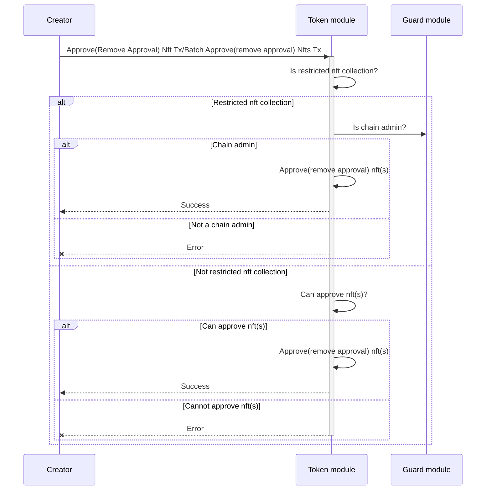
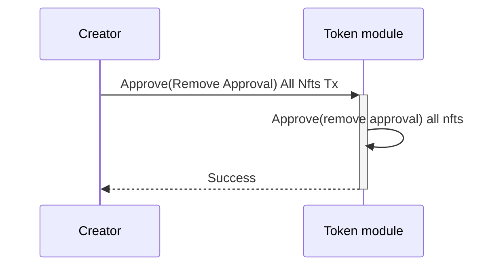
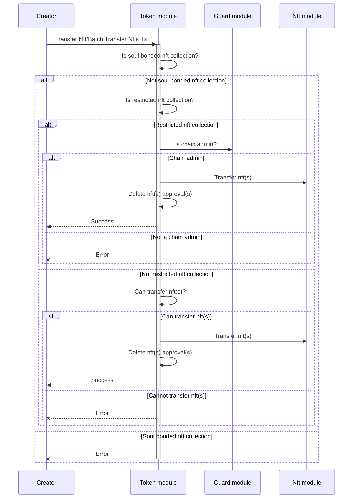
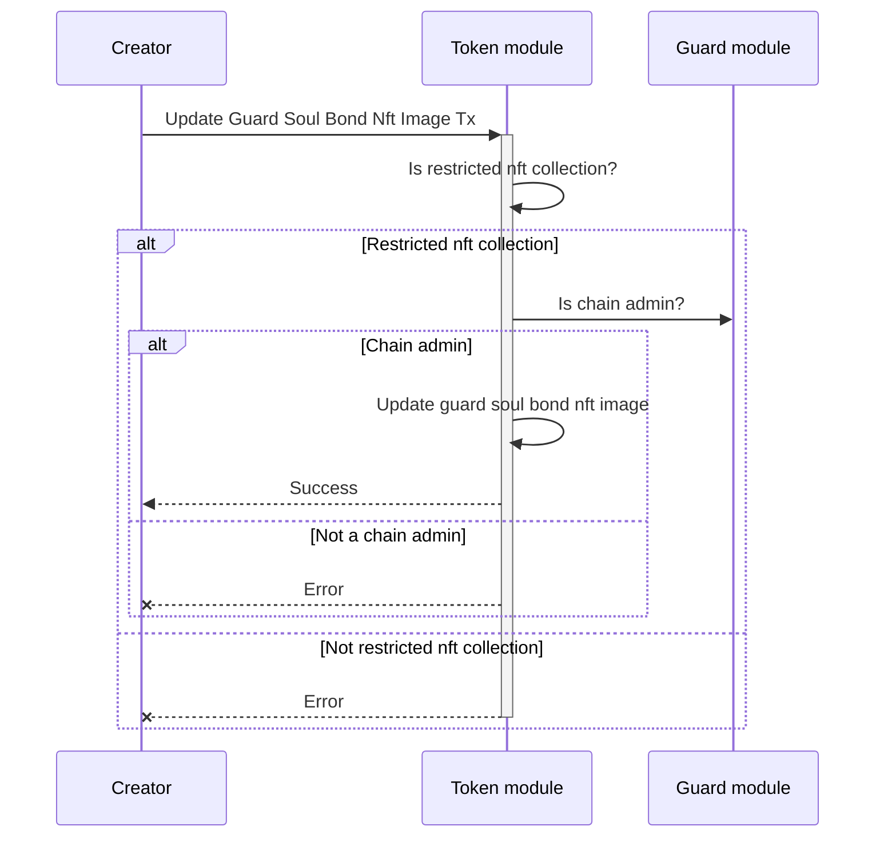

<!-- order: 1 -->

# Transactions flows

## Create Nft Collection

Creates a new nft collection.

## Mint Nft/Batch Mint Nfts

Mints a new nft.

## Burn Nft/Batch Burn Nfts

Burns an existing nft.

## Approve Nft/Batch Approve Nfts

Adds/removes an approval for an existing nft.

## Approve All Nfts

Adds/removes an approval for all nfts.

## Transfer Nft/Batch Transfer Nfts

Transfers an existing nft.

## Update Guard Soul Bond Nft Image

Updates a guard's soul bond nft image.
