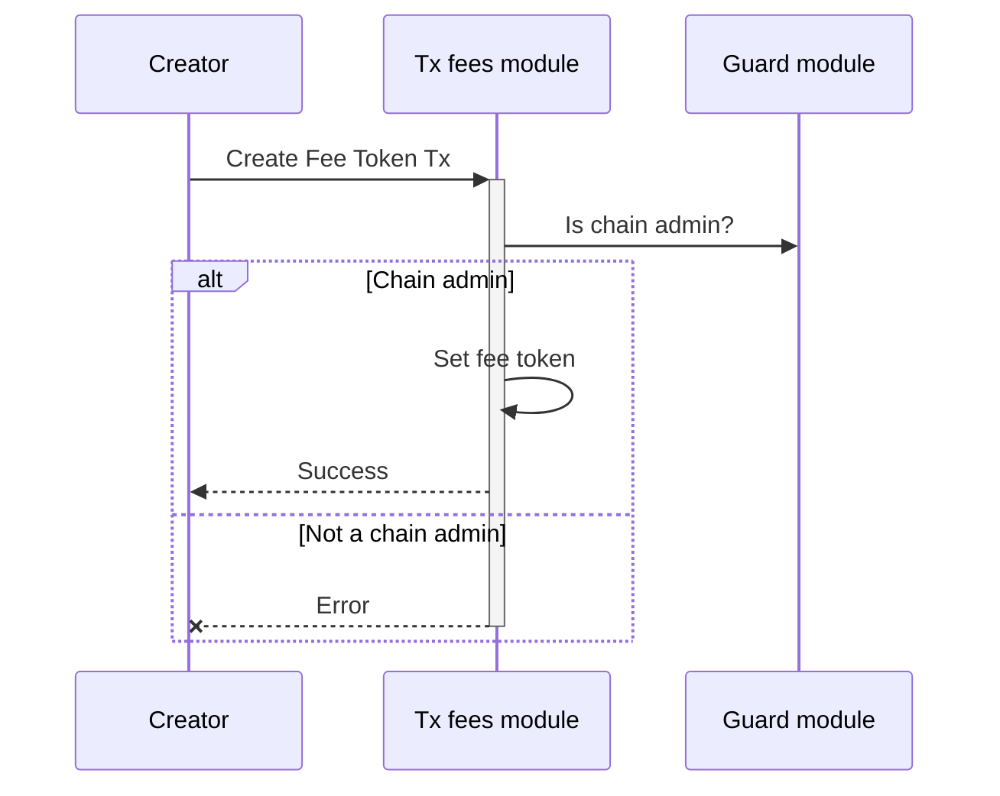
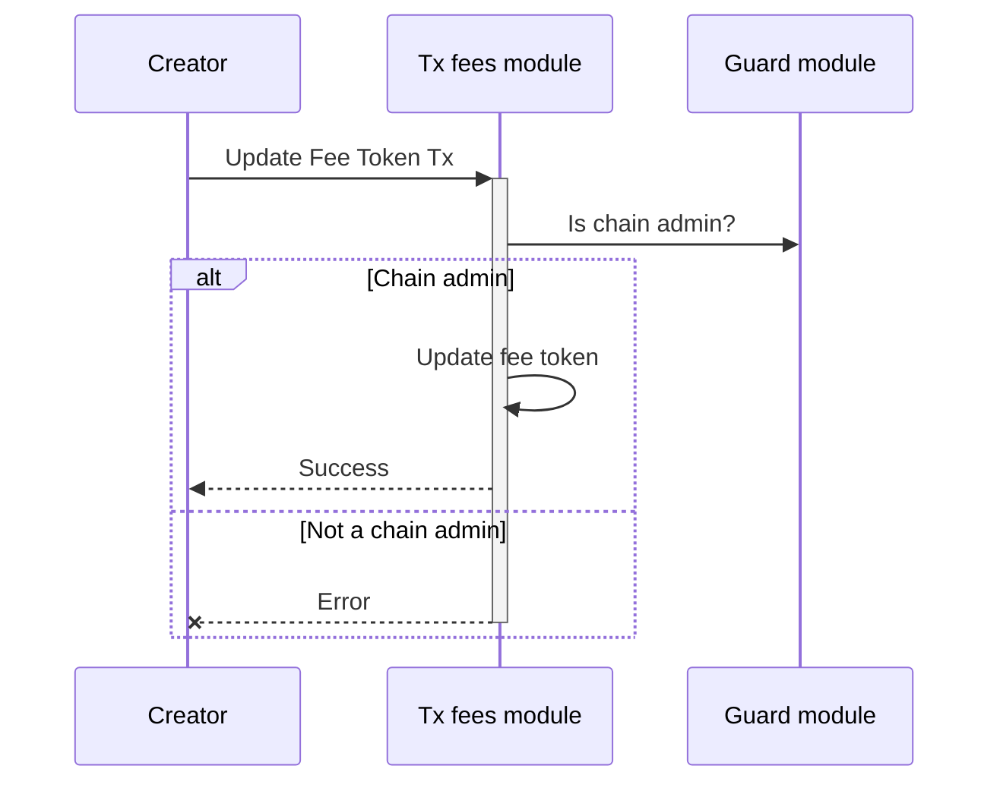
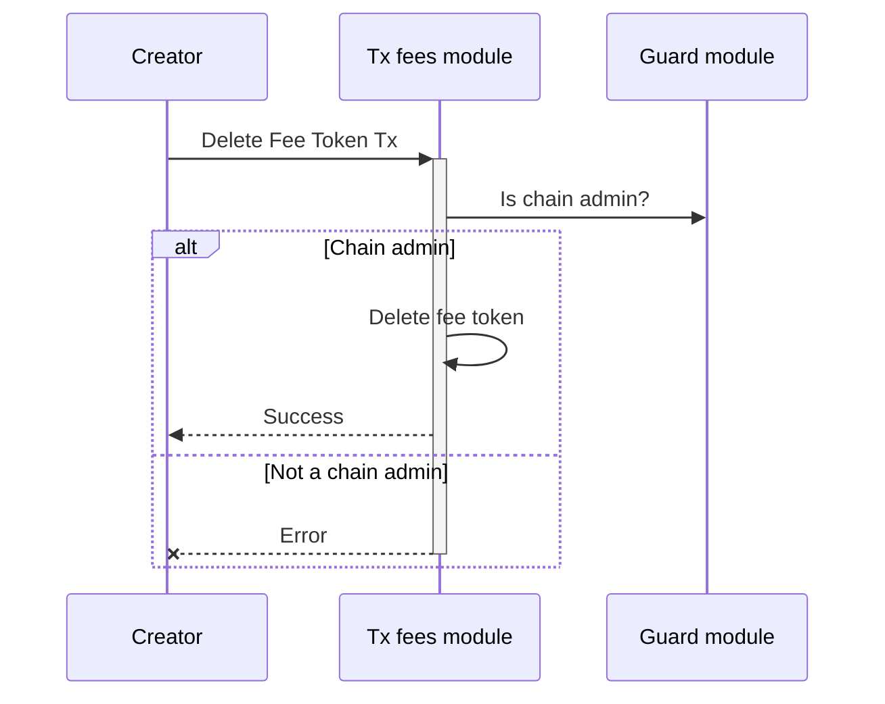

<!-- order: 1 -->

# Transactions flows

## Create Fee Token

```mermaid
sequenceDiagram
Creator->>+Tx fees module: Create Fee Token Tx
Tx fees module->>Guard module: Is chain admin?
alt Chain admin
  Tx fees module->>Tx fees module: Set fee token
  Tx fees module-->>Creator: Success
else Not a chain admin
  Tx fees module--x-Creator: Error
end
```

## Update Fee Token

```mermaid
sequenceDiagram
Creator->>+Tx fees module: Update Fee Token Tx
Tx fees module->>Guard module: Is chain admin?
alt Chain admin
  Tx fees module->>Tx fees module: Update fee token
  Tx fees module-->>Creator: Success
else Not a chain admin
  Tx fees module--x-Creator: Error
end
```

## Delete Fee Token

```mermaid
sequenceDiagram
Creator->>+Tx fees module: Delete Fee Token Tx
Tx fees module->>Guard module: Is chain admin?
alt Chain admin
  Tx fees module->>Tx fees module: Delete fee token
  Tx fees module-->>Creator: Success
else Not a chain admin
  Tx fees module--x-Creator: Error
end
```
