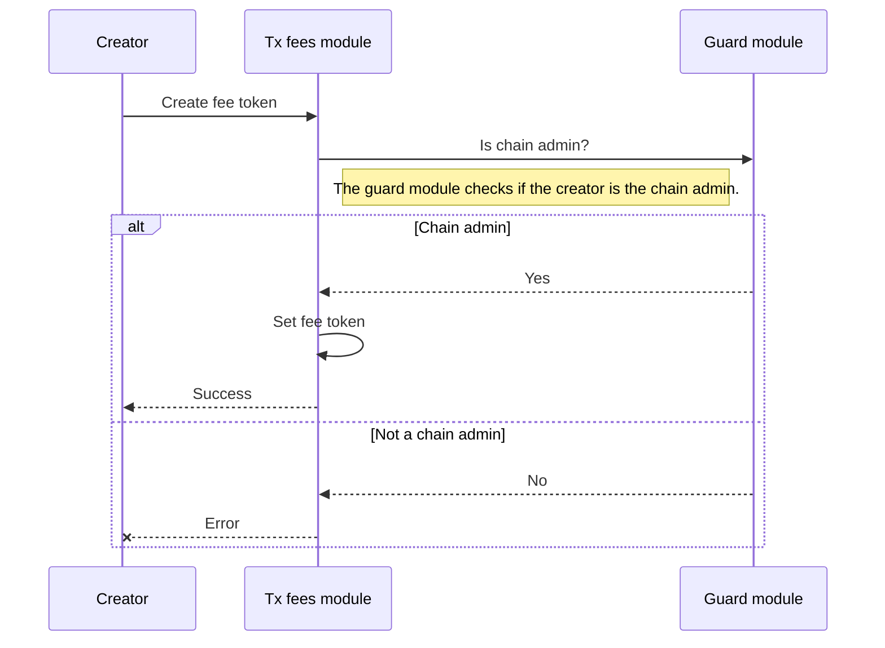
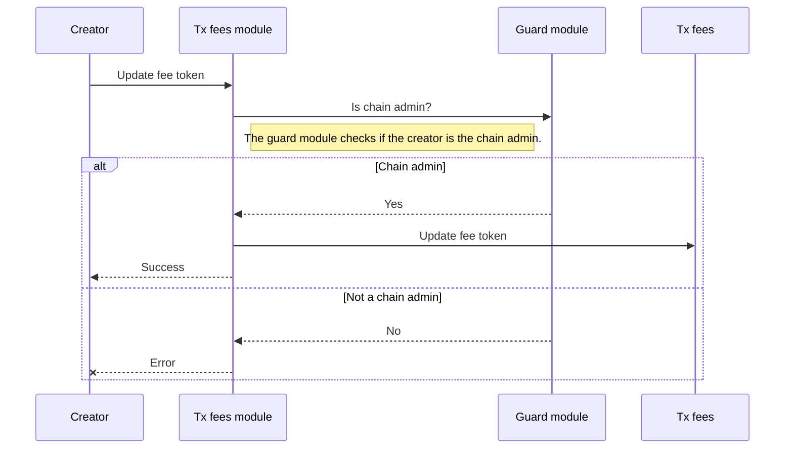

<!-- order: 1 -->

# Transactions flows

## Create fee token

```mermaid
sequenceDiagram
Creator ->> Tx fees module: Create fee token
Tx fees module->>Guard module: Is chain admin?
Note left of Guard module: The guard module checks if the creator is the chain admin.
alt Chain admin
  Guard module-->>Tx fees module: Yes
  Tx fees module->>Tx fees module: Set fee token
  Tx fees module-->> Creator: Success
else Not a chain admin
  Guard module-->>Tx fees module: No
  Tx fees module--x Creator: Error
end
```

## Update fee token

```mermaid
sequenceDiagram
Creator ->> Tx fees module: Update fee token
Tx fees module->>Guard module: Is chain admin?
Note left of Guard module: The guard module checks if the creator is the chain admin.
alt Chain admin
  Guard module-->>Tx fees module: Yes
  Tx fees module->>Tx fees: Update fee token
  Tx fees module-->> Creator: Success
else Not a chain admin
  Guard module-->>Tx fees module: No
  Tx fees module--x Creator: Error
end
```

## Delete fee token

```mermaid
sequenceDiagram
Creator ->> Tx fees module: Delete fee token
Tx fees module->>Guard module: Is chain admin?
Note left of Guard module: The guard module checks if the creator is the chain admin.
alt Chain admin
  Guard module-->>Tx fees module: Yes
  Tx fees module->>Tx fees module: Delete fee token
  Tx fees module-->> Creator: Success
else Not a chain admin
  Guard module-->>Tx fees module: No
  Tx fees module--x Creator: Error
end
```
